## apps/desktop モジュール責務一覧

`apps/desktop/src/` 配下を Rust モジュールツリーに沿ってまとめたもの。
コードを 1 次ソースとして読み取った結果。

---

### クレート依存関係

`apps/desktop` から辿れるワークスペース内クレートの依存方向。点線は feature ゲート（`gpu` / `html-panel`）で有効化される依存。

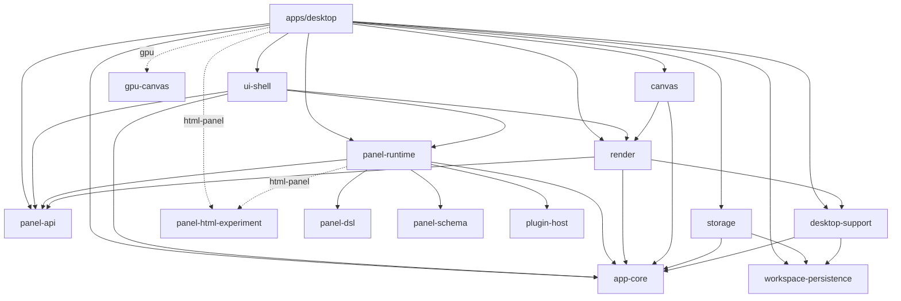

---

### `crate` (ルート)

デスクトップアプリのバイナリ。プロセスを立ち上げ、OS との接続層・GPU 提示層・レイアウト計算層・アプリ状態層を組み合わせる役割を担う。

---

### `crate::runtime`

OS のウィンドウ/イベントループとアプリ状態の境界を担うモジュール。OS 由来の入力やライフサイクルイベントをアプリが扱える抽象に翻訳し、毎フレームの提示要求をプレゼンタに引き渡す。

#### `crate::runtime::pointer`
ポインティングデバイス由来の入力（位置・ボタン・スクロール・タッチ）を、デバイス差や座標系差を吸収した正規化済みのポインタ操作として上位層に渡す責務。

#### `crate::runtime::keyboard`
キー入力と IME を扱う。文字編集・コマンド呼び出し・モディファイア状態など、用途別の入力概念に整理して上位層に届ける。

#### `crate::runtime::tests`
入力経路から描画反映までの一連のフローを横断的に検証する結合テスト。

---

### `crate::wgpu_canvas`

GPU を用いた最終提示を担うモジュール。上位層から渡される表示計画を受け取り、サーフェスへの描画を実行する。

---

### `crate::frame`

ウィンドウ寸法から UI 領域配置を決定し、座標系間の変換を提供するレイアウトモジュール。状態を持たない純粋計算が中心。

#### `crate::frame::geometry`
矩形のフィット計算や、ウィンドウ座標系と各サブ領域座標系との写像といった幾何ユーティリティ。

#### `crate::frame::tests`
レイアウト・座標変換が満たすべき不変条件のユニットテスト。

---

### `crate::app`

アプリケーションの状態と振る舞いを集約するモジュール。ドキュメント、UI、I/O などサブシステムを統合し、入力・コマンド適用・サービス処理・提示生成・バックグラウンド処理といった関心ごとに分割した子モジュールから構成される。

#### `crate::app::bootstrap`
起動時に必要な状態を組み立てる責務。永続化された設定や直前セッションを読み出し、整合の取れた初期状態を構築する。

#### `crate::app::state`
アプリの可視状態を最新化する補助的なオペレーションを提供する。表示用キャッシュやプレビューなど派生状態の更新点を集める。

#### `crate::app::commands`
コマンドという概念の入口となる薄い層。歴史的経緯による互換ポイントを保つ。

#### `crate::app::command_router`
受け取ったコマンドを種別に応じて適切な実行経路へ振り分ける責務。

#### `crate::app::drawing`
描画ランタイムをアプリ層から扱いやすい形で公開する薄いブリッジ。

#### `crate::app::input`
正規化済みの入力を受け取り、現在のモードや対象に応じた意味のある操作（描画・選択・パネル操作など）に変換する責務。

#### `crate::app::io_state`
ファイルパス・ダイアログ・セッション保存先など、外界との接続に関わる状態をまとめる。

#### `crate::app::present`
1 フレーム分の表示計画を組み立てる責務。差分のみ更新可能な部分とフレーム全体を再計算する部分を分けて提示層に渡す。

#### `crate::app::present_state`
提示に関わる差分情報や遅延更新指示を保持する。次フレームで何をどこまで更新すべきかを管理する。

#### `crate::app::snapshot_store`
ドキュメントの瞬間状態を保管する責務。世代数の上限と古いものの破棄ルールを持つ。

#### `crate::app::background_tasks`
時間がかかる I/O や処理を別スレッドへ逃がし、その完了を取り込む責務。

#### `crate::app::panel_config_sync`
永続化された設定とアプリの実行時状態の双方向同期。設定変更を画面に反映し、画面操作の結果を設定に書き戻す。

#### `crate::app::panel_dispatch`
パネル UI に対する継続的な対話（ドラッグ・押下など）の遷移状態を保持し、対応するアクションへ橋渡しする。

#### `crate::app::tests`
アプリ層の振る舞いをモジュール横断で検証する結合テスト群。

---

### `crate::app::services`

UI から発行される副作用を伴う要求（保存・読込・書き出し・カタログ操作など）を分類し、対応するハンドラへ振り分ける窓口モジュール。アプリの I/O 境界を集約する。

#### `crate::app::services::export`
表示中の成果物を画像など外部形式に書き出す要求を処理する。

#### `crate::app::services::gpu_sync`
GPU 上にしか存在しない描画結果を CPU 側の表現に同期させる責務。永続化や読み出しに必要な前段処理。

#### `crate::app::services::project_io`
プロジェクト単位での新規作成・保存・読込と、それに伴う履歴・状態の更新を扱う。

#### `crate::app::services::snapshot`
ドキュメントの瞬間状態の作成・復元要求を扱う。

#### `crate::app::services::text_render`
テキスト入力を成果物上のラスタ表現として確定させる要求を扱う。

#### `crate::app::services::tool_catalog`
ツールやプリセットといったカタログ系資産の再読込・取り込みを扱う。

#### `crate::app::services::workspace_io`
作業空間レイアウトのプリセット適用・保存・書き出しと、その永続化を扱う。

---

## crates/app-core モジュール責務一覧

`crates/app-core/src/` 配下を Rust モジュールツリーに沿ってまとめたもの。

---

### クレート依存関係

`app-core` はワークスペース最下層のドメインクレートで、ワークスペース内の他クレートには依存しない。外部クレートは `serde`, `thiserror` のみ。

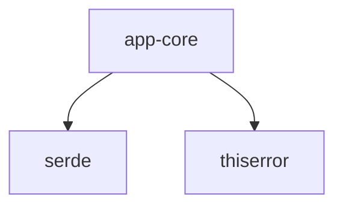

被依存側（このクレートを参照しているワークスペース内クレート、`apps/desktop` から辿れる範囲）:

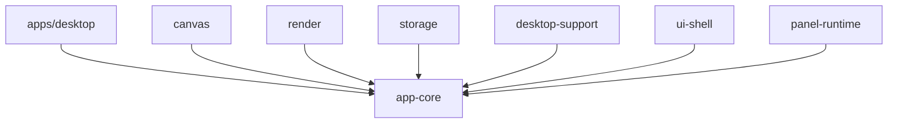

---

### `crate` (ルート)

altpaint のドメインモデルを保持する基盤クレート。作品・ページ・コマ・レイヤーといった最小構造と、状態変更の入口となるコマンド表現、座標系・履歴・描画パラメータといった他層が共有する語彙を定義する。

---

### `crate::command`

ユーザー操作やアプリ内リクエストを「状態変更要求」という単一の概念に揃える層。各ドメイン（ツール、色、ペン、ビュー、パネル、レイヤーなど）への変更指示を統一形式で表現し、上位層から下位層への変更経路の入口となる。

---

### `crate::coordinates`

ウィンドウ・キャンバス・パネルローカルなど複数の座標系を型レベルで区別し、座標変換・領域判定・差分領域の合成といった空間的な操作の語彙を一元的に提供する。

---

### `crate::document`

作品全体・ページ・コマ・レイヤーツリーといった永続状態の中心モデルと、現在のツール・色・ビュー状態を保持する責務。状態変更要求の適用窓口となり、子モジュールに具体的な変更ロジックを委ねる。

#### `crate::document::bitmap`
ビットマップという基本素材に対する描画・消去といった編集操作の語彙を提供する。ドメイン型の定義と編集アルゴリズムを分離する。

#### `crate::document::layer_ops`
レイヤーへの編集適用、変更領域の整合、レイヤー間合成といった編集系オペレーションを集約し、ドキュメント本体を状態遷移の表現に集中させる。

#### `crate::document::pen_state`
ペンプリセットの選択・サイズ補正・現行ツールに応じた描画パラメータの導出といった、ペン状態の整合性に関わるロジックを集約する。

#### `crate::document::tests`
ドキュメント構造に対する単体テスト。

---

### `crate::error`

クレート内で発生するエラーを表現する最小限のエラー型を定義する。

---

### `crate::history`

Undo/Redo の基盤を提供する責務。状態変更の前後差分を世代管理し、上位層が時系列を遡って復元できるようにする。

---

### `crate::painting`

描画入力・描画コンテキスト・ビットマップ合成戦略・ビットマップ編集操作といった、描画プラグインと中核ドメインの間に立つインターフェースを定める。

---

### `crate::paint_params`

ストロークの分解単位など、描画系で共有される定数・パラメータを集約する。

---

### `crate::workspace`

浮動パネルのアンカー・位置・サイズなど、UI 層のレイアウト状態を表すデータを定義する。

---

## crates/canvas モジュール責務一覧

`crates/canvas/src/` 配下を Rust モジュールツリーに沿ってまとめたもの。

---

### クレート依存関係

`canvas` はドメイン状態（`app-core`）と表示計画（`render`）の間に立ち、入力を描画差分に変換する中間層。外部クレートは `font8x8` を使う。

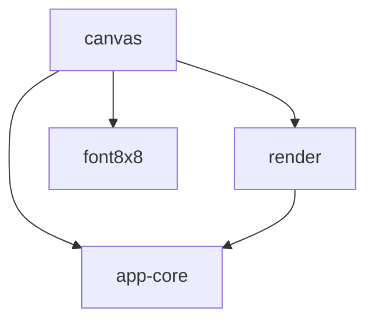

被依存側（このクレートを参照しているワークスペース内クレート、`apps/desktop` から辿れる範囲）:

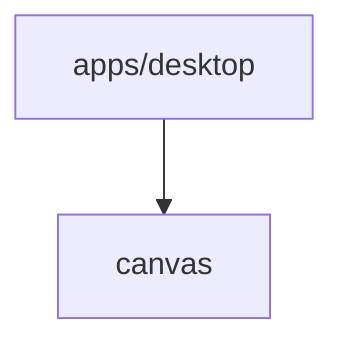

---

### `crate` (ルート)

ポインタなどの入力を描画操作へ翻訳し、ドメインモデルに対するビットマップ差分を生成するキャンバスランタイム。プラグイン形式の描画操作実装と、入力→差分→記録のパイプラインを提供する。

---

### `crate::context`

実行時の描画コンテキスト（アクティブなツール・ペン・色・対象キャンバス状態）を 1 つの値にまとめる型を定義する。

---

### `crate::context_builder`

ドキュメントの現在状態と入力位置から、その瞬間に描画が成立するコンテキストを解決する責務。対象パネル内に入力が収まっているかの判定もここで行う。

---

### `crate::edit_record`

描画操作の記録（Undo/Redo に必要な前後差分情報）を表す型を扱う。

---

### `crate::gesture`

ポインタの押下・移動・解放の連なりをジェスチャという概念に整理し、入力状態を更新して描画入力やプレビュー更新指示へと組み立てる責務。

---

### `crate::input_state`

ジェスチャ進行中に必要な蓄積情報（軌跡・スムージング・選択点列・矩形プレビューなど）を保持する。

---

### `crate::registry`

描画プラグインを識別子で管理し、既定プラグイン群を含むレジストリを提供する。実行時にどの描画実装が呼ばれるかの選択点となる。

---

### `crate::render_bridge`

入力状態から表示層が必要とするプレビュー情報（矩形範囲など）を導出する責務。描画ランタイムと表示計画層との間の翻訳点。

---

### `crate::runtime`

入力をプラグインへ振り分けて描画差分を生成する実行エンジン。コンテキスト解決・プラグイン呼び出し・操作記録生成を一貫したパイプラインとしてまとめる。

---

### `crate::view_mapping`

表示空間とキャンバス空間の座標変換を提供する責務。入力位置を描画対象上の位置に対応付ける。

---

### `crate::ops`

ツール種別ごとの基本描画操作の集合。ストローク・スタンプ・塗りつぶし・テキストといったレベルでビットマップ差分を生成する語彙を提供する。

#### `crate::ops::composite`
ツールやレイヤーの状態に応じた合成方法・色決定・ブレンドの選択ロジックを集約する。

#### `crate::ops::flood_fill`
連続した領域を一括で塗りつぶす操作。

#### `crate::ops::lasso_fill`
任意の閉じた点列で囲まれた領域内を塗りつぶす操作。

#### `crate::ops::stamp`
ペンサイズ・形状・筆圧などの要素から 1 点分の描画形状を作り、指定位置に置く操作。

#### `crate::ops::stroke`
始点と終点の間を補間し、複数のスタンプを連ねて連続的なストロークを構成する操作。

#### `crate::ops::text`
テキスト文字列をビットマップに焼き付けるための抽象（差し替え可能なレンダラ）と既定実装を提供する。

---

### `crate::plugins`

入力を描画差分へ変換するプラグインの境界を定めるモジュール。

#### `crate::plugins::builtin_bitmap`
標準的なビットマップ描画（スタンプ・ストローク・塗りつぶしなど）を担う組み込みプラグイン。

---

### `crate::tests`

ランタイム・コンテキスト・入力・各 ops 系の振る舞いを検証するテスト群。

---

## crates/desktop-support モジュール責務一覧

`crates/desktop-support/src/` 配下を Rust モジュールツリーに沿ってまとめたもの。

---

### クレート依存関係

`desktop-support` はドメインモデル（`app-core`）と UI 状態 DTO（`workspace-persistence`）の上に立ち、デスクトップアプリ固有の OS 寄りユーティリティをまとめる中位クレート。

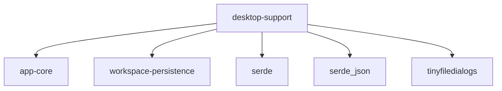

被依存側（`apps/desktop` から辿れる範囲）:

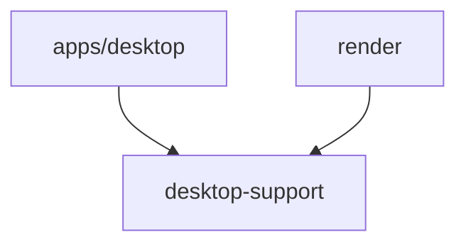

---

### `crate` (ルート)

デスクトップアプリ固有の補助機能をまとめるクレート。設定値・ダイアログ・セッション永続化・テンプレート・プロファイラなど、UI とドメインの間で共有される横断的な責務を集約する。

---

### `crate::config`

UI の既定寸法・配色・入力目標値、プロジェクトファイルの既定パス、ドキュメント寸法の解釈など、アプリ全体で参照される定数とユーティリティを一箇所にまとめる。

---

### `crate::dialogs`

ファイルを開く・保存する・エラーを表示するといったネイティブダイアログ越しの操作を抽象化する。実装を差し替え可能な境界を提供することでテスト容易性を保つ。

---

### `crate::session`

直前に開いていたプロジェクトや UI レイアウト・プラグイン設定からなるセッション状態を永続化・復元する責務。

---

### `crate::templates`

キャンバスサイズなどのテンプレート定義の読み込み・保存と、UI 表示用の整形を担う。

---

### `crate::workspace_presets`

ワークスペースのパネル配置・表示状態をプリセットとしてカタログ管理し、永続化と互換バージョン管理を担う。

---

### `crate::profiler`

フレーム時間や入力遅延などの計測指標を時間窓で集計するプロファイラの親モジュール。

#### `crate::profiler::engine`
フレーム区間・GPU 提示内訳・入力遅延を逐次集計し、瞬間値とスナップショットを生成する集計エンジン。

#### `crate::profiler::snapshot`
集計結果を画面表示向けの文字列に整形し、目標値との比較マーカーを付与する。

#### `crate::profiler::types`
プロファイラが共有する計測値・スナップショットなどのデータ型を定義する。

#### `crate::profiler::tests`
プロファイラ集計ロジックの回帰テスト。

---

## crates/gpu-canvas モジュール責務一覧

`crates/gpu-canvas/src/` 配下を Rust モジュールツリーに沿ってまとめたもの。

---

### クレート依存関係

`gpu-canvas` はドメイン側（`app-core`）の上に GPU 描画能力を提供するオプショナルなバックエンド。`gpu` feature 経由で `wgpu` を取り込む。

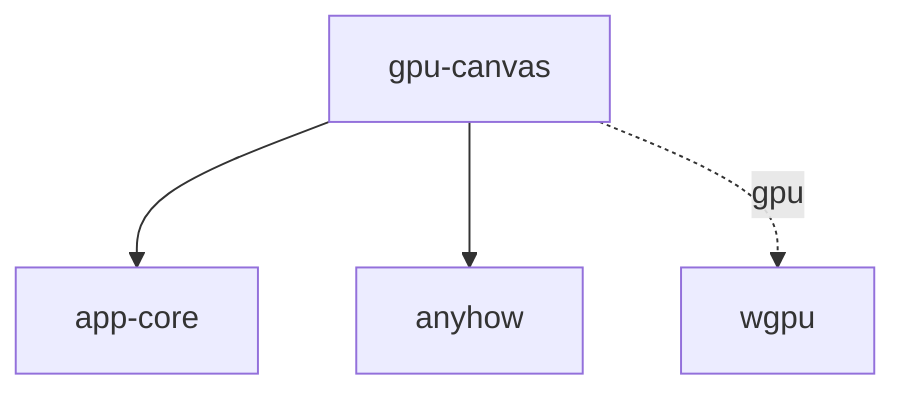

被依存側（`apps/desktop` から辿れる範囲）:

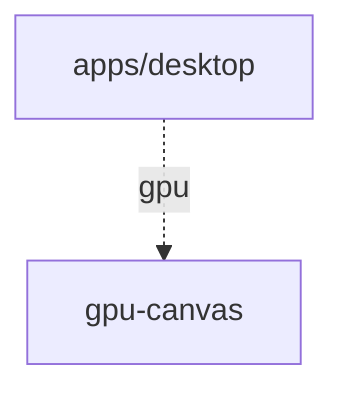

---

### `crate` (ルート)

GPU を使ったキャンバス描画機能をひとまとめにするバックエンドクレート。`gpu` feature が有効なときに、GPU 上でのブラシ・塗りつぶし・合成といった描画オペレーションと、それに必要な GPU リソース管理の基盤を提供する。

---

### `crate::brush`

GPU 上でブラシ・消しゴムなどのスタンプ列をレイヤーへ適用する描画パスの責務。

---

### `crate::composite`

複数レイヤーを順序通りに合成し、変更範囲のみ再生成する合成パスの責務。ブレンド方法の選択もここで扱う。

---

### `crate::fill`

連結領域や閉じた領域の塗りつぶしを GPU 上で実行する責務。収束判定や反復回数の上限で安全性を担保する。

---

### `crate::format_check`

利用中の GPU アダプタが必要なテクスチャ機能をサポートしているかを起動時に確認する責務。

---

### `crate::gpu`

GPU デバイスやレイヤーテクスチャ、ペン先キャッシュ、テクスチャプールといった、GPU 描画に共通して必要となるリソース型を集約する基盤層。

---

### `crate::tests`

CPU 単体テストと GPU 統合テストの集合。

---

## crates/panel-api モジュール責務一覧

`crates/panel-api/src/` 配下を Rust モジュールツリーに沿ってまとめたもの。

---

### クレート依存関係

`panel-api` はパネル側プラグインとホストの間で共有される最小コントラクトを定義する境界クレート。`app-core` のドメイン語彙を利用する。

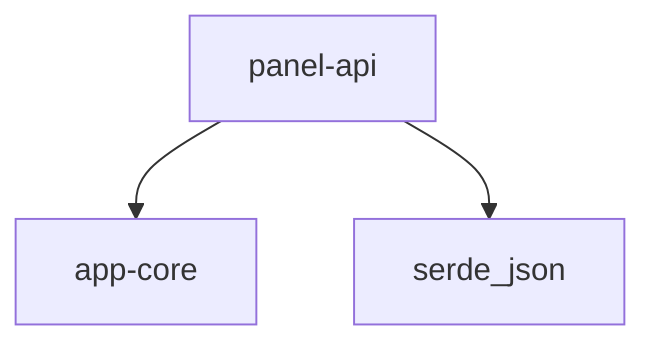

被依存側（`apps/desktop` から辿れる範囲）:

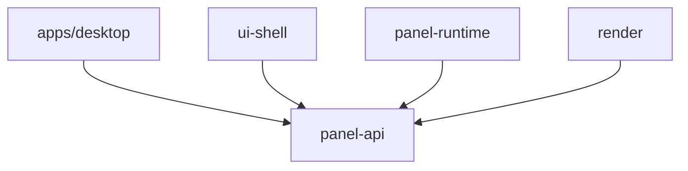

---

### `crate` (ルート)

パネル型プラグインとホスト間で交わすデータ型・イベント・ホストアクション、およびプラグイン実装が満たすべきトレイトを定義する最小インターフェース層。

---

### `crate::services`

ホスト側サービス要求（プロジェクト I/O・ワークスペース・ツール・ビュー・履歴・スナップショット・エクスポートなど）の識別子と要求ペイロード型を定義し、パネルからホストへのサービス呼び出し境界を提供する。

---

## crates/panel-dsl モジュール責務一覧

`crates/panel-dsl/src/` 配下を Rust モジュールツリーに沿ってまとめたもの。

---

### クレート依存関係

`panel-dsl` はワークスペース内クレートに依存しない、`.altp-panel` DSL のパース・検証専用クレート。

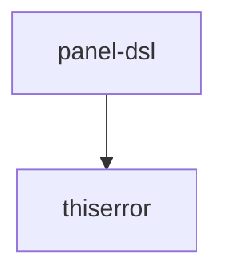

被依存側（`apps/desktop` から辿れる範囲）:

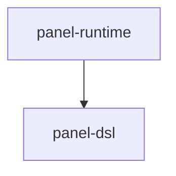

---

### `crate` (ルート)

`.altp-panel` DSL の入口。AST 定義・パーサー・検証の責務を子モジュールに分け、安定した型と関数を再公開する。

---

### `crate::ast`

DSL のテキスト解析直後と検証後の双方の状態を型として表現する。パネル定義・状態フィールド・ビュー要素といった DSL 概念の形態を定める。

---

### `crate::parser`

テキスト形式の `.altp-panel` ソースを構文木へ変換する純粋なパース層。

---

### `crate::validation`

解析済みの構文木とファイルシステム上のリソースを照合し、実行可能な正規化済み定義へ変換する責務。

---

### `crate::tests`

サンプルパネルを用いたパース・検証の回帰テスト。

---

## crates/panel-runtime モジュール責務一覧

`crates/panel-runtime/src/` 配下を Rust モジュールツリーに沿ってまとめたもの。

---

### クレート依存関係

`panel-runtime` はパネル DSL の読込・Wasm パネル実行・ホスト状態同期を統括する中位クレート。`html-panel` feature を有効にすると HTML パネル実装を取り込む。

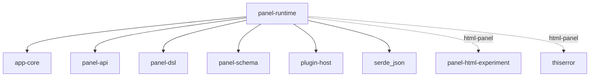

被依存側（`apps/desktop` から辿れる範囲）:

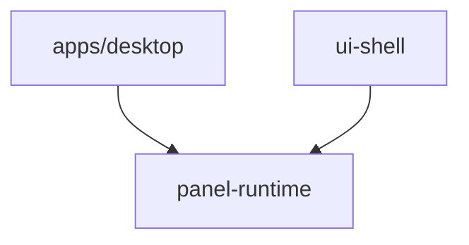

---

### `crate` (ルート)

DSL ベース・Wasm ベース・(オプションで) HTML ベースの各種パネル実装を統合し、ホストアプリに対して単一のパネル実行ランタイムを提供する。

---

### `crate::config`

パネルの永続化設定の読み書き境界。起動時の復元と終了時の保存を担う。

---

### `crate::dsl_loader`

ファイルシステム上のパネルマニフェストを走査・収集する責務。

---

### `crate::dsl_panel`

DSL 記述によるパネル定義を Wasm 実装と組み合わせて実行し、状態評価・ツリー生成・イベント処理を統合する。

---

### `crate::host_sync`

ドキュメントや現在ツールなどホスト側の状態をパネル側に渡せる形へ同期する責務。再評価コストを抑えるためのキャッシュも担う。

---

### `crate::html_panel`

`html-panel` feature 有効時のみ存在。HTML+CSS で記述されたパネルの実行と、外部所有の GPU リソースを使った直描画を提供する。

---

### `crate::registry`

複数のパネルプラグインをまとめて保持し、変更追跡・キャッシュ・イベント分配・GPU コンテキスト管理を行うランタイムの中枢。

---

### `crate::tests`

モックパネルを用いたコマンド対応付けや更新伝搬の検証テスト。

---

## crates/panel-schema モジュール責務一覧

`crates/panel-schema/src/` 配下を Rust モジュールツリーに沿ってまとめたもの。

---

### クレート依存関係

`panel-schema` はホスト⇔Wasm パネル間で交わすメッセージ形式（DTO）を定義する純粋データクレート。ワークスペース内クレートには依存しない。

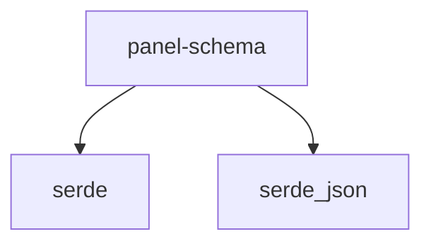

被依存側（`apps/desktop` から辿れる範囲）:

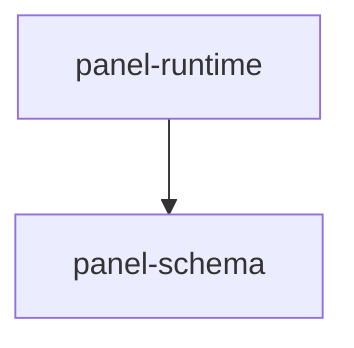

---

### `crate` (ルート)

ホストと Wasm パネルの間で受け渡される初期化要求・イベント要求・状態パッチ・コマンド・診断情報といったメッセージ形式を、シリアライズ可能なデータ型として定義する単一モジュール。

---

## crates/plugin-host モジュール責務一覧

`crates/plugin-host/src/` 配下を Rust モジュールツリーに沿ってまとめたもの。

---

### クレート依存関係

`plugin-host` は Wasm パネルランタイムを `wasmtime` 上で実装するクレート。共有 DTO に `panel-schema` を利用する。

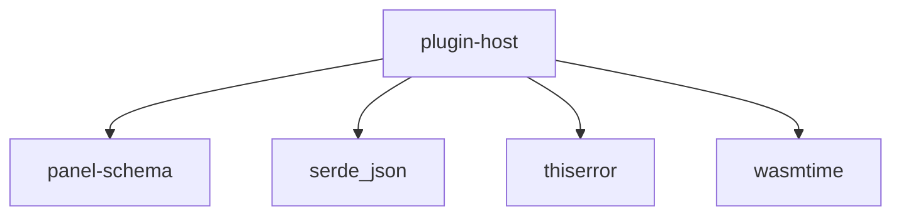

被依存側（`apps/desktop` から辿れる範囲）:

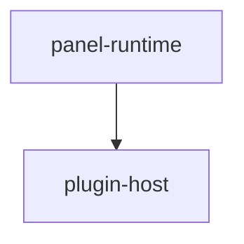

---

### `crate` (ルート)

Wasm パネルのロード・インスタンス化・ホストとパネル間メッセージ往復を担う単一モジュールのクレート。Wasm エンジンの共有・ホスト関数のリンク・パネルからの通知収集を一括して提供する。

---

## crates/plugin-macros モジュール責務一覧

`crates/plugin-macros/src/` 配下を Rust モジュールツリーに沿ってまとめたもの。

---

### クレート依存関係

`plugin-macros` はパネル/プラグイン作者向けの proc-macro クレート。標準的な proc-macro エコシステム（`proc-macro2` / `quote` / `syn`）にのみ依存する。

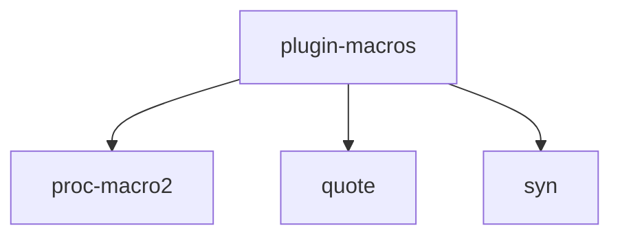

被依存側（`apps/desktop` から辿れる範囲は無し。プラグイン側 SDK 経由で使われる）:

```mermaid
graph TD
    plugin_sdk[plugin-sdk] --> plugin_macros[plugin-macros]
```

---

### `crate` (ルート)

パネル/プラグイン側のハンドラ関数をホスト連携に必要な形へと自動展開する手続きマクロ群を提供する単一モジュール。ボイラープレートを隠してハンドラ宣言を簡潔に保つ責務を持つ。

---

## crates/plugin-sdk モジュール責務一覧

`crates/plugin-sdk/src/` 配下を Rust モジュールツリーに沿ってまとめたもの。

---

### クレート依存関係

`plugin-sdk` はパネル/プラグイン作者向けに提供される SDK クレート。共有 DTO（`panel-schema`）と proc-macro（`plugin-macros`）に依存する。

```mermaid
graph TD
    plugin_sdk[plugin-sdk]
    plugin_sdk --> plugin_macros[plugin-macros]
    plugin_sdk --> panel_schema[panel-schema]
    plugin_sdk --> serde_json
```

被依存側: `apps/desktop` から辿る経路にはない。プラグイン側（`plugins/*`）の Wasm 実装で使われる。

---

### `crate` (ルート)

プラグイン作者が必要とするビルダー・コマンド表現・ホスト状態参照・ランタイム ABI・サービス要求・状態操作を、1 つの統一された SDK 表面として再公開する。

---

### `crate::builder`

コマンド記述子やハンドラ結果を段階的に組み立てるためのビルダー API を提供し、簡潔な記述を可能にする。

---

### `crate::commands`

文字列キーを介さずに、ツール・色・プロジェクト操作などのコマンドを型として組み立てるための層。

---

### `crate::host`

ホスト側の現在状態スナップショット（ドキュメント・ツール・色など）を型付きで読み取る参照 API を提供する。

---

### `crate::runtime`

Wasm パネルがホスト ABI を呼び出すための低レベル関数群。状態操作・イベント取得・ホスト値照会・コマンド実行・診断送信などの境界を担う。

---

### `crate::services`

サービス要求（プロジェクト I/O、ワークスペース I/O など）を型付きで組み立てるためのビルダー API。

---

### `crate::state`

パネルローカル状態のパスや基本型操作を型として表現し、状態の読み書きを文字列キーから抽象化する。

---

### `crate::tests`

SDK 表層機能（マクロ・ビルダー・各種 API）の回帰テスト。

---

## crates/render モジュール責務一覧

`crates/render/src/` 配下を Rust モジュールツリーに沿ってまとめたもの。

---

### クレート依存関係

`render` はドメイン状態をフレーム描画計画に変換する中位クレート。テキスト描画のために `ab_glyph` / `font8x8` / `fontdb` を併用する。

```mermaid
graph TD
    render
    render --> app_core[app-core]
    render --> panel_api[panel-api]
    render --> desktop_support[desktop-support]
    render --> ab_glyph
    render --> font8x8
    render --> fontdb
```

被依存側（`apps/desktop` から辿れる範囲）:

```mermaid
graph TD
    desktop[apps/desktop] --> render
    canvas --> render
    ui_shell[ui-shell] --> render
```

---

### `crate` (ルート)

キャンバス描画基盤の核。ビューポート・キャンバス座標変換、シーン準備、フレーム合成の根幹型を提供し、各サブモジュールが共有する語彙となる。

---

### `crate::brush_preview`

ブラシプレビューの位置と更新領域を前後フレームから差分計算する責務。

---

### `crate::canvas_plan`

キャンバス領域に関する表示計画を集約し、表示領域・ソース寸法・変換から描画矩形と差分領域を導出する責務。

---

### `crate::compose`

背景・キャンバス・パネル・UI といったフレーム各層を RGBA ピクセルへ合成し、差分描画やスケーリングを行う合成エンジン。

---

### `crate::dirty`

差分領域の和集合計算を提供し、複数の更新領域を統合管理する責務。

---

### `crate::frame_plan`

ホストから渡される 1 フレーム分の描画計画を表現し、キャンバス・パネル・オーバーレイ各層の情報をまとめる責務。

---

### `crate::layer_group`

背景・キャンバス・一時オーバーレイ・UI パネルといった層ごとに差分領域を独立管理する責務。

---

### `crate::overlay_plan`

キャンバス上に一時的に出る要素（ブラシプレビュー・選択投げ縄・パネル生成プレビュー・ナビゲータなど）の状態と合成計画を保持する責務。

---

### `crate::panel`

UI パネルの描画・レイアウト・測定を実装し、ボタン・スライダ・カラーホイール等の表示要素のラスタライズとヒット領域生成を担う。

---

### `crate::panel_plan`

パネル面の配置計画を軽量に表現する責務。

---

### `crate::status`

ステータス表示領域のサイズ計測ユーティリティを提供する責務。

---

### `crate::text`

システムフォント優先・ビットマップフォントフォールバックでテキスト描画・幅測定・折り返しを行う責務。

---

#### `crate::tests`

幾何変換・差分領域更新・パネルラスタライズなど各モジュール機能の単体テスト。

---

## crates/storage モジュール責務一覧

`crates/storage/src/` 配下を Rust モジュールツリーに沿ってまとめたもの。

---

### クレート依存関係

`storage` は永続化と外部形式入出力を担う中位クレート。SQLite, MessagePack, zstd, png, base64, sha2 など多数の外部クレートに依存する。

```mermaid
graph TD
    storage
    storage --> app_core[app-core]
    storage --> workspace_persistence[workspace-persistence]
    storage --> anyhow
    storage --> base64
    storage --> rmp_serde[rmp-serde]
    storage --> rusqlite
    storage --> serde
    storage --> serde_json
    storage --> sha2
    storage --> thiserror
    storage --> zstd
    storage --> png
```

被依存側（`apps/desktop` から辿れる範囲）:

```mermaid
graph TD
    desktop[apps/desktop] --> storage
```

---

### `crate` (ルート)

プロジェクトの永続化・外部形式入出力・ペンとツールのカタログ読込・画像エクスポートをひとつにまとめるストレージ層クレート。

---

### `crate::export`

アクティブな成果物を画像形式（PNG）で外部ファイルに書き出す責務。

---

### `crate::pen_exchange`

外部ツール（Photoshop / CLIP STUDIO / GIMP など）のペンファイルを内部形式へ取り込む責務と、取り込み結果の報告。

---

### `crate::pen_format`

ペンの圧力曲線・先端形状・動的パラメータといった内部仕様を定義し、JSON との相互変換を担う。

---

### `crate::pen_presets`

`pens/` 配下のペン定義ファイルを再帰的に探索し、内部表現へ変換する責務。

---

### `crate::project_file`

ワークスペース UI 状態・プラグイン設定を含むプロジェクト全体の永続化・復元を担う上位インターフェース。

---

### `crate::project_sqlite`

ドキュメント・レイヤー・パネルといった構造化データを SQLite で保存し、チャンク単位の更新と差分保存を担う実装層。

---

### `crate::tool_catalog`

`tools/` 配下のツール定義ファイルを再帰的に探索し、内部表現へ変換する責務。

---

## crates/ui-shell モジュール責務一覧

`crates/ui-shell/src/` 配下を Rust モジュールツリーに沿ってまとめたもの。

---

### クレート依存関係

`ui-shell` はパネル群のレイアウト・フォーカス・ヒットテスト・サーフェス生成を担う UI 中位クレート。テキスト描画系 (`ab_glyph` / `font8x8` / `fontdb`) を共有する。

```mermaid
graph TD
    ui_shell[ui-shell]
    ui_shell --> app_core[app-core]
    ui_shell --> panel_api[panel-api]
    ui_shell --> panel_runtime[panel-runtime]
    ui_shell --> render
    ui_shell --> ab_glyph
    ui_shell --> font8x8
    ui_shell --> fontdb
```

被依存側（`apps/desktop` から辿れる範囲）:

```mermaid
graph TD
    desktop[apps/desktop] --> ui_shell[ui-shell]
```

---

### `crate` (ルート)

パネル群の表示状態を集約する UI シェルの入口。フォーカス・ヒット領域・ワークスペースレイアウト・サーフェス描画など、UI シェル中核の状態を保持し、責務を子モジュールに分散する。

---

### `crate::focus`

フォーカス遷移とテキスト入力編集状態（カーソル・プリエディット・挿入削除）を管理し、IME 経由の入力処理を本体から独立させる責務。

---

### `crate::presentation`

パネルサーフェスのピクセルバッファ・ヒット領域・座標変換を保持し、入力位置を UI コンポーネントレベルのイベントへ翻訳する責務。

---

### `crate::surface_render`

パネルツリーからサーフェスへのラスタライズ前段処理を担う。差分追跡・キャッシュ・部分再合成を整理し、最終ラスタライズを `render` クレートに委譲する。

---

### `crate::tree_query`

パネルノードツリーの再帰走査を共通化する責務。フォーカス可能ノード抽出やドロップダウン探索など、複数の UI 振る舞いで共有される走査ロジックを集約する。

---

### `crate::workspace`

ワークスペースのパネル並び順・位置・サイズ・表示状態を管理する責務。レイアウト管理用パネルの動的生成も担う。

---

### `crate::tests`

UI シェルの振る舞いを検証する単体テスト。

---

## crates/workspace-persistence モジュール責務一覧

`crates/workspace-persistence/src/` 配下を Rust モジュールツリーに沿ってまとめたもの。

---

### クレート依存関係

`workspace-persistence` はワークスペース UI 状態を永続化形式として表す DTO クレート。`app-core` のレイアウト型を借りる以外はシリアライズ系の標準ライブラリのみ。

```mermaid
graph TD
    workspace_persistence[workspace-persistence]
    workspace_persistence --> app_core[app-core]
    workspace_persistence --> serde
    workspace_persistence --> serde_json
```

被依存側（`apps/desktop` から辿れる範囲）:

```mermaid
graph TD
    desktop[apps/desktop] --> workspace_persistence[workspace-persistence]
    storage --> workspace_persistence
    desktop_support[desktop-support] --> workspace_persistence
```

---

### `crate` (ルート)

プロジェクトファイルとセッション状態の双方で共有される、ワークスペースレイアウトとプラグイン設定からなる UI 永続化スナップショットを 1 つのデータ型として定義する単一モジュール。


