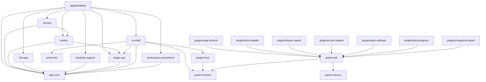
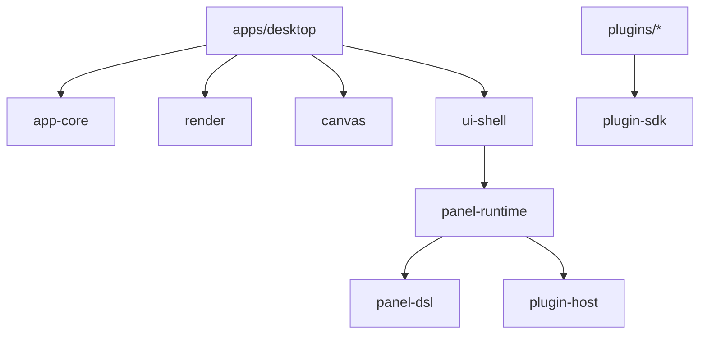

# altpaint モジュール依存関係

## この文書の目的

この文書は、**2026-03-10 時点の実装コードを正本として**、workspace 内のクレートと主要モジュールの依存関係を整理するための文書である。

主に次を明確にする。

- どのクレートがどのクレートへ依存しているか
- 各クレートが実際に何を担当しているか
- ランタイム上でどの経路を通ってデータとイベントが流れるか
- 今後 `ARCHITECTURE.md` や `ROADMAP.md` を読む前提として、どこが「現実の実装」か

この文書は理想図ではなく、**今のコードの実態整理**を優先する。

## 読み方

まず compile-time 依存を見る。
その後、起動・描画・パネル・保存の runtime flow を見る。

重要な前提は次の3点である。

1. `app-core` がドメインの中心である
2. `apps/desktop` がデスクトップ実行ホストである
3. パネル系は `plugin-api` / `panel-*` / `plugin-host` / `ui-shell` に分散している

## workspace パッケージ一覧

2026-03-11 時点の workspace package は次の通り。

### 中核クレート

- `app-core`
- `canvas`
- `render`
- `storage`
- `desktop-support`
- `plugin-api`
- `ui-shell`
- `workspace-persistence`
- `plugin-host`
- `panel-dsl`
- `panel-schema`
- `panel-sdk`
- `panel-macros`
- `apps/desktop`

補足:

- `crates/canvas` はフェーズ2で追加済みである。
- フェーズ3で `crates/panel-runtime` を追加候補とする。
- `panel-sdk` / `panel-macros` は将来 `plugin-sdk` 系へ寄せる方針とする。

### 組み込みパネル crate

- `plugins/app-actions`
- `plugins/workspace-presets`
- `plugins/tool-palette`
- `plugins/view-controls`
- `plugins/panel-list`
- `plugins/layers-panel`
- `plugins/color-palette`
- `plugins/pen-settings`
- `plugins/job-progress`
- `plugins/snapshot-panel`

## compile-time 依存関係

### クレート依存グラフ



### 依存関係の要点

- `app-core` は workspace 内の土台であり、ローカル依存を持たない
- `canvas` / `render` / `storage` / `desktop-support` / `plugin-api` / `workspace-persistence` は `app-core` に依存する周辺クレートである
- `canvas` は `render` の view mapping API を使うが、project I/O や panel runtime へは依存しない
- `render` は floating panel rasterize のため `plugin-api` にも依存する
- `ui-shell` が現在の**パネルランタイム統合点**であり、DSL 読み込み・Wasm 実行・Panel 描画をまとめて持っている
- `plugin-host` は `ui-shell` の内側で使われ、`apps/desktop` は直接依存していない
- `panel-sdk` は plugin author 向け表面 API であり、macro を含む唯一の作者向け入口である

## 将来の配置判断用メモ

この節は**現状の compile-time 依存ではなく、今後の責務移動先を固定するためのメモ**である。



| 論理名          | 置く責務                                              | 置かない責務                                  |
| --------------- | ----------------------------------------------------- | --------------------------------------------- |
| `desktopApp`    | event loop、OS I/O、GPU 所有、subsystem orchestration | canvas op、panel runtime 詳細、project 意味論 |
| `app-core`      | pure state、`Document`、`Command`                     | desktop / `wgpu` / `plugin-host` 依存         |
| `render`        | frame plan、dirty rect、座標変換、compose 計算        | project / workspace I/O                       |
| `canvas`        | gesture 解釈、tool runtime、bitmap op                 | panel runtime                                 |
| `ui-shell`      | panel presentation、host facade                       | Wasm runtime 詳細                             |
| `panel-runtime` | DSL/Wasm/runtime sync                                 | panel surface 描画                            |
| `plugin-sdk`    | plugin 作者向け API                                   | host 内部型の露出                             |

## クレート別の実責務

### `app-core`

担当:

- `Document` / `Work` / `Page` / `Panel` / `RasterLayer` などのドメインモデル
- `Command` による状態変更入口
- キャンバス編集、レイヤー操作、表示変換、色、ペンプリセット状態
- `WorkspaceLayout` とパネル可視性の保存対象モデル

主要モジュール:

- `command.rs`
- `document.rs`
- `workspace.rs`
- `error.rs`

依存しないもの:

- `winit`
- `wgpu`
- Wasm ランタイム
- パネル DSL parser

補足:

- `PaintPluginContext` や `BitmapEdit` などの共有 primitive は持つが、paint context の具体的な組み立ては `canvas` 側へ移した

### `canvas`

担当:

- `CanvasRuntime`
- `CanvasInputState`
- `advance_pointer_gesture(...)` による input state machine
- `build_paint_context(...)` による `Document` 読み取り文脈の構築
- built-in bitmap paint plugin
- stamp / stroke / flood fill / lasso fill / composite
- view-to-canvas 変換と panel rect preview bridge

主要モジュール:

- `runtime.rs`
- `context_builder.rs`
- `gesture.rs`
- `input_state.rs`
- `view_mapping.rs`
- `render_bridge.rs`
- `plugins/builtin_bitmap.rs`
- `ops/*`

### `render`

担当:

- `Document` から `RenderFrame` を得る最小描画入口
- `CanvasViewTransform` から canvas scene / quad / dirty 写像 / view 座標変換を得る
- floating panel layer の GUI ラスタライズ
- panel hit region の生成

現状の実態:

- canvas 幾何に加えて floating panel layer の rasterize を持つようになった
- ただし最終 upload と GPU presenter orchestration は、まだ主に `apps/desktop` 側にある

### `plugin-api`

担当:

- `PanelPlugin` trait
- `PanelTree` / `PanelNode`
- `PanelEvent`
- `HostAction`

意味:

- host が理解できる最小パネル中間表現
- `Command` をパネルから直接返すのではなく、`HostAction` を経由するための境界

### `panel-dsl`

担当:

- `.altp-panel` の読み込み
- parser / validator
- normalized IR
- handler binding 抽出

依存の特徴:

- workspace ローカル依存なし
- DSL の純粋処理に閉じている

### `panel-schema`

担当:

- host と Wasm runtime 間でやりとりする DTO
- `PanelInitRequest/Response`
- `PanelEventRequest`
- `HandlerResult`
- `StatePatch`
- `CommandDescriptor`
- `Diagnostic`

### `panel-macros`

担当:

- `#[panel_init]`
- `#[panel_handler]`
- `#[panel_sync_host]`

意味:

- plugin author が `extern "C"` や export 名を直接書かなくても済むようにする proc-macro 層
- plugin 作者は通常この crate を直接依存せず、`panel-sdk` から使う

### `panel-sdk`

担当:

- plugin author 向け安定表面 API
- typed `commands::*`
- typed `state::*`
- runtime helper
- `panel-macros` の再 export

意味:

- plugin 側は `panel-schema` の DTO と ABI 事情を直接知らなくても実装できる
- 物理的には別 crate だが、論理的には `panel-macros` を含む authoring surface である

### `plugin-host`

担当:

- `wasmtime` ベースの `WasmPanelRuntime`
- host import の定義
- Wasm memory 読み書き
- `PanelEventRequest` -> `HandlerResult` の橋渡し

重要事項:

- 現時点では panel runtime 専用であり、一般的 plugin host 全体にはまだ広がっていない
- `CommandDescriptor` / `StatePatch` / `Diagnostic` の収集が中心

### `ui-shell`

担当:

- Panel host runtime の現在の中心
- Panel 登録
- `.altp-panel` の再帰ロード
- DSL -> `PanelTree` 評価
- Wasm handler 実行
- Panel の local state / host snapshot / persistent config 管理
- レイアウト、ヒットテスト、スクロール、フォーカス、テキスト入力
- software panel rendering

実装上の特徴:

- `DslPanelPlugin` を内部に持つ
- `plugin-host` を内部利用して Wasm handler を実行する
- runtime / presentation の両方を 1 crate の facade に集めている

補足:

- `render` 依存は解消した
- ただし runtime / presentation の同居は残っており、分離方針は [docs/tmp/ui-shell-runtime-presentation-split-2026-03-10.md](docs/tmp/ui-shell-runtime-presentation-split-2026-03-10.md) に置いた

### `workspace-persistence`

担当:

- `WorkspaceUiState`
- `PluginConfigs`

意味:

- project 保存と session 保存で共有する UI 永続化 DTO
- ownership は `storage` / `desktop-support` に残したまま、重複したシリアライズ形だけを共通化する

### `storage`

担当:

- project save/load
- `format_version` 管理
- `WorkspaceUiState` の永続化
- ペンプリセットファイル群の読込

主要モジュール:

- `project_file.rs`
- `pen_presets.rs`

### `desktop-support`

担当:

- 配色・寸法・既定パスなどの desktop config
- native dialog 境界
- session save/load
- runtime profiler

主要モジュール:

- `config.rs`
- `dialogs.rs`
- `session.rs`
- `profiler.rs`

### `apps/desktop`

担当:

- `winit` の event loop
- `wgpu` presenter
- desktop layout
- canvas pointer input から `Command` への変換
- `DesktopApp` による状態遷移と副作用統合
- base frame / canvas texture / overlay frame の三層提示

主要モジュール:

- `main.rs`
- `runtime.rs`
- `app/mod.rs`
- `app/commands.rs`
- `app/input.rs`
- `app/present.rs`
- `frame.rs`
- `wgpu_canvas.rs`
- `../../crates/canvas/src/*`

### `plugins/*`

担当:

- 各 built-in panel の Wasm runtime 実装
- `panel.altp-panel` と対になる handler 群

依存ルール:

- compile-time では `panel-sdk` にのみ依存する
- host の内部型へ直接依存しない

## モジュール単位の見取り図

### 1. デスクトップホスト側

```text
apps/desktop/main.rs
  -> runtime.rs
     -> app/mod.rs
        -> app/commands.rs
        -> app/input.rs
        -> app/present.rs
     -> frame.rs
     -> wgpu_canvas.rs

crates/canvas/src/lib.rs
  -> runtime.rs
  -> context_builder.rs
  -> gesture.rs
  -> view_mapping.rs
  -> plugins/builtin_bitmap.rs
  -> ops/*
```

役割分担:

- `runtime.rs`: OS イベントと再描画サイクル
- `app/*`: 状態変化と副作用
- `crates/canvas/src/*`: gesture / runtime / bitmap op / view mapping
- `frame.rs`: CPU 側フレーム構築と desktop 固有の差分矩形計算
- `wgpu_canvas.rs`: 実 GPU 提示

### 2. パネルランタイム側

```text
panel.altp-panel
  -> panel-dsl
  -> ui-shell::DslPanelPlugin
  -> plugin-host::WasmPanelRuntime
  -> panel-schema DTO
  -> plugin-api::PanelTree / HostAction
```

役割分担:

- `panel-dsl`: 定義ファイルの正規化
- `plugin-host`: Wasm handler 呼び出し
- `ui-shell`: state と host snapshot を渡し、結果を `PanelTree` と `HostAction` に変換

### 3. 永続化側

```text
DesktopApp
  -> storage::save_project_to_path / load_project_from_path
  -> Document + WorkspaceUiState

DesktopApp
  -> desktop-support::save_session_state / load_session_state
```

project file と session file は役割が異なる。

- project file: 作品状態 + workspace layout + panel config
- session file: 最後に開いた project と desktop session の補助状態

## runtime flow

### 起動フロー

1. `main.rs` が `DesktopRuntime::run(...)` を呼ぶ
2. `DesktopRuntime` が `DesktopApp::new(...)` を構築する
3. `apps/desktop/src/app/bootstrap.rs` が session / project / workspace preset を解決し、`UiShell` と `Document` の初期状態を組み立てる
4. `UiShell` が `plugins/` 以下の `.altp-panel` を再帰探索してロードする
5. 各 panel について `DslPanelPlugin` が Wasm runtime を初期化する
6. `DesktopRuntime` が `winit` window と `wgpu` presenter を用意する

### キャンバス編集フロー

1. OS pointer event が `runtime.rs` に届く
2. `DesktopApp::handle_pointer_*` が panel/canvas を振り分ける
3. `canvas::view_mapping` が view 座標を canvas 座標へ変換する
4. `canvas::gesture` が down / drag / up を `PaintInput` や panel rect preview へ変換する
5. `canvas::runtime` が `Document` と built-in plugin から bitmap 差分を作る
6. `Document::apply_bitmap_edits_to_active_layer(...)` が実データを更新する
7. dirty rect / transform 更新 / UI 再同期要求は主に `apps/desktop/src/app/present_state.rs` に蓄積される
8. `prepare_present_frame(...)` が base/overlay/canvas 更新情報を組み立てる
9. `wgpu_canvas.rs` が 3 層を提示する

### パネルイベントフロー

1. pointer / keyboard event が `DesktopApp` に届く
2. `apps/desktop/src/app/panel_dispatch.rs` が panel hit-test / drag / host action 適用を中継する
3. `UiShell` が hit-test / focus / text input 編集を行う
4. 対象 panel が DSL/Wasm panel なら `DslPanelPlugin::handle_event(...)` が呼ばれる
5. 必要なら `plugin-host` を通じて Wasm handler を実行する
6. `StatePatch` を panel local state に適用する
7. `CommandDescriptor` を `HostAction::DispatchCommand(...)` 等へ変換する
8. `apps/desktop/src/app/panel_dispatch.rs` の `DesktopApp::execute_host_action(...)` が `Command` や workspace 操作を実行する

### 保存・読込フロー

1. `apps/desktop/src/app/command_router.rs` が保存/読込 command を受ける
2. `apps/desktop/src/app/background_tasks.rs` が project save task を起動または回収する
3. project 保存は `storage` へ委譲する
4. workspace layout / plugin config は `UiShell` から取り出して一緒に保存する
5. session 保存は `apps/desktop/src/app/io_state.rs` 経由で `desktop-support` へ委譲する

## 現在の境界で重要なこと

### `app-core` は依然として最重要の安定境界

今後クレートを増やしても、以下は維持したい。

- `Document` と `Command` は `app-core` に置く
- UI や GPU の型を `app-core` に入れない
- 保存形式と panel runtime は `app-core` の外側に置く

### `ui-shell` は現状かなり多機能

現実のコードでは、`ui-shell` は以下を同時に持っている。

- panel registry
- panel layout / hit-test / software render
- DSL evaluation
- Wasm runtime bridge
- focus / text input / config persistence
- runtime / presentation の二軸同居

そのため、現在の `ui-shell` は「単なる UI shell」より広く、**panel runtime 統合クレート**として読む方が実態に近い。

### `render` はまだ薄い

`render` は将来のレンダリング中核候補だが、現時点では次の責務の多くがまだ `apps/desktop` 側にある。

- desktop fixed layout
- dirty rect の表示先への写像
- base / overlay の CPU 合成
- GPU texture upload 戦略
- quad 計算

従って、レンダリング設計を読むときは「理想は `render` 側」「実装の多くは `apps/desktop` 側」という二層で理解する必要がある。

## 今後も守るべき依存ルール

1. `app-core` に `winit` / `wgpu` / `wasmtime` を入れない
2. `app-core` から `apps/desktop` / `plugin-host` を参照しない
3. `plugins/*` から host 内部クレートへ直接依存させない
4. panel の ABI DTO は `panel-schema` に閉じ込める
5. desktop 固有の I/O や dialog は `desktop-support` に寄せる
6. project 永続化は `storage`、session 永続化は `desktop-support` に分ける
7. `apps/desktop` だけが OS window と GPU presenter を所有する
8. `render` に project / workspace I/O の意味論を入れない
9. `ui-shell` presentation 側へ Wasm runtime 詳細を持ち込まない
10. `canvas` に panel runtime を入れない

## リファクタリング候補

実装を読んだ結果、次は整理候補になる。

1. `render` と `apps/desktop::frame` の責務再分配
2. `ui-shell` 内の DSL/Wasm runtime 部分の分離
3. `plugin-api` が `app-core::Command` を直接知っている点の再評価
4. panel permission の宣言値を runtime で実際に検証する仕組みの強化

ただし、これらは**今そうなっている**という意味ではない。現時点の正本は、上記 compile-time 依存と runtime flow である。
