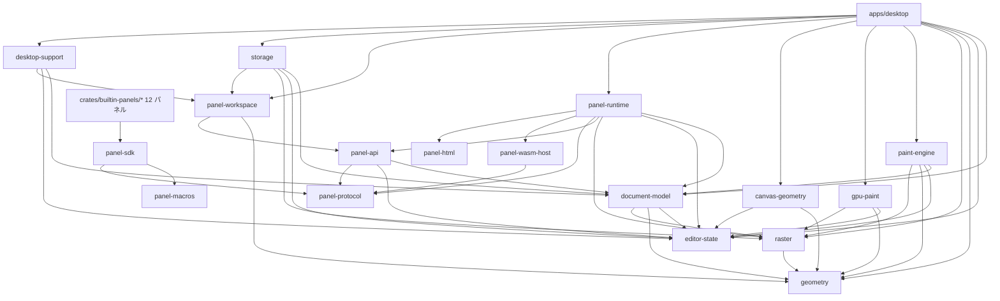
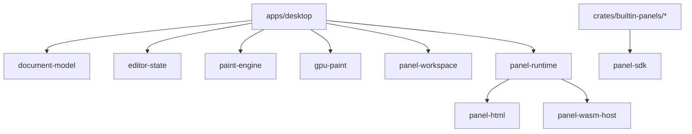

# altpaint モジュール依存関係

## この文書の目的

この文書は、**2026-06-13 時点 (ADR 018 B5 完了) の実装コードを正本として**、workspace 内のクレートと主要モジュールの依存関係を整理するための文書である。

主に次を明確にする。

- どのクレートがどのクレートへ依存しているか
- 各クレートが実際に何を担当しているか
- ランタイム上でどの経路を通ってデータとイベントが流れるか
- 今後 `ARCHITECTURE.md` や `ROADMAP.md` を読む前提として、どこが「現実の実装」か

この文書は理想図ではなく、**今のコードの実態整理**を優先する。

## 読み方

まず compile-time 依存を見る。
その後、起動・描画・パネル・保存の runtime flow を見る。

重要な前提は次の3点である。

1. ドメインの中心は水平土台 4 クレート `geometry` / `raster` / `document-model` / `editor-state` である（ADR 018 B5 で旧 `app-core` を責務別に解体）。`document-model::Document`（作品コンテンツ）と `editor-state::EditorSession`（編集セッション）が状態の二大入口
2. `apps/desktop`（package `altpaint-desktop`）がデスクトップ実行ホストである
3. パネル系は `panel-api` / `panel-protocol` / `panel-wasm-host` / `panel-sdk` / `panel-html` / `panel-runtime` / `panel-workspace` に分散しているが、desktop からの入口は `panel-runtime` (facade) と `panel-workspace` (workspace 配置) の 2 系統に集約されている (ADR 017)

## workspace パッケージ一覧

2026-06-13 時点 (ADR 018 B5 完了) の workspace package は次の通り（計 30 メンバー: 中核 18 + 組み込みパネル 12）。

### 中核クレート（水平土台）

ADR 018 B5 で旧 `app-core` を責務別の 4 クレートへ解体した:

- `geometry`（座標型・矩形・dirty rect 演算。ローカル依存ゼロ）
- `raster`（`RgbaBitmap`・ブレンド・ラスタライズ・`BitmapEdit`。`geometry` のみ依存）
- `document-model`（`Work`/`Page`/`Koma`/`RasterLayer`・`DocumentCommand`・`normalize_after_load`）
- `editor-state`（`EditorSession`・`ToolDefinition`/`PenPreset`・`SessionCommand`・`view_policy`）

### 中核クレート（その他）

- `paint-engine`（旧 `canvas`）
- `gpu-paint`（旧 `gpu-canvas`）
- `canvas-geometry`（旧 `render-types`。B5 で `CanvasViewGeometry` 単一経路へ縮約）
- `storage`
- `desktop-support`
- `panel-api`
- `panel-workspace`（旧 `ui-shell`）
- `panel-wasm-host`（旧 `plugin-host`）
- `panel-protocol`（旧 `panel-schema`）
- `panel-macros`（旧 `plugin-macros`）
- `panel-sdk`（旧 `plugin-sdk`）
- `panel-html`
- `panel-runtime`
- `apps/desktop`（package `altpaint-desktop`、bin `altpaint`）

補足:

- `geometry` / `raster` / `document-model` / `editor-state` は ADR 018 B5 (2026-06-13) で旧 `app-core` を解体して新設したもの。`app-core` クレートはワークスペースから削除済み。
- 括弧内の旧名は ADR 018 B2 (2026-06-12) で改名したもの。
- `crates/panel-dsl` は Phase 10（ADR 012）で `.altp-panel` DSL ごと削除済み。
- `crates/workspace-persistence` は ADR 016 で旧 `app-core::workspace` へ統合し削除済み。`WorkspaceUiState` / `WorkspacePanelState` は B5 (BL-075) で `panel-workspace` へ移設した。
- `crates/panel-html` は旧名 `panel-html-experiment` を ADR 016 で正式名称化したもの。
- `panel-api` / `panel-sdk` を正面名とし、proc-macro は `panel-macros` として物理分離する。

### 組み込みパネル crate（`crates/builtin-panels/` 配下、12 個）

- `crates/builtin-panels/app-actions`
- `crates/builtin-panels/workspace-presets`
- `crates/builtin-panels/tool-palette`
- `crates/builtin-panels/view-controls`
- `crates/builtin-panels/koma-list`
- `crates/builtin-panels/layers`
- `crates/builtin-panels/color-palette`
- `crates/builtin-panels/tool-settings`
- `crates/builtin-panels/job-progress`
- `crates/builtin-panels/snapshots`
- `crates/builtin-panels/text-flow`
- `crates/builtin-panels/workspace-layout`（Phase 12 追加）

## compile-time 依存関係

### クレート依存グラフ

水平土台 4 クレートの依存方向は `geometry`（最下層、ローカル依存ゼロ）→ `raster` → `editor-state` / `document-model` の順で、`editor-state` は `document-model` に依存しない（循環回避のため一方向）。


```mermaid
graph TD
    geometry[geometry]
    raster[raster] --> geometry
    editorstate[editor-state]
    docmodel[document-model] --> editorstate
    docmodel --> geometry
    docmodel --> raster

    desktop[apps/desktop] --> docmodel
    desktop --> editorstate
    desktop --> geometry
    desktop --> raster
    desktop --> paintengine[paint-engine]
    desktop --> gpupaint[gpu-paint]
    desktop --> canvasgeo[canvas-geometry]
    desktop --> panelruntime[panel-runtime]
    desktop --> panelws[panel-workspace]
    desktop --> storage[storage]
    desktop --> dsupport[desktop-support]

    paintengine --> docmodel
    paintengine --> editorstate
    paintengine --> geometry
    paintengine --> raster
    gpupaint --> editorstate
    gpupaint --> geometry
    gpupaint --> raster
    canvasgeo --> geometry
    canvasgeo --> editorstate
    storage --> docmodel
    storage --> editorstate
    storage --> raster
    storage --> panelws
    dsupport --> docmodel
    dsupport --> editorstate
    dsupport --> panelws
    panelapi[panel-api] --> docmodel
    panelapi --> editorstate
    panelapi --> protocol[panel-protocol]

    panelws --> geometry
    panelws --> panelapi

    panelruntime --> docmodel
    panelruntime --> editorstate
    panelruntime --> raster
    panelruntime --> panelapi
    panelruntime --> protocol
    panelruntime --> wasmhost[panel-wasm-host]
    panelruntime --> phtml[panel-html]

    wasmhost --> protocol
    panelsdk[panel-sdk] --> pmacros[panel-macros]
    panelsdk --> protocol

    panels[crates/builtin-panels/* 12 パネル] --> panelsdk
```

### 依存関係の要点

- 水平土台 4 クレートは ADR 018 B5 で旧 `app-core` を責務別に解体したものである:
  - `geometry` は最下層でローカルクレート依存を持たない（`serde` のみ）。座標型・矩形・dirty rect 演算
  - `raster` は `geometry` のみに依存し、`RgbaBitmap` / ブレンド / ラスタライズ / `BitmapEdit` を持つ（ドメインモデル・GPU 非依存）
  - `editor-state` は `document-model` に依存しない（循環回避。`serde` のみ）。`EditorSession` / ツール・ペン定義 / `SessionCommand` / `view_policy`
  - `document-model` は `editor-state` / `geometry` / `raster` に依存し、`Document` / `Work` / `Page` / `Koma` / `RasterLayer` / `DocumentCommand` を持つ
  - いずれも `winit` / `wgpu` / `wasmtime` / `blitz` に依存しない
- `paint-engine` / `gpu-paint` / `canvas-geometry` / `panel-api` は水平土台の周辺クレートである
- `paint-engine` のローカル依存は `document-model` / `editor-state` / `geometry` / `raster`（B5 で旧 app-core 依存を 4 クレートへ付け替え。BL-042 で view mapping ラッパーは廃止済みで、view 座標変換は desktop が `canvas-geometry::map_view_to_canvas_with_transform` を直接呼ぶ）。project I/O や panel runtime へは依存しない
- `gpu-paint` は `wgpu` に依存する唯一のペイント実装クレートで、ローカル依存は `editor-state` / `geometry` / `raster` のみ
- `canvas-geometry` は B5 で `CanvasViewGeometry` 単一経路へ縮約され、ローカル依存は `geometry` / `editor-state` のみ（`CanvasPlan` / overlay DTO は desktop へ移管）
- `panel-html` はローカル依存を持たず、Blitz / taffy / vello / wgpu に閉じた HTML パネル描画クレートである
- `panel-runtime` は panel サブシステムの facade であり、`PanelRuntime`・`HtmlWasmPanel`
  （HTML+Wasm）・host state 同期・hit 収集・同梱パネル loader を持ち、`panel-api` の host 向け型と
  `panel-html`（`panel_runtime::html`）を再公開する。desktop は panel-api / panel-html へ直接依存しない（ADR 017）
- `panel-workspace` はパネル配置専用 crate で、ローカル依存は `geometry` / `panel-api` のみ（BL-041 で hit 矩形型を `geometry::WindowRect` に統合）。B5 (BL-075) で `WorkspaceUiState` / `WorkspacePanelState` を保持するようになった。
  runtime のパネル一覧は `reconcile_panels(panel_ids)` の引数として desktop 側から受け取り（ADR 016）、
  hit-test API の戻り値型 `ResizeHandle` を再公開する（ADR 017）
- `panel-wasm-host` は `panel-runtime` の内側で使われ、`apps/desktop` は直接依存していない
- `panel-sdk` はパネル作者向け表面 API であり、macro と DOM mutation API を含む唯一の作者向け入口である
- 各パネル crate（`crates/builtin-panels/*`）は `panel-sdk` のみに依存する。旧 `builtin-panels`
  umbrella crate は ADR 017 で `panel-runtime::loader` に統合し削除した

## 将来の配置判断用メモ

この節は**現状の compile-time 依存ではなく、今後の責務移動先を固定するためのメモ**である。


```mermaid
graph TD
  desktop[apps/desktop] --> docmodel[document-model]
  desktop --> editorstate[editor-state]
  desktop --> paintengine[paint-engine]
  desktop --> gpupaint[gpu-paint]
  desktop --> panelws[panel-workspace]
  desktop --> panelruntime[panel-runtime]
  panelruntime --> phtml[panel-html]
  panelruntime --> wasmhost[panel-wasm-host]
  panels[crates/builtin-panels/*] --> panelsdk[panel-sdk]
```

| 論理名            | 置く責務                                              | 置かない責務                                  |
| ----------------- | ----------------------------------------------------- | --------------------------------------------- |
| `desktopApp`      | event loop、OS I/O、GPU 所有、subsystem orchestration | canvas op、panel runtime 詳細、project 意味論 |
| `geometry`        | 座標型、矩形、dirty rect 演算                         | ドメインモデル、GPU、I/O（ローカル依存ゼロ）  |
| `raster`          | `RgbaBitmap`、ブレンド、ラスタライズ、`BitmapEdit`    | ドメインモデル、GPU（`geometry` のみ依存）    |
| `document-model`  | pure state、`Document` / `Work` / `Koma`、`DocumentCommand` | desktop / `wgpu` / `panel-wasm-host` 依存 |
| `editor-state`    | `EditorSession`、ツール/ペン定義、`SessionCommand`、`view_policy` | 作品データ（`document-model` 非依存 = 循環回避） |
| `canvas-geometry` | canvas plan、dirty rect、座標変換の純データ計算       | GPU 実装、project / workspace I/O             |
| `gpu-paint`       | ブラシ / 塗り / 合成の GPU compute 実装               | dispatch 判断、document 意味論                |
| `paint-engine`    | gesture 解釈、ペイント文脈解決、bitmap op             | panel runtime                                 |
| `panel-workspace` | パネル配置、focus、hit テスト                         | Wasm runtime 詳細                             |
| `panel-runtime`   | HTML/Wasm runtime sync、hit 収集                      | panel surface のウィンドウ配置                |
| `panel-sdk`       | パネル作者向け API（DOM mutation 含む）               | host 内部型の露出                             |

## クレート別の実責務

> 注: ADR 018 B5 (2026-06-13) で旧 `app-core` を `geometry` / `raster` / `document-model` / `editor-state` の水平土台 4 クレートへ解体し、ワークスペースから削除した。以下はその新構成での実責務である。

### `geometry`

担当:

- 座標型: `WindowPoint` / `CanvasViewportPoint` / `CanvasDisplayPoint` / `PagePoint` / `PagePointF` / `KomaLocalPoint` / `PanelSurfacePoint`
- 矩形型: `WindowRect` / `PanelSurfaceRect` と空間変換トレイト（`ClampToCanvasBounds` / `MergeInSpace`）
- dirty rect 型 (`PageDirtyRect` / `WindowDirtyRect` / `PanelSurfaceDirtyRect`) と演算 (`accumulate_dirty_rect` / `union_optional_rect`)

主要モジュール:

- `coordinates.rs`
- `dirty.rs`

依存の特徴:

- ローカルクレート依存ゼロ（`serde` のみ）。最下層の水平土台

### `raster`

担当:

- `RgbaBitmap`（旧 `CanvasBitmap`、R11/R12 を B5 で実施）とラスタライズプリミティブ
- ピクセルブレンドの単一実装（`BlendMode` / `composite_pixel` / `source_over_coverage_pixel`。BlendMode→GPU code 対応表の単一定義）
- ビットマップ編集差分（`BitmapEdit` / `BitmapComposite` / `BitmapCompositor`）
- `MAX_STAMP_STEPS`（CPU 経路 `paint_engine::ops::stroke` と GPU 経路 `gpu_paint::brush` が共通参照。最終的な paint-engine 移設は B8）

主要モジュール:

- `bitmap.rs`
- `blend.rs`
- `edit.rs`

依存の特徴:

- ローカル依存は `geometry` のみ。ドメインモデル・GPU には依存しない

### `document-model`

担当:

- 作品ドメインモデル `Document` / `Work` / `Page` / `Koma` / `RasterLayer` / `LayerMask`（旧 `Panel` は ADR 018 B1 で `Koma` へ改名。panel は UI パネル専用語）
- `DocumentCommand`（純粋なドキュメント変異）による状態変更入口
- `normalize_after_load`（ロード後の不変条件修復）、コマグリッドレイアウト、レイヤー合成
- `parse_document_size` と上限定数（`MAX_PAGE_DIMENSION` / `MAX_PAGE_PIXELS`）

主要モジュール:

- `command.rs`
- `document.rs`（+ `document/layer_ops.rs`）
- `blend.rs`（`raster::blend` の再エクスポート薄層）

依存の特徴:

- ローカル依存は `editor-state` / `geometry` / `raster`。`winit` / `wgpu` / Wasm ランタイムには依存しない
- B5 (BL-072) で `Document` を作品コンテンツ（`Work` 中心）と編集セッション（`editor-state::EditorSession`）に分割した

### `editor-state`

担当:

- エディタの一過性編集状態 `EditorSession`（アクティブツール・色・ペンプリセット・表示変換）
- ツール/ペン定義型 `ToolDefinition` / `ToolKind` / `ToolSettingDefinition` / `PenPreset` / `PenRuntimeEngine` / `PenTipBitmap` / `ColorRgba8` / `CanvasViewTransform`
- `SessionCommand`（ツール/色/ペン/ビューのセッション変更。B4 で旧 `Command` を 2 分割した後 B5 BL-073 で本クレートへ移設）
- `view_policy`（ズーム倍率・clamp・パン量のビュー操作ポリシー）、`tool_state`

主要モジュール:

- `command.rs`
- `session.rs`
- `view_policy.rs`

依存の特徴:

- 作品データ（`document-model`）に依存しない（循環回避のため一方向）。`serde` のみ

補足（B5 での移動先）:

- `EditHistory`（undo/redo、`PaintPatch` enum = `Cpu` / `Gpu` の型付きスナップショット方式。`OpaqueGpuData` + downcast は B5 で全廃）は `apps/desktop/src/app/paint/history.rs` へ移管した
- `WorkspaceUiState` / `WorkspacePanelState` / `PanelConfigs`（project / session 共有の UI 永続化 DTO）は B5 (BL-075) で `panel-workspace` へ移設した
- `PaintInput` / `PaintPluginContext` / `PaintPlugin` などの共有 paint primitive は B5 で `paint-engine` へ移設した（paint context の組み立ても `paint-engine` 側）

### `paint-engine`（旧 `canvas`）

担当:

- `PaintEngine`（旧 `CanvasRuntime`。`compute_paint_edits` でペイント差分を計算する状態なしの計算機）
- `CanvasInputState`
- `advance_pointer_gesture(...)` による input state machine
- `build_paint_context(...)` による `Document` 読み取り文脈の構築
- built-in bitmap paint plugin
- stamp / stroke / flood fill / lasso fill / composite の bitmap op
- GPU dispatch 用の `compute_stamp_positions`
- `PaintInput` / `PaintPluginContext` / `PaintPlugin`（B5 で旧 app-core から移設）

主要モジュール:

- `engine.rs`
- `context_builder.rs`
- `context.rs`
- `gesture.rs`
- `input_state.rs`
- `painting.rs`（B5 で旧 app-core から移設）
- `plugins/builtin_bitmap.rs`
- `ops/*`

依存の特徴:

- ローカル依存は `document-model` / `editor-state` / `geometry` / `raster`（B5 で旧 app-core 依存を 4 クレートへ付け替え）
- コマ作成ジェスチャ・テキストラスタライズは B5 (BL-081/082) で `apps/desktop` へ分離した

### `gpu-paint`（旧 `gpu-canvas`、Phase 8 追加）

担当:

- `LayerTextureStore` / `GpuRgbaTexture`（レイヤーテクスチャの upload / readback。旧 `GpuCanvasPool` / `GpuLayerTexture`）
- `BrushPipeline`（stamp / stroke / erase。旧 `GpuBrushDispatch`）
- `FillPipeline`（flood fill / lasso fill。旧 `GpuFillDispatch`）
- `CompositePipeline`（レイヤー合成。旧 `GpuLayerCompositor`）
- `src/shaders/` の 7 WGSL compute shader（書込み専用だった `GpuPenTipCache` と孤立 brush_stamp.wgsl は ADR 018 B0 で削除）
- `pipeline.rs`（build_pipeline の 3 重複 + alpha 展開 2 重複を共通化、dispatcher 全コンストラクタを共有 context 受け取りに統一。矩形は半開矩形型 1 つへ統一し公開 API から無名タプルを排除 — BL-039 / BL-040）

依存の特徴:

- ローカル依存は `editor-state` / `geometry` / `raster`（B5 で旧 app-core 依存を付け替え）。`wgpu` 依存はこのクレートと `panel-html` / `apps/desktop` に限られる
- Phase 9A で feature gate を撤廃し、`apps/desktop` の必須依存になった

### `canvas-geometry`（旧 `render-types`、Phase 9B 追加。B5 で縮約）

担当:

- キャンバス表示幾何クレート（wgpu / fontdb / panel-api 非依存。ローカル依存は `geometry` / `editor-state` のみ）
- `CanvasViewGeometry` 単一経路（旧 `CanvasScene`。構築は `CanvasViewGeometry::compute`。view↔page 座標写像）と提示用テクスチャ矩形 `TextureQuad`。矩形型は `geometry::WindowRect` を使う（BL-041 で旧 `PixelRect` を統合）

意味:

- GPU 経路（`gpu-paint` / `wgpu_canvas.rs`）への入力となる幾何計算
- B5 で `CanvasViewGeometry` 単一経路へ縮約した。`CanvasPlan` / `LayerDirtyAccumulator` / `CanvasOverlayState` / `KomaNavigatorOverlay` などの overlay DTO は `apps/desktop` へ移管した（旧 `crates/render` は Phase 9F で物理削除済み。`RenderFrame` 後継は `apps/desktop/src/app/cpu_canvas_snapshot.rs::CpuCanvasSnapshot`、旧 `CanvasFrame`。詳細は `docs/adr/010-render-crate-removal.md`）

### `panel-api`

担当:

- `PanelPlugin` trait（`handle_event` / `handles_keyboard_event` / `persistent_config` 等）
- `PanelEvent`（`Activate` / `SetValue` / `DragValue` / `SetText` / `Keyboard`）
- `HostAction`（`DispatchDocumentCommand` / `DispatchSessionCommand` / `RequestService` / `MovePanel` / `SetPanelVisibility`。B4 で `DispatchCommand` を document/session に分割。`MovePanel` / `SetPanelVisibility` は desktop 側で `workspace_layout.*` サービスへ変換され、専用 variant は B6 P3 で削除予定）
- `ResizeHandle`（8 ハンドルリサイズ。旧 `ResizeEdge`）
- `ServiceRequest` と service 名定数の互換表面（定数の正本は `panel_protocol::names`。
  `services::names` はフラット名の再エクスポートとして維持）

意味:

- `DocumentCommand` / `SessionCommand` / `ServiceRequest` をパネルから直接返すのではなく、`HostAction` を経由するための境界
- `PanelTree` / `PanelNode` / `PanelView` は Phase 12（ADR 014）で撤去済み

### `panel-protocol`（旧 `panel-schema`）

担当:

- host と Wasm runtime 間でやりとりする DTO
- `PanelEventRequest`
- `HandlerEffects`（旧 `HandlerResult`。副作用バンドル）
- `StatePatch` / `StatePatchOp`
- `apply_patches`（`StatePatch` 適用の唯一の実装。BL-035 で host / runtime の二重実装を解消）
- `RequestDescriptor`（旧 `CommandDescriptor`）
- `Diagnostic`
- `names`: host↔panel 間 wire 名（command / service 名）の feature 別定数モジュール
  （単一定義点。リテラル直書き禁止）

### `panel-macros`（旧 `plugin-macros`）

担当:

- `#[panel_init]`
- `#[panel_handler]`
- `#[panel_sync_host]`

意味:

- パネル作者が `extern "C"` や export 名を直接書かなくても済むようにする proc-macro 層
- パネル作者は通常この crate を直接依存せず、`panel-sdk` から使う

### `panel-sdk`（旧 `plugin-sdk`）

担当:

- パネル作者向け安定表面 API
- typed `commands::*` / `services::*` / `state::*`
- host state accessor（`host.rs`）
- DOM mutation API（`dom.rs`: `query_selector` / `set_attribute` / `set_inner_html` 等 — Phase 10）
- runtime helper
- `panel-macros` の再 export

意味:

- パネル側は `panel-protocol` の DTO と ABI 事情を直接知らなくても実装できる
- 物理的には別 crate だが、論理的には `panel-macros` を含む authoring surface である

### `panel-wasm-host`（旧 `plugin-host`）

担当:

- `wasmtime`（cache feature 有効、共有 `Engine`）ベースの `PanelWasmInstance`（旧 `WasmPanelRuntime`。パネル 1 枚ごとの Module+Store+Instance）
- `HostCallContext`（旧 `RuntimeCollector`。収集 + 入力 + DOM ポインタの呼出しコンテキスト）
- `PanelWasmHostError`（旧 `PluginHostError`）
- host import の定義（state / host_get / event_get / command / diagnostic 系）
- DOM mutation host functions（`dom_api.rs`: Blitz `DocumentMutator` を Wasm に公開 — Phase 10）
- host import の登録は関心別 register モジュール（`state_api` / `host_state_api` / `request_api` / `dom_api`）に分割（BL-038）
- Wasm memory 読み書き（`memory.rs` の共通ヘルパ。文字列コピー host fn の 4 重複と read_utf8/current_memory 二重定義を解消 — BL-037）
- `panel_init` / `panel_handle_event` / `panel_sync_host` / `panel_handle_keyboard` の橋渡し

重要事項:

- パネル専用の Wasm 実行器である（汎用 plugin host ではない。「plugin」は予約語化 — ADR 018）
- ローカル依存は `panel-protocol` のみ。`blitz-dom` / `blitz-html` に外部依存する

### `panel-html`

担当:

- `HtmlPanelView`（旧 `HtmlPanelEngine`。パネル 1 枚の DOM+GPU 状態を抱くビュー）: Blitz による HTML/CSS パース・taffy レイアウト・vello による GPU 直描画
- `resolve_action_rects`: GPU 非依存のレイアウト解決と `ActionRect`（旧 `RenderedPanelHit`）収集（Phase 13）
- `PanelSizeConstraints`: CSS min/max 由来のリサイズクランプ（Phase 11）
- `ActionDescriptor` / `parse_data_action`: `data-action` 属性のパース
- `PanelGpuTarget`: パネル毎の GPU テクスチャターゲット
- パネルサイズは外部注入の権威サイズ `panel_size` / `set_panel_size`（旧 `measured_size` / `on_load`）

依存の特徴:

- workspace ローカル依存なし
- Phase 9E 以降パネル描画の唯一の正式経路（旧名 `panel-html-experiment`、ADR 016 で正式名称化）

### `panel-runtime`

担当:

- `PanelRuntime`（`runtime.rs`）: panel registry、dirty panel 管理、event / keyboard dispatch
  （結果型は `PanelDispatchResult` / `PanelKeyboardResult`）、GPU テクスチャ管理
  （`RenderedPanelTexture`、旧 `PanelGpuFrame`）、`collect_panel_hits`
- `HtmlWasmPanel`（旧 `BuiltinPanelPlugin`）: `HtmlPanelView` + `PanelWasmInstance` を束ねる唯一のパネル実装
- `loader.rs`: `register_builtin_panels(runtime, assets_root)` による同梱 12 パネルの一括登録
  （各パネルディレクトリ `panel.html` + `panel.css` + `panel.meta.json` + `.wasm` の読込。
  旧 `builtin-panels` umbrella crate を ADR 017 で統合）
- `host_state.rs`（旧 `host_sync.rs`）: `HostStateCache`（旧 `HostSnapshotCache`）による
  差分シリアライズと host state（旧 host snapshot）の構築・配信
- `persistent_config.rs`（旧 `config.rs`）: panel persistent config の収集 / 復元
- `request_translation.rs`（旧 `commands.rs`）: 名前空間 prefix 単位の `RequestDescriptor` →
  `DocumentCommand` / `SessionCommand` / `ServiceRequest` 変換器の定義と既定登録
  （`register_default_translators`）。BL-061 で巨大 match を解体
- `translator_registry.rs`: 名前空間 prefix → 変換クロージャの `TranslatorRegistry`。
  未登録 prefix/name は黙殺せず `TranslationDiagnostic` を返す（BL-061）。
  `PanelRuntime` が構築した共有 registry を `register_panel` で各 `HtmlWasmPanel` へ注入
- `meta.rs`: `panel.meta.json`（`default_size` 必須）のパース
- facade 再公開: `panel-api` の host 向け型（`HostAction` / `PanelEvent` / `ServiceRequest` 等）と
  `panel-html`（`panel_runtime::html`）

実装上の特徴:

- DSL 時代の `dsl_loader.rs` / `dsl_panel.rs` / `dsl_to_html.rs` は Phase 10〜12 で削除済み
- hit / move handle / full rect テーブルの収集は GPU 非依存で、headless テストでも実経路で検証できる（Phase 13）
- 各パネル crate は compile-time では `panel-sdk` にのみ依存し、host の内部型へ直接依存しない

### `panel-workspace`（旧 `ui-shell`）

担当:

- パネルのワークスペース配置の中心（`PanelWorkspace`、旧 `PanelPresentation`）
- workspace layout（4 隅アンカー、move / visibility / resize）
- HTML panel hit-test（`panel_hit_at` / `panel_resize_hit_at` / move handle（html_ 接頭辞は B2 で除去）。
  すべて `WindowPoint` を受け、ローカル座標は `PanelSurfacePoint` で返す — ADR 017）
- focus 管理（`focus_panel_node` / `focus_next` / `focus_previous`）

実装上の特徴:

- runtime（Wasm 実行・host state 同期）は持たない。`panel-runtime` が runtime 側の正本である
- panel-runtime へのコンパイル依存も持たない。登録パネル一覧は
  `reconcile_panels(panel_ids: Vec<&'static str>)` の引数として受け取る（ADR 016）
- hit-test API の戻り値型 `ResizeHandle`（旧 `ResizeEdge`）を再公開する（ADR 017）
- DSL 時代の `tree_query.rs` / `TextInputEditorState` / winit IME 編集経路は Phase 12 で、
  CPU 合成時代の `PanelSurface` / scroll offset / no-op スタブ群は ADR 016 で削除済み

### `storage`

担当:

- SQLite ベース project save/load（`rusqlite` bundled、エラー型は `ProjectStoreError`（旧 `StorageError`）、
  要約は `ProjectManifest`（旧 `ProjectIndex`））
- `CURRENT_PROJECT_FORMAT_VERSION` 管理（旧 `CURRENT_FORMAT_VERSION`）
- page / koma 単位の部分読込、layer chunk 保存（`zstd` 圧縮チャンク）
- コマ合成キャッシュ永続化（SQLite テーブルは `komas` / `koma_composites`、ADR 018 B1 で改名）
- PNG export
- ペンプリセット読込と import/export（保存 DTO は `StoredPenEngine`、旧 `PenEngine`）
- `tools/` カタログ読込

主要モジュール:

- `project_file.rs`
- `project_sqlite.rs`
- `pen_exchange.rs` / `pen_format.rs` / `pen_catalog.rs`（旧 `pen_presets.rs`）
- `tool_catalog.rs`
- `export.rs`

### `desktop-support`

担当:

- 配色・寸法・既定パスなどの desktop config（`builtin_panels_dir()`（旧 `default_panel_dir()`）は `crates/builtin-panels` を指す）
- native dialog 境界
- session save/load
- `FrameProfiler`（旧 `DesktopProfiler`）
- canvas size preset 読込（`CanvasSizePreset`、旧 `CanvasTemplate`）
- workspace preset catalog の読込 / 保存

主要モジュール:

- `config.rs`
- `dialogs.rs`
- `session.rs`
- `profiler/`
- `canvas_size_presets.rs`（旧 `templates.rs`）
- `workspace_presets.rs`

### `apps/desktop`（package `altpaint-desktop`、bin `altpaint`）

担当:

- `winit` の event loop（`DesktopEventLoop`、旧 `DesktopRuntime`）
- `wgpu` presenter（`WgpuPresenter` + solid / circle / line quad パイプライン）
- GPU ペイントリソースの所有と dispatch（`LayerTextureStore` / `BrushPipeline` / `FillPipeline` / `CompositePipeline`）
- canvas pointer input から `DocumentCommand` / `SessionCommand` / `PaintInput` への変換（ビュー操作は `SessionCommand::ZoomViewBy` 等の相対コマンドを発行し、倍率・clamp は `editor_state::view_policy` が所有 = B4 / BL-064、B5 BL-073 で editor-state へ移設）
- `EditHistory` による undo/redo（`PaintPatch` enum = `Cpu` / `Gpu` の型付きスナップショット。`OpaqueGpuData` + downcast は B5 で全廃。`apps/desktop/src/app/paint/`）
- コマ作成ジェスチャ・テキストラスタライズ（B5 BL-081/082 で paint-engine から移設）と `CanvasPlan` / overlay DTO（B5 で canvas-geometry から移管）
- `DesktopApp` による状態遷移と副作用統合
- `PresentFrame`（旧 `PresentScene`。背景 / canvas / overlay / panel / status quad）の組み立てと提示

主要モジュール:

- `main.rs`
- `event_loop.rs`（+ `event_loop/{pointer,keyboard}.rs`。旧 `runtime.rs`）
- `app/mod.rs`
- `app/input.rs`
- `app/present.rs`
- `app/invalidation.rs`（旧 `present_state.rs`）
- `app/cpu_canvas_snapshot.rs`（旧 `canvas_frame.rs`）
- `app/services/*`
- `present_quads/{mod,geometry,solid_quad,overlay_quad,status_panel}.rs`（旧 `frame/`。`StatusBar`、旧 `StatusPanel`）
- `wgpu_canvas.rs`

### `crates/builtin-panels/*`（12 パネル）

担当:

- 各 built-in panel の Wasm runtime 実装（DOM mutation handler）
- `panel.html` / `panel.css` / `panel.meta.json` と対になる handler 群

依存ルール:

- compile-time では `panel-sdk` にのみ依存する
- host の内部型へ直接依存しない

## モジュール単位の見取り図

### 1. デスクトップホスト側

```text
apps/desktop/main.rs
  -> event_loop.rs
     -> app/mod.rs
        -> app/input.rs
        -> app/present.rs
        -> app/services/*
     -> present_quads/mod.rs (+ solid_quad / overlay_quad / status_panel)
     -> wgpu_canvas.rs

crates/paint-engine/src/lib.rs
  -> engine.rs
  -> context_builder.rs
  -> gesture.rs
  -> plugins/builtin_bitmap.rs
  -> ops/*

crates/gpu-paint/src/lib.rs
  -> gpu.rs (LayerTextureStore)
  -> brush.rs / fill.rs / composite.rs
  -> shaders/*.wgsl
```

役割分担:

- `event_loop.rs`: OS イベント、再描画サイクル、`PresentFrame` 組み立て
- `app/*`: 状態変化と副作用、GPU dispatch
- `crates/paint-engine/src/*`: gesture / paint engine / bitmap op / view mapping
- `crates/gpu-paint/src/*`: ブラシ / 塗り / 合成の compute shader 実行
- `present_quads/*`: desktop レイアウトと quad DTO、ステータスバー
- `wgpu_canvas.rs`: 実 GPU 提示

### 2. パネルランタイム側

```text
crates/builtin-panels/<name>/{panel.html, panel.css, panel.meta.json, *.wasm}
  -> panel-runtime::register_builtin_panels (loader.rs)
  -> panel-runtime::HtmlWasmPanel
     -> panel-html::HtmlPanelView (Blitz + vello)
     -> panel-wasm-host::PanelWasmInstance (wasmtime + dom_api)
  -> panel-protocol DTO
  -> panel-api::PanelEvent / HostAction (desktop へは panel-runtime が再公開)
```

役割分担:

- `panel-html`: HTML/CSS のレイアウト解決・GPU 描画・hit 矩形収集
- `panel-wasm-host`: Wasm handler 呼び出しと DOM mutation host functions
- `panel-runtime`: パネル資産の発見と一括登録、state と host state の受け渡し、
  結果の `HostAction` / DOM 更新への変換

### 3. 永続化側

```text
DesktopApp
  -> (保存前) services/gpu_sync.rs::sync_gpu_bitmaps_to_cpu
  -> storage::save_project_to_path / load_project_from_path
  -> Document (作品) + WorkspaceLayout + panel_configs

DesktopApp
  -> desktop-support::save_session_state / load_session_state
  -> EditorSession (編集セッション)
```

project file と session file は役割が異なる（B5 BL-079 で保存境界を分離した）。

- project file: 作品状態 `Document` + workspace layout + panel config（`EditorSession` は含まない）
- session file: 最後に開いた project と `EditorSession`（ツール/色/ペン/ビューの編集セッション状態）

## runtime flow

### 起動フロー

1. `main.rs` が `DesktopEventLoop::run(...)` を呼ぶ
2. `DesktopEventLoop` が `DesktopApp::new(...)` を構築する
3. `apps/desktop/src/app/bootstrap.rs` が session / project / workspace preset を解決し、`PanelRuntime` / `PanelWorkspace` と `Document` の初期状態を組み立てる
4. `register_builtin_panels(&mut panel_runtime, &builtin_panels_dir())` が `crates/builtin-panels/` 配下 12 パネルをロードし、各 `HtmlWasmPanel` が HTML と Wasm instance を初期化する
5. パネルサイズは `panel.meta.json::default_size` を初期値に、workspace 永続値で上書きされる
6. `DesktopEventLoop` が `winit` window と `wgpu` presenter を用意し、`install_gpu_resources` が GPU ペイントリソースを構築して全レイヤーを GPU テクスチャへ同期する

### キャンバス編集フロー

1. OS pointer event が `event_loop.rs` に届く
2. `DesktopApp::handle_pointer_*` が panel/canvas を振り分ける
3. `canvas-geometry::map_view_to_canvas_with_transform` が view 座標を page 座標へ変換する（desktop が直接呼ぶ）
4. `paint_engine::gesture` が down / drag / up を `PaintInput` やコマ矩形 preview へ変換する
5. `services/project_io.rs::apply_paint_input` が `paint_engine::PaintEngine::compute_paint_edits` で `BitmapEdit` 差分（dirty rect の典拠）を計算する
6. `BrushPipeline` / `FillPipeline` が compute shader で GPU レイヤーテクスチャへ直接書き込み、`CompositePipeline` が合成する（ストローク中は CPU bitmap を書き換えない）
7. dirty rect / transform 更新 / UI 再同期要求は `apps/desktop/src/app/invalidation.rs` に蓄積される
8. `prepare_present_frame(...)` が dirty panel sync・hit テーブル更新・差分計画を組み立てる
9. `wgpu_canvas.rs` が `PresentFrame` を提示する

### パネルイベントフロー

1. pointer / keyboard event が `DesktopApp` に届く
2. `apps/desktop/src/app/panel_dispatch.rs` が hit テーブル（`PanelRuntime::collect_panel_hits` が `prepare_present_frame` で CPU 更新）を使って panel hit-test / drag / resize / host action 適用を中継する
3. 対象 panel へ `PanelEvent` が forward され、`HtmlWasmPanel::handle_event(...)` が呼ばれる
4. `panel-wasm-host` を通じて Wasm handler（`panel_handle_event` / `panel_handle_keyboard`）を実行する。handler は DOM mutation host functions で自パネルの DOM を更新できる
5. `StatePatch` を panel local state に適用する
6. `panel-runtime` の translator registry が `RequestDescriptor` を名前空間 prefix で振り分け、`HostAction::DispatchDocumentCommand(...)`（`DocumentCommand`）/ `DispatchSessionCommand(...)`（`SessionCommand`）/ `RequestService(...)`（`ServiceRequest`）のいずれかへ変換する。未登録 prefix/name は黙殺せず `TranslationDiagnostic` としてログ出力する（B4 / BL-061）
7. `apps/desktop/src/app/panel_dispatch.rs` の `DesktopApp::execute_host_action(...)` が `apply_document_command` / `apply_session_command` / `execute_service_request` へ振り分けて実行する
8. `HtmlPanelView` が vello で GPU テクスチャへ再描画し、`wgpu_canvas` が `panel_quads` 層で合成する

### 保存・読込フロー

1. 保存/読込は `ServiceRequest` (`project_io.*`) としてパネル/入力層から発行され、`apps/desktop/src/app/services/project_io.rs` のサービスハンドラが受ける (B4 / BL-060 で旧 `command_router` の「Command → ServiceRequest 再変換」経路を撤去し、I/O は最初から service 経路を流れる)
2. 保存前に `services/gpu_sync.rs` が GPU テクスチャを readback して `Document` の CPU bitmap を最新化する
3. `apps/desktop/src/app/background_tasks.rs` が project save task を起動または回収する
4. project 保存は `storage` へ委譲する
5. workspace layout は `PanelWorkspace`、panel config は `PanelRuntime` から取り出して一緒に保存する
6. session 保存は `apps/desktop/src/app/io_state.rs` 経由で `desktop-support` へ委譲する

## 現在の境界で重要なこと

### 水平土台 4 クレートは最重要の安定境界

ADR 018 B5 で旧 `app-core` を解体した後も、以下は維持したい。

- `Document`・`DocumentCommand` は `document-model`、`EditorSession`・`SessionCommand`（B4 で旧 `Command` を 2 分割）は `editor-state` に置く。I/O は enum ではなく `ServiceRequest` 経路に一本化する
- UI や GPU の型を `geometry` / `raster` / `document-model` / `editor-state` に入れない
- 保存形式と panel runtime は水平土台 4 クレートの外側に置く
- 水平土台 4 クレートの依存方向は `geometry` → `raster` → `editor-state` / `document-model` の一方向を維持し、`editor-state` は `document-model` に依存させない（循環回避）

### `panel-runtime` と `panel-workspace` の現在境界

現実のコードでは、責務は次のように分かれている。

- `panel-runtime`: panel registry、HTML/Wasm runtime bridge、host state 同期、config persistence、hit 収集
- `panel-workspace`: workspace layout / hit-test 結果の利用 / focus

そのため、現在は `panel-runtime` を runtime 側の正本、`panel-workspace` を配置側の正本として読むのが実態に近い。

### GPU ペイントの dispatch 判断は `apps/desktop` 側にある

`gpu-paint` は compute shader の実装を持つが、次は `apps/desktop` 側にある。

- どの入力で GPU dispatch するかの判断（`services/project_io.rs::apply_paint_input`）
- GPU リソースの所有と初期化（`app/mod.rs::install_gpu_resources`）
- 保存前 readback の起動（`services/gpu_sync.rs`）

従って、ペイント経路を読むときは「実装は `gpu-paint` 側」「結合と判断は `apps/desktop` 側」という二層で理解する必要がある。

## 今後も守るべき依存ルール

1. 水平土台 4 クレート（`geometry` / `raster` / `document-model` / `editor-state`）に `winit` / `wgpu` / `wasmtime` / `blitz` を入れない
2. 水平土台 4 クレートから `apps/desktop` / `panel-wasm-host` を参照しない。`editor-state` は `document-model` に依存させない（循環回避）
3. `crates/builtin-panels/*` のパネル crate から host 内部クレートへ直接依存させない（`panel-sdk` のみ）
4. panel の ABI DTO は `panel-protocol` に閉じ込める
5. desktop 固有の I/O や dialog は `desktop-support` に寄せる
6. project 永続化は `storage`、session 永続化は `desktop-support` に分ける
7. `apps/desktop` だけが OS window と GPU presenter を所有する
8. `canvas-geometry` に project / workspace I/O の意味論や GPU 実装を入れない
9. `panel-workspace` 配置側へ Wasm runtime 詳細を持ち込まない
10. `paint-engine` に panel runtime を入れない

## リファクタリング候補

実装を読んだ結果、次は整理候補になる。

1. `apply_paint_input`（`services/project_io.rs`）内の CPU 差分計算と GPU dispatch の分離 (ADR 018 B8 で PaintPlan / PaintBackend 化を予定)
2. `panel-api` が `document-model::DocumentCommand` / `editor-state::SessionCommand` を直接知っている点の再評価 (ADR 018 B6 で HostRequest の descriptor 化と panel-api 解体を予定)
3. tool 実行 plugin と host runtime の安定境界の確立

（旧候補「`panel-html-experiment` の正式名称化」は ADR 016 で、desktop の依存集中・座標系の生タプルは ADR 017 で、「`app_core::Panel` (コマ) と UI パネルの命名衝突の解消」は ADR 018 B1 の `Koma` 改名で完了済み）

ただし、これらは**今そうなっている**という意味ではない。現時点の正本は、上記 compile-time 依存と runtime flow である。
