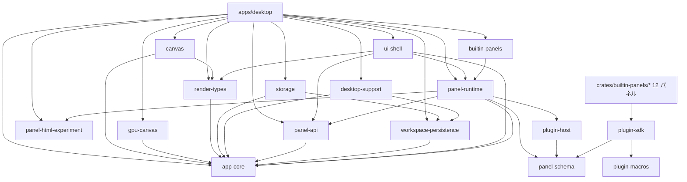
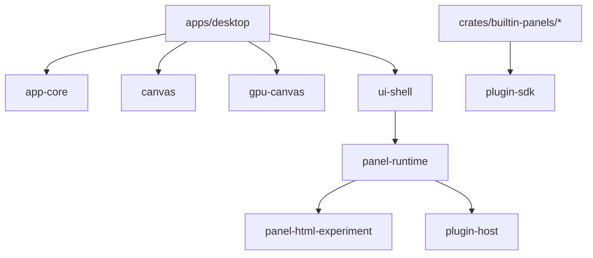

# altpaint モジュール依存関係

## この文書の目的

この文書は、**2026-06-11 時点の実装コードを正本として**、workspace 内のクレートと主要モジュールの依存関係を整理するための文書である。

主に次を明確にする。

- どのクレートがどのクレートへ依存しているか
- 各クレートが実際に何を担当しているか
- ランタイム上でどの経路を通ってデータとイベントが流れるか
- 今後 `ARCHITECTURE.md` や `ROADMAP.md` を読む前提として、どこが「現実の実装」か

この文書は理想図ではなく、**今のコードの実態整理**を優先する。

## 読み方

まず compile-time 依存を見る。
その後、起動・描画・パネル・保存の runtime flow を見る。

重要な前提は次の3点である。

1. `app-core` がドメインの中心である
2. `apps/desktop` がデスクトップ実行ホストである
3. パネル系は `panel-api` / `panel-schema` / `plugin-host` / `plugin-sdk` / `panel-html-experiment` / `panel-runtime` / `builtin-panels` / `ui-shell` に分散している

## workspace パッケージ一覧

2026-06-11 時点の workspace package は次の通り（計 29 メンバー）。

### 中核クレート

- `app-core`
- `canvas`
- `gpu-canvas`
- `render-types`
- `storage`
- `desktop-support`
- `panel-api`
- `ui-shell`
- `workspace-persistence`
- `plugin-host`
- `panel-schema`
- `plugin-macros`
- `plugin-sdk`
- `panel-html-experiment`
- `panel-runtime`
- `builtin-panels`（ローダ umbrella crate）
- `apps/desktop`

補足:

- `crates/gpu-canvas` は Phase 8 で追加済みである（GPU ペイント compute shader）。
- `crates/render-types` は Phase 9B で追加済みである（純データ DTO）。旧 `crates/render` は Phase 9F で物理削除済み。
- `crates/panel-dsl` は Phase 10（ADR 012）で `.altp-panel` DSL ごと削除済み。
- `panel-api` / `plugin-sdk` を正面名とし、proc-macro は `plugin-macros` として物理分離する。

### 組み込みパネル crate（`crates/builtin-panels/` 配下、12 個）

- `crates/builtin-panels/app-actions`
- `crates/builtin-panels/workspace-presets`
- `crates/builtin-panels/tool-palette`
- `crates/builtin-panels/view-controls`
- `crates/builtin-panels/panel-list`
- `crates/builtin-panels/layers-panel`
- `crates/builtin-panels/color-palette`
- `crates/builtin-panels/pen-settings`
- `crates/builtin-panels/job-progress`
- `crates/builtin-panels/snapshot-panel`
- `crates/builtin-panels/text-flow`
- `crates/builtin-panels/workspace-layout`（Phase 12 追加）

## compile-time 依存関係

### クレート依存グラフ


```mermaid
graph TD
    desktop[apps/desktop] --> appcore[app-core]
    desktop --> canvas[canvas]
    desktop --> gpucanvas[gpu-canvas]
    desktop --> rendertypes[render-types]
    desktop --> panelruntime[panel-runtime]
    desktop --> phtml[panel-html-experiment]
    desktop --> uishell[ui-shell]
    desktop --> panelapi[panel-api]
    desktop --> builtinpanels[builtin-panels]
    desktop --> storage[storage]
    desktop --> dsupport[desktop-support]
    desktop --> wpersist[workspace-persistence]

    canvas --> appcore
    canvas --> rendertypes
    gpucanvas --> appcore
    rendertypes --> appcore
    storage --> appcore
    storage --> wpersist
    dsupport --> appcore
    dsupport --> wpersist
    panelapi --> appcore
    wpersist --> appcore

    uishell --> appcore
    uishell --> panelapi
    uishell --> panelruntime
    uishell --> rendertypes

    panelruntime --> appcore
    panelruntime --> panelapi
    panelruntime --> pschema[panel-schema]
    panelruntime --> phost[plugin-host]
    panelruntime --> phtml

    builtinpanels --> panelruntime

    phost --> pschema
    pluginsdk[plugin-sdk] --> pmacros[plugin-macros]
    pluginsdk --> pschema

    panels[crates/builtin-panels/* 12 パネル] --> pluginsdk
```

### 依存関係の要点

- `app-core` は workspace 内の土台であり、ローカル依存を持たない
- `canvas` / `gpu-canvas` / `render-types` / `panel-api` / `workspace-persistence` は `app-core` 系の周辺クレートである
- `canvas` は `render-types` の view mapping API を使うが、project I/O や panel runtime へは依存しない
- `gpu-canvas` は `wgpu` に依存する唯一のペイント実装クレートで、`app-core` 以外のローカル依存を持たない
- `panel-html-experiment` はローカル依存を持たず、Blitz / taffy / vello / wgpu に閉じた HTML パネルエンジンである
- `panel-runtime` が現在の panel runtime 統合点であり、`BuiltinPanelPlugin`（HTML+Wasm）・host sync・hit 収集を持つ
- `ui-shell` は `panel-runtime` に依存する presentation crate である
- `plugin-host` は `panel-runtime` の内側で使われ、`apps/desktop` は直接依存していない
- `plugin-sdk` は plugin author 向け表面 API であり、macro と DOM mutation API を含む唯一の作者向け入口である
- 各パネル crate（`crates/builtin-panels/*`）は `plugin-sdk` のみに依存する。ローダ umbrella の `builtin-panels` は `panel-runtime` に依存する

## 将来の配置判断用メモ

この節は**現状の compile-time 依存ではなく、今後の責務移動先を固定するためのメモ**である。


```mermaid
graph TD
  desktop[apps/desktop] --> appcore[app-core]
  desktop --> canvas[canvas]
  desktop --> gpucanvas[gpu-canvas]
  desktop --> uishell[ui-shell]
  uishell --> panelruntime[panel-runtime]
  panelruntime --> phtml[panel-html-experiment]
  panelruntime --> phost[plugin-host]
  panels[crates/builtin-panels/*] --> pluginsdk[plugin-sdk]
```

| 論理名          | 置く責務                                              | 置かない責務                                  |
| --------------- | ----------------------------------------------------- | --------------------------------------------- |
| `desktopApp`    | event loop、OS I/O、GPU 所有、subsystem orchestration | canvas op、panel runtime 詳細、project 意味論 |
| `app-core`      | pure state、`Document`、`Command`                     | desktop / `wgpu` / `plugin-host` 依存         |
| `render-types`  | frame plan、dirty rect、座標変換の純データ計算        | GPU 実装、project / workspace I/O             |
| `gpu-canvas`    | ブラシ / 塗り / 合成の GPU compute 実装               | dispatch 判断、document 意味論                |
| `canvas`        | gesture 解釈、tool runtime、bitmap op                 | panel runtime                                 |
| `ui-shell`      | panel presentation、host facade                       | Wasm runtime 詳細                             |
| `panel-runtime` | HTML/Wasm runtime sync、hit 収集                      | panel surface のウィンドウ配置                |
| `plugin-sdk`    | plugin 作者向け API（DOM mutation 含む）              | host 内部型の露出                             |

## クレート別の実責務

### `app-core`

担当:

- `Document` / `Work` / `Page` / `Panel` / `RasterLayer` などのドメインモデル
- `Command` による状態変更入口
- `CommandHistory`（undo/redo）
- キャンバス編集、レイヤー操作、表示変換、色、ペンプリセット状態
- `WorkspaceLayout` とパネル可視性の保存対象モデル

主要モジュール:

- `command.rs`
- `document.rs`（+ `document/{bitmap,layer_ops,pen_state}.rs`）
- `history.rs`
- `paint_params.rs`
- `painting.rs`
- `workspace.rs`
- `coordinates.rs`
- `error.rs`

依存しないもの:

- `winit`
- `wgpu`
- Wasm ランタイム

補足:

- `PaintPluginContext` や `BitmapEdit` などの共有 primitive は持つが、paint context の具体的な組み立ては `canvas` 側へ移した

### `canvas`

担当:

- `CanvasRuntime`
- `CanvasInputState`
- `advance_pointer_gesture(...)` による input state machine
- `build_paint_context(...)` による `Document` 読み取り文脈の構築
- built-in bitmap paint plugin
- stamp / stroke / flood fill / lasso fill / composite / text
- GPU dispatch 用の `compute_stamp_positions`
- view-to-canvas 変換と panel rect preview bridge

主要モジュール:

- `runtime.rs`
- `context_builder.rs`
- `gesture.rs`
- `input_state.rs`
- `view_mapping.rs`
- `render_bridge.rs`
- `registry.rs`
- `plugins/builtin_bitmap.rs`
- `ops/*`

### `gpu-canvas`（Phase 8 追加）

担当:

- `GpuCanvasPool` / `GpuLayerTexture`（レイヤーテクスチャの upload / readback）
- `GpuPenTipCache`
- `GpuBrushDispatch`（stamp / stroke / erase）
- `GpuFillDispatch`（flood fill / lasso fill）
- `GpuLayerCompositor`（レイヤー合成）
- `src/shaders/` の 8 WGSL compute shader

依存の特徴:

- ローカル依存は `app-core` のみ。`wgpu` 依存はこのクレートと `panel-html-experiment` / `apps/desktop` に限られる
- Phase 9A で feature gate を撤廃し、`apps/desktop` の必須依存になった

### `render-types`（Phase 9B 追加）

担当:

- 純データ DTO 専用クレート（wgpu / fontdb / panel-api 非依存、`app-core` のみ依存）
- `PixelRect` / `TextureQuad` / `CanvasScene` / `prepare_canvas_scene`
- `FramePlan` / `CanvasPlan` / `PanelPlan` / `LayerGroupDirtyPlan`
- `CanvasOverlayState` / `PanelNavigatorOverlay` / `PanelNavigatorEntry`
- dirty rect の union 計算、ブラシ preview dirty / 露出背景 / 座標変換などの純粋計算

意味:

- GPU 経路（`gpu-canvas` / `wgpu_canvas.rs`）への入力 DTO
- 旧 `crates/render` は Phase 9F で物理削除済み。`RenderFrame` 後継は `apps/desktop/src/app/canvas_frame.rs::CanvasFrame`（詳細は `docs/adr/010-render-crate-removal.md`）

### `panel-api`

担当:

- `PanelPlugin` trait（`handle_event` / `handles_keyboard_event` / `persistent_config` 等）
- `PanelEvent`（`Activate` / `SetValue` / `DragValue` / `SetText` / `Keyboard`）
- `HostAction`（`DispatchCommand` / `RequestService` / `InvokePanelHandler` / `MovePanel` / `SetPanelVisibility`）
- `ResizeEdge`（8 ハンドルリサイズ）
- `ServiceRequest` と service 名定数

意味:

- `Command` をパネルから直接返すのではなく、`HostAction` を経由するための境界
- `PanelTree` / `PanelNode` / `PanelView` は Phase 12（ADR 014）で撤去済み

### `panel-schema`

担当:

- host と Wasm runtime 間でやりとりする DTO
- `PanelInitRequest/Response`
- `PanelEventRequest`
- `HandlerResult`
- `StatePatch` / `StatePatchOp`
- `CommandDescriptor`
- `Diagnostic`

### `plugin-macros`

担当:

- `#[panel_init]`
- `#[panel_handler]`
- `#[panel_sync_host]`

意味:

- plugin author が `extern "C"` や export 名を直接書かなくても済むようにする proc-macro 層
- plugin 作者は通常この crate を直接依存せず、`plugin-sdk` から使う

### `plugin-sdk`

担当:

- plugin author 向け安定表面 API
- typed `commands::*` / `services::*` / `state::*`
- host snapshot accessor（`host.rs`）
- DOM mutation API（`dom.rs`: `query_selector` / `set_attribute` / `set_inner_html` 等 — Phase 10）
- runtime helper
- `plugin-macros` の再 export

意味:

- plugin 側は `panel-schema` の DTO と ABI 事情を直接知らなくても実装できる
- 物理的には別 crate だが、論理的には `plugin-macros` を含む authoring surface である

### `plugin-host`

担当:

- `wasmtime`（cache feature 有効、共有 `Engine`）ベースの `WasmPanelRuntime`
- host import の定義（state / host_get / event_get / command / diagnostic 系）
- DOM mutation host functions（`dom_api.rs`: Blitz `DocumentMutator` を Wasm に公開 — Phase 10）
- Wasm memory 読み書き
- `panel_init` / `panel_handle_event` / `panel_sync_host` / `panel_handle_keyboard` の橋渡し

重要事項:

- 現時点では panel runtime 専用であり、一般的 plugin host 全体にはまだ広がっていない
- ローカル依存は `panel-schema` のみ。`blitz-dom` / `blitz-html` に外部依存する

### `panel-html-experiment`

担当:

- `HtmlPanelEngine`: Blitz による HTML/CSS パース・taffy レイアウト・vello による GPU 直描画
- `resolve_action_rects`: GPU 非依存のレイアウト解決と hit 矩形収集（Phase 13）
- `PanelSizeConstraints`: CSS min/max 由来のリサイズクランプ（Phase 11）
- `ActionDescriptor` / `parse_data_action`: `data-action` 属性のパース
- `PanelGpuTarget`: パネル毎の GPU テクスチャターゲット

依存の特徴:

- workspace ローカル依存なし
- 名前は experiment のままだが、Phase 9E 以降パネル描画の唯一の正式経路である

### `panel-runtime`

担当:

- `PanelRuntime`: panel registry、dirty panel 管理、event / keyboard dispatch、GPU frame 管理、`collect_panel_hits`
- `BuiltinPanelPlugin`: `HtmlPanelEngine` + `WasmPanelRuntime` を束ねる唯一のパネル実装
- `host_sync.rs`: `HostSnapshotCache` による差分シリアライズと host snapshot 同期
- `config.rs`: panel persistent config の収集 / 復元
- `meta.rs`: `panel.meta.json`（`default_size` 必須）のパース

実装上の特徴:

- DSL 時代の `dsl_loader.rs` / `dsl_panel.rs` / `dsl_to_html.rs` は Phase 10〜12 で削除済み
- hit / move handle / full rect テーブルの収集は GPU 非依存で、headless テストでも実経路で検証できる（Phase 13）

### `builtin-panels`

担当:

- `register_builtin_panels(runtime, assets_root)` による 12 パネルの一括登録（`loader.rs`）
- 各パネルディレクトリ（`panel.html` + `panel.css` + `panel.meta.json` + `.wasm`）の読込

依存ルール:

- umbrella crate は `panel-runtime` に依存する
- 各パネル crate は compile-time では `plugin-sdk` にのみ依存し、host の内部型へ直接依存しない

### `ui-shell`

担当:

- panel presentation の中心
- workspace layout（4 隅アンカー、move / visibility / resize）
- HTML panel hit-test（`html_panel_hit_at` / `panel_resize_hit_at` / move handle）
- focus 管理
- panel surface の構築（`render_panel_surface`）
- scroll offset 管理

実装上の特徴:

- runtime（Wasm 実行・host sync）は持たない。`panel-runtime` が runtime 側の正本である
- DSL 時代の `tree_query.rs` / `TextInputEditorState` / winit IME 編集経路は Phase 12 で削除済み

### `workspace-persistence`

担当:

- `WorkspaceUiState`（`workspace_layout` + `plugin_configs`）
- `PluginConfigs`（`BTreeMap<String, Value>`）

意味:

- project 保存と session 保存で共有する UI 永続化 DTO
- ownership は `storage` / `desktop-support` に残したまま、重複したシリアライズ形だけを共通化する

### `storage`

担当:

- SQLite ベース project save/load（`rusqlite` bundled）
- `format_version` 管理
- page / panel 単位の部分読込、layer chunk 保存（`rmp-serde` + `zstd`）
- current panel snapshot 永続化
- PNG export
- ペンプリセット読込と import/export
- `tools/` カタログ読込

主要モジュール:

- `project_file.rs`
- `project_sqlite.rs`
- `pen_exchange.rs` / `pen_format.rs` / `pen_presets.rs`
- `tool_catalog.rs`
- `export.rs`

### `desktop-support`

担当:

- 配色・寸法・既定パスなどの desktop config（`default_panel_dir()` は `crates/builtin-panels` を指す）
- native dialog 境界
- session save/load
- runtime profiler
- canvas template 読込
- workspace preset catalog の読込 / 保存

主要モジュール:

- `config.rs`
- `dialogs.rs`
- `session.rs`
- `profiler.rs`
- `templates.rs`
- `workspace_presets.rs`

### `apps/desktop`

担当:

- `winit` の event loop
- `wgpu` presenter（`WgpuPresenter` + solid / circle / line quad パイプライン）
- GPU ペイントリソースの所有と dispatch（`GpuCanvasPool` / `GpuBrushDispatch` / `GpuFillDispatch` / `GpuLayerCompositor` / `GpuPenTipCache`）
- canvas pointer input から `Command` / `PaintInput` への変換
- `DesktopApp` による状態遷移と副作用統合
- `PresentScene`（背景 / canvas / overlay / panel / status quad）の組み立てと提示

主要モジュール:

- `main.rs`
- `runtime.rs`（+ `runtime/{pointer,keyboard}.rs`）
- `app/mod.rs`
- `app/commands.rs`
- `app/input.rs`
- `app/present.rs`
- `app/canvas_frame.rs`
- `app/services/*`
- `frame/{mod,geometry,solid_quad,overlay_quad,status_panel}.rs`
- `wgpu_canvas.rs`

### `crates/builtin-panels/*`（12 パネル）

担当:

- 各 built-in panel の Wasm runtime 実装（DOM mutation handler）
- `panel.html` / `panel.css` / `panel.meta.json` と対になる handler 群

依存ルール:

- compile-time では `plugin-sdk` にのみ依存する
- host の内部型へ直接依存しない

## モジュール単位の見取り図

### 1. デスクトップホスト側

```text
apps/desktop/main.rs
  -> runtime.rs
     -> app/mod.rs
        -> app/commands.rs
        -> app/input.rs
        -> app/present.rs
        -> app/services/*
     -> frame/mod.rs (+ solid_quad / overlay_quad / status_panel)
     -> wgpu_canvas.rs

crates/canvas/src/lib.rs
  -> runtime.rs
  -> context_builder.rs
  -> gesture.rs
  -> view_mapping.rs
  -> plugins/builtin_bitmap.rs
  -> ops/*

crates/gpu-canvas/src/lib.rs
  -> gpu.rs (pool / pen tip cache)
  -> brush.rs / fill.rs / composite.rs
  -> shaders/*.wgsl
```

役割分担:

- `runtime.rs`: OS イベント、再描画サイクル、`PresentScene` 組み立て
- `app/*`: 状態変化と副作用、GPU dispatch
- `crates/canvas/src/*`: gesture / runtime / bitmap op / view mapping
- `crates/gpu-canvas/src/*`: ブラシ / 塗り / 合成の compute shader 実行
- `frame/*`: desktop レイアウトと quad DTO、ステータスバー
- `wgpu_canvas.rs`: 実 GPU 提示

### 2. パネルランタイム側

```text
crates/builtin-panels/<name>/{panel.html, panel.css, panel.meta.json, *.wasm}
  -> builtin-panels::register_builtin_panels
  -> panel-runtime::BuiltinPanelPlugin
     -> panel-html-experiment::HtmlPanelEngine (Blitz + vello)
     -> plugin-host::WasmPanelRuntime (wasmtime + dom_api)
  -> panel-schema DTO
  -> panel-api::PanelEvent / HostAction
```

役割分担:

- `builtin-panels`: パネル資産の発見と一括登録
- `panel-html-experiment`: HTML/CSS のレイアウト解決・GPU 描画・hit 矩形収集
- `plugin-host`: Wasm handler 呼び出しと DOM mutation host functions
- `panel-runtime`: state と host snapshot を渡し、結果を `HostAction` と DOM 更新に変換

### 3. 永続化側

```text
DesktopApp
  -> (保存前) services/gpu_sync.rs::sync_gpu_bitmaps_to_cpu
  -> storage::save_project_to_path / load_project_from_path
  -> Document + WorkspaceUiState

DesktopApp
  -> desktop-support::save_session_state / load_session_state
```

project file と session file は役割が異なる。

- project file: 作品状態 + workspace layout + panel config
- session file: 最後に開いた project と desktop session の補助状態

## runtime flow

### 起動フロー

1. `main.rs` が `DesktopRuntime::run(...)` を呼ぶ
2. `DesktopRuntime` が `DesktopApp::new(...)` を構築する
3. `apps/desktop/src/app/bootstrap.rs` が session / project / workspace preset を解決し、`PanelRuntime` / `PanelPresentation` と `Document` の初期状態を組み立てる
4. `register_builtin_panels(&mut panel_runtime, &default_panel_dir())` が `crates/builtin-panels/` 配下 12 パネルをロードし、各 `BuiltinPanelPlugin` が HTML と Wasm runtime を初期化する
5. パネルサイズは `panel.meta.json::default_size` を初期値に、workspace 永続値で上書きされる
6. `DesktopRuntime` が `winit` window と `wgpu` presenter を用意し、`install_gpu_resources` が GPU ペイントリソースを構築して全レイヤーを GPU テクスチャへ同期する

### キャンバス編集フロー

1. OS pointer event が `runtime.rs` に届く
2. `DesktopApp::handle_pointer_*` が panel/canvas を振り分ける
3. `canvas::view_mapping` が view 座標を canvas 座標へ変換する
4. `canvas::gesture` が down / drag / up を `PaintInput` や panel rect preview へ変換する
5. `services/project_io.rs::execute_paint_input` が `canvas::CanvasRuntime` で `BitmapEdit` 差分（dirty rect の典拠）を計算する
6. `GpuBrushDispatch` / `GpuFillDispatch` が compute shader で GPU レイヤーテクスチャへ直接書き込み、`GpuLayerCompositor` が合成する（ストローク中は CPU bitmap を書き換えない）
7. dirty rect / transform 更新 / UI 再同期要求は `apps/desktop/src/app/present_state.rs` に蓄積される
8. `prepare_present_frame(...)` が dirty panel sync・hit テーブル更新・差分計画を組み立てる
9. `wgpu_canvas.rs` が `PresentScene` を提示する

### パネルイベントフロー

1. pointer / keyboard event が `DesktopApp` に届く
2. `apps/desktop/src/app/panel_dispatch.rs` が hit テーブル（`PanelRuntime::collect_panel_hits` が `prepare_present_frame` で CPU 更新）を使って panel hit-test / drag / resize / host action 適用を中継する
3. 対象 panel へ `PanelEvent` が forward され、`BuiltinPanelPlugin::handle_event(...)` が呼ばれる
4. `plugin-host` を通じて Wasm handler（`panel_handle_event` / `panel_handle_keyboard`）を実行する。handler は DOM mutation host functions で自パネルの DOM を更新できる
5. `StatePatch` を panel local state に適用する
6. `CommandDescriptor` を `HostAction::DispatchCommand(...)` または `HostAction::RequestService(...)` へ変換する
7. `apps/desktop/src/app/panel_dispatch.rs` の `DesktopApp::execute_host_action(...)` が `Command` または host service handler を実行する
8. `HtmlPanelEngine` が vello で GPU テクスチャへ再描画し、`wgpu_canvas` が `panel_quads` 層で合成する

### 保存・読込フロー

1. `apps/desktop/src/app/command_router.rs` が保存/読込 command を service request へ正規化する
2. 保存前に `services/gpu_sync.rs` が GPU テクスチャを readback して `Document` の CPU bitmap を最新化する
3. `apps/desktop/src/app/background_tasks.rs` が project save task を起動または回収する
4. project 保存は `storage` へ委譲する
5. workspace layout は `PanelPresentation`、plugin config は `PanelRuntime` から取り出して一緒に保存する
6. session 保存は `apps/desktop/src/app/io_state.rs` 経由で `desktop-support` へ委譲する

## 現在の境界で重要なこと

### `app-core` は依然として最重要の安定境界

今後クレートを増やしても、以下は維持したい。

- `Document` と `Command` は `app-core` に置く
- UI や GPU の型を `app-core` に入れない
- 保存形式と panel runtime は `app-core` の外側に置く

### `panel-runtime` と `ui-shell` の現在境界

現実のコードでは、責務は次のように分かれている。

- `panel-runtime`: panel registry、HTML/Wasm runtime bridge、host sync、config persistence、hit 収集
- `ui-shell`: workspace layout / hit-test 結果の利用 / focus / panel surface

そのため、現在は `panel-runtime` を runtime 側の正本、`ui-shell` を presentation 側の正本として読むのが実態に近い。

### GPU ペイントの dispatch 判断は `apps/desktop` 側にある

`gpu-canvas` は compute shader の実装を持つが、次は `apps/desktop` 側にある。

- どの入力で GPU dispatch するかの判断（`services/project_io.rs::execute_paint_input`）
- GPU リソースの所有と初期化（`app/mod.rs::install_gpu_resources`）
- 保存前 readback の起動（`services/gpu_sync.rs`）

従って、ペイント経路を読むときは「実装は `gpu-canvas` 側」「結合と判断は `apps/desktop` 側」という二層で理解する必要がある。

## 今後も守るべき依存ルール

1. `app-core` に `winit` / `wgpu` / `wasmtime` を入れない
2. `app-core` から `apps/desktop` / `plugin-host` を参照しない
3. `crates/builtin-panels/*` のパネル crate から host 内部クレートへ直接依存させない（`plugin-sdk` のみ）
4. panel の ABI DTO は `panel-schema` に閉じ込める
5. desktop 固有の I/O や dialog は `desktop-support` に寄せる
6. project 永続化は `storage`、session 永続化は `desktop-support` に分ける
7. `apps/desktop` だけが OS window と GPU presenter を所有する
8. `render-types` に project / workspace I/O の意味論や GPU 実装を入れない
9. `ui-shell` presentation 側へ Wasm runtime 詳細を持ち込まない
10. `canvas` に panel runtime を入れない

## リファクタリング候補

実装を読んだ結果、次は整理候補になる。

1. `execute_paint_input`（`services/project_io.rs`）内の CPU 差分計算と GPU dispatch の分離
2. `panel-html-experiment` の正式名称化（experiment ではなく正式経路である）
3. `panel-api` が `app-core::Command` を直接知っている点の再評価
4. tool 実行 plugin と host runtime の安定境界の確立

ただし、これらは**今そうなっている**という意味ではない。現時点の正本は、上記 compile-time 依存と runtime flow である。
