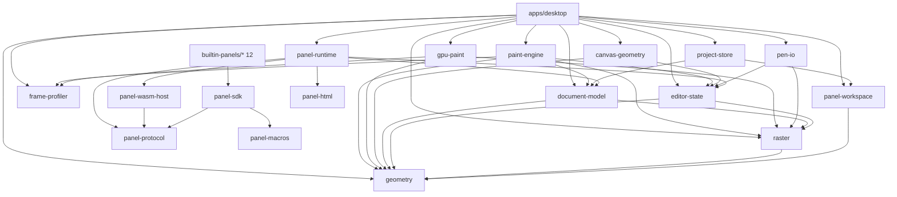

# altpaint 大規模リファクタリング設計書

- 作成日: 2026-06-12
- 作成 Agent: Claude Fable 5 (claude-fable-5[1m])
- 入力: 19 エージェント全クレート調査 (`.context/survey-results-2026-06-12.json` 相当の調査出力)、`docs/MODULE_DEPENDENCIES.md`、`docs/ARCHITECTURE.md`、実コード確認
- ベースライン: cargo test --workspace 415 passed / 0 failed / 8 ignored、clippy 警告 0
- 前提制約: Rust 2024 workspace / 各バッチ終了時に全テストパス + clippy 0 / 後方互換コード禁止 (alpha) / OS 固有コード禁止 / 挙動変更は TDD
- 注記: 本書に記載のファイル行数は 2026-06-12 調査時点の実測値。根拠の規模感を示す目安であり、以後のコミットでずれても結論には影響しない

---

## 1. 目標アーキテクチャ

### 1.1 設計原則

1. **水平の土台 = 全 feature が共有する純粋な語彙と機構のみ**。feature 固有の知識 (パネル ID、コマンド名、config キー、UI 文言) を土台に置かない。**唯一の例外は wire 名定数**: Wasm 境界の共有契約点として panel-protocol の feature 別 `names` モジュールに置く (§1.6、不変条件 3。この例外の理由は ADR = BL-164 に記録)。
2. **垂直 feature = 「契約 + ホスト側ハンドラ + 状態 + UI パネル + テスト」を 1 スライスで所有**。新 feature 追加時に水平ファイルの横断編集を不要にする。例外は原則 1 の wire 名定数のみ: 新 feature は panel-protocol に自分の `names::<feature>` モジュールを **additive に追加するだけ**で、既存モジュールの横断編集は発生しない。
3. **1 クレート = 1 責務**。寄せ集めクレート (`desktop-support`、現 `storage`、現 `app-core`) は解体する。
4. **名前は単独で責務が誤解なく伝わること**。`support` / `core` / `util` / 多義語 (`panel` / `runtime` / `scene` / `snapshot`) を排除する。
5. ARCHITECTURE.md の基本理念「性能要求の高いものは host、それ以外は plugin」は維持する。本リファクタは「host = 水平土台」「plugin (パネル) = 垂直 feature」の物理構造をそれに一致させる作業である。

### 1.2 用語体系 (改名の基盤。全改名はこの表に従う)

| 用語 | 意味 | 禁止される用法 |
| --- | --- | --- |
| **koma** / `Koma` | 漫画のコマ (ドメイン)。旧 `app_core::Panel` | コマを panel / frame と呼ぶこと |
| **panel** | ワークスペース上の UI パネル (HTML+Wasm) 専用 | コマの意味で使うこと |
| **page** | 作品のピクセル空間 (描画対象座標系) | — |
| **canvas** | キャンバスの**表示面** (ビューポート上の見え方) | ペイント演算エンジンの意味 (旧 canvas クレート) |
| **paint** | 描画入力の解釈・差分生成・GPU 実行 | — |
| **frame** | 提示 (presentation) の 1 描画フレームのみ | コマの意味で使うこと |
| **plugin** | 予約語。現行コードでは使用しない (パネル系は panel-、描画バックエンドは backend) | `PaintPlugin` / `plugin-host` 等 |
| **host state** | ホスト→パネルへ配る状態 JSON (旧 host snapshot) | snapshot と呼ぶこと |
| **snapshot** | `DocumentSnapshot` (ユーザー向けドキュメント快照機能) 専用 | host state / SQLite 合成キャッシュ / プロファイラ統計 |
| **runtime** | `panel-runtime` (パネル実行統括) 専用 | `CanvasRuntime` / `DesktopRuntime` / `WasmPanelRuntime` |
| **session** | エディタの一過性編集状態 (ツール/色/ビュー) | 作品データに混ぜること |

### 1.3 最終クレート構成

```text
[水平土台 — 純粋語彙・機構]
  geometry          座標系 (Window/CanvasViewport/Page/KomaLocal/PanelSurface) と矩形・dirty rect 演算
  raster            RgbaBitmap、ブレンド (単一実装)、ラスタライズプリミティブ、BitmapEdit
  document-model    Work → Page → Koma → RasterLayer、DocumentCommand、不変条件、コマグリッドレイアウト
  editor-state      EditorSession (active tool/pen/color/view)、ToolDefinition/PenPreset 型、SessionCommand
  canvas-geometry   CanvasViewGeometry (旧 CanvasScene)、view↔page 座標写像、TextureQuad
  frame-profiler    フレーム/入力レイテンシ計測 (整形・表示責務なし)。クレート化の根拠: B8 の
                    encoder 集約 (BL-133) 等の効果計測で gpu-paint / paint-engine 内部に計測点を
                    挿す必要があり、desktop 内モジュールでは下層→desktop の逆依存になるため、
                    循環依存なしに全層から参照できる水平土台に置く

[パネル基盤 — 水平 (feature 非依存)]
  panel-protocol    ABI 定数・wire 名定数 (feature 別モジュール)・StatePatch+適用・RequestDescriptor・HostState DTO
  panel-wasm-host   wasmtime 実行器 + host functions (state/host_state/request/dom の register モジュール群)
  panel-html        HTML/CSS → layout → vello Scene → GPU テクスチャ、data-action 矩形収集
  panel-runtime     パネル registry・dirty 追跡・イベント dispatch・HostState section 合成・translator registry・loader
  panel-workspace   パネル配置 (WorkspaceLayout)・focus・hit/move/resize ジオメトリ (旧 ui-shell + app-core::workspace)
  panel-sdk         パネル作者向け水平 API (abi/dom/state/shortcut/テストマクロ + panel-protocol 再公開)
  panel-macros      panel_init / panel_handler / panel_on_host_change proc-macro

[垂直 feature クレート]
  paint-engine      ジェスチャ解釈、ペイント文脈解決、PaintPlan 生成、CPU 参照実装 (旧 canvas)
  gpu-paint         LayerTextureStore + brush/fill/composite パイプライン + snapshot/readback (旧 gpu-canvas)
  project-store     SQLite プロジェクト永続化 (chunk codec / manifest 含む)
  pen-io            ペン形式 (.altp-pen / ABR / SUT / GBR) 相互変換 + pens/ ロード

[アプリ]
  apps/desktop (package: altpaint-desktop, bin: altpaint)
    src/event_loop.rs        winit イベントポンプ (旧 runtime.rs、薄く)
    src/presenter/           WgpuPresenter + PresentFrame + シェーダ (旧 wgpu_canvas.rs を分割)
    src/platform/            dialogs (旧 desktop-support::dialogs)、dirs ベースのパス解決
    src/app/                 composition root (DesktopApp = 配線のみ) + present パイプライン
    src/features/            垂直スライス群:
      paint/        PaintBackend (Cpu/Gpu)、EditHistory + 型付き patch、undo/redo、GPU 同期
      project/      save/load/背景保存ジョブ、セッション永続化
      export/       PNG 書き出し (旧 storage::export)
      workspace/    プリセット catalog + workspace_layout service + config 注入
      tools/        tool catalog ロード (旧 storage::tool_catalog)、ペン import 報告
      koma/         コマ作成ジェスチャ・ナビゲーション (koma_nav)
      view/         zoom/pan/rotate (相対コマンド + clamp ポリシー)、ビュー慣性アニメーション
      snapshots/    DocumentSnapshotStore
      text/         テキストラスタライズ (font8x8、旧 canvas::ops::text)
      panel_interaction/  パネル drag/resize/press、カーソル
      status_bar/   ステータスバー (旧 frame::status_panel)

[ビルトインパネル 12 個] (各 = 完結した垂直スライス)
  app-actions / color-palette / job-progress / layers (旧 layers-panel) /
  koma-list (旧 panel-list) / tool-settings (旧 pen-settings) / snapshots (旧 snapshot-panel) /
  text-flow / tool-palette / view-controls / workspace-layout / workspace-presets
```

### 1.4 依存方向 (compile-time)



註: 本図は直接依存の主要エッジを示す参考図であり、エッジ集合の完全一致検証は行わない (desktop→panel-protocol 等、再公開経由か直接依存かが実装時に決まるエッジがあるため)。機械検証は §5.2-4 の禁止依存の不在チェック (否定形) で行う。

守るべき不変条件 (現行ルールを更新):

1. `geometry` / `raster` / `panel-protocol` はローカル依存ゼロ (panel-protocol は serde / serde_json のみ。StatePatch 適用と JSON payload 処理に serde_json は必須)。
2. `document-model` / `editor-state` に wgpu / winit / wasmtime / blitz を入れない。
3. パネル基盤 (panel-*) はドメイン feature の語彙 (tool/layer/koma の wire 名の**意味**) を知らない。wire 名定数の**置き場**は panel-protocol の feature 別モジュールだが、解釈はホスト側 feature が登録する translator が行う。
4. ビルトインパネルは `panel-sdk` のみに依存。
5. `apps/desktop` だけが OS window と GPU presenter を所有。
6. GPU 描画原則 (編集中の CPU→GPU ビットマップ転送禁止) は維持。

### 1.5 描画パイプライン再設計 (目標形)

現状の問題: `execute_paint_input` が CPU で全画素の `BitmapEdit` を生成し、GPU 経路では dirty rect だけ取り出して画素を捨てる。筆圧カーブが context 解決時と stamp 時に二重適用され CPU/GPU で線幅が乖離する。GPU dispatch 判断・パラメータ組立が desktop に漏れている。

目標形 (3 段分離):

```text
[1] paint-engine: 解釈と計画 (純データ、画素なし)
    pointer gesture ──> PaintInput ──> resolve_paint_context (筆圧→実効サイズはここで 1 回だけ解決)
                                  ──> PaintPlan
                                        ├ Stroke { stamps: Vec<StampPoint>, radius, color, mode: StrokeMode }
                                        ├ FloodFill { seed: PagePoint, color, target_layer }
                                        ├ LassoFill { polygon, color, target_layer }
                                        └ dirty: PageDirtyRect (計画段階で確定)

[2] PaintBackend trait (desktop features/paint が実装を所有)
    trait PaintBackend {
        fn apply(&mut self, plan: &PaintPlan, target: &PaintTarget) -> AppliedPaint;
        fn begin_stroke / commit_stroke -> PaintPatch;   // 履歴用 before/after
    }
    GpuPaintBackend: gpu-paint の BrushPipeline/FillPipeline へ機械的に変換し dispatch。
                     編集中に CPU 画素を一切生成しない (flood fill の visited 配列も廃止)。
    CpuPaintBackend: paint-engine の CPU ops を呼ぶ参照実装・テスト用 + GPU 不在時の表示フォールバック。
                     旧 CanvasFrame (CpuCanvasSnapshot) はこの表示経路に統合する (GPU 必須化はしない = BL-136)。
                     CPU/GPU 同一 plan 同一結果のゴールデンテストで等価性を担保。

[3] 履歴: PaintPatch は enum { Cpu(BitmapPatch), Gpu(GpuRegionPatch) } の型付き表現。
    Arc<dyn Any> (OpaqueGpuData) と downcast を全廃。EditHistory は desktop features/paint が所有。
```

gpu-paint 側は dispatch ごとの `queue.submit` をやめ、呼び出し側 encoder に pass を積む API (`dispatch_stroke(&mut encoder, ...)`) に変更し、ストローク区間を 1 submit に集約する。

ツール拡張: ジェスチャ種別・合成モード・サイズ解決を `ToolDescriptor` (editor-state の ToolDefinition から導出) に集約し、`ToolKind` のクローズド match 散在 (現在 4 ファイル 6 箇所以上) を解消する。これが将来の「ツール処理プラグイン」(ARCHITECTURE.md の最終目標) の境界になるが、Wasm ツールプラグイン自体は本リファクタのスコープ外。

### 1.6 パネル (プラグイン) API 再設計 (目標形)

現状の問題: 同一操作の語彙が 3 系統 (`commands::project` / `services::project_io` / `Command` enum)、wire 文字列が 3 箇所に重複定義、command/service の振り分けがホスト側の名前 probe フォールバック、host state が 1 値 1 往復の文字列 ABI、handler 引数が i32 1 個 + `event_string` 暗黙読み。

目標形:

```text
panel-protocol (依存ゼロの単一契約点。「ここを読めばプロトコル全体が分かる」)
  ├ abi:    export 名 (panel_init / panel_handle_* / panel_on_host_change)、
  │         host import 名、DiagnosticLevel↔i32、handler payload 規約
  ├ patch:  StatePatch { Set, Toggle } + apply_patches (唯一の適用実装)
  ├ request: RequestDescriptor { name, payload } (旧 CommandDescriptor。command/service の区別を廃止)
  ├ host_state: セクションキー定数 + 型付き DTO (DocumentState / ToolState / ViewState ...)
  └ names:  feature 別 wire 名モジュール (names::koma_nav / names::layer / names::tool /
            names::project_io / names::workspace / names::view / names::snapshot / ...)

パネル側 (panel-sdk):
  emit_request(&RequestDescriptor) の単一発行 API (emit_command/emit_service/各 descriptor 版の 4 関数を統合)。
  handler は typed payload (serde Deserialize 構造体 1 個) を受ける。event_string 暗黙読みを廃止。
  dom: set_text / set_visible / set_button_active / set_slider / render_options / render_action_list
       (escape 内蔵) を水平ヘルパとして提供し、12 パネルのコピペを置換。
  state: session::* (一時) / config::* (永続) の 2 層型付きキー。素キー廃止。型付きキーは get/set を持つ。
  shortcut: capture→割当→マッチの状態機械を SDK レジストリ化 (tool-palette / app-actions の二重実装を置換)。

ホスト側 (panel-runtime):
  translator registry: 名前空間 prefix ("koma_nav." 等) ごとに desktop の feature が
  RequestDescriptor → DocumentCommand | SessionCommand | ServiceRequest 変換器を登録。
  巨大 match (commands.rs 381 行) を廃止。未登録名は diagnostics 経由でログに出す (黙殺禁止)。

  HostState section registry: feature が SnapshotSection { key, build(&Document,&EditorSession),
  revision() } を登録し、panel-runtime は合成とキャッシュ枠組みのみ持つ。
  キャッシュ無効化は内容 revision ベース (現状の件数+index キーは stale 配信バグの原因)。
  パネルは meta.json で購読セクションを宣言し、購読セクションの revision が変わった時のみ再 render。

diagnostics: HandlerEffects (旧 HandlerResult) の diagnostics を panel-runtime が log/tracing へ
必ず流す。パネル内エラーの黙殺を廃止。
```

---

## 2. 改名表

凡例: 種別 = crate / type / module / fn / field / term。波及範囲 = 主な修正対象。確信度 low の調査提案には採否理由を付す。

### 2.1 用語決定: コマ = `Koma` (最重要決定)

調査では `Frame` (4 エージェント)、`Koma` (横断調査)、`ComicPanel` (docs 調査) が提案された。**`Koma` を採用する**。

- `Frame` 不採用の理由: 提示系の語彙 (`prepare_present_frame`、フレームプロファイラ、`CanvasFrame`、`PanelGpuFrame`、旧 `FramePlan`、毎フレーム描画) と再衝突する。`FramePlan` を削除しても「frame = 描画フレーム」は提示層に不可避に残り、Panel 二義問題を Frame 二義問題に移し替えるだけになる。
- `ComicPanel` 不採用の理由: "Panel" 部分文字列が残り grep 分離ができない。冗長。
- `Koma` 採用の理由: 衝突ゼロ・grep 一意・コード内コメント (document.rs:377「コマ」) と UI 表示 (`"コマ {}"`) の正準語と一致。プロジェクト文書は日本語が正本。

### 2.2 クレート改名

| # | 現名 | 新名 | 種別 | 根拠 | 波及範囲 |
| --- | --- | --- | --- | --- | --- |
| C1 | `canvas` | `paint-engine` | crate | 実責務は入力解釈+ペイント差分生成。gpu-canvas / wgpu_canvas / CanvasScene と「canvas」が三重衝突。利用側フィールド名 `paint_runtime` が実態を既に言い当てている | Cargo.toml 全域、use 文 |
| C2 | `gpu-canvas` | `gpu-paint` | crate | テクスチャ管理ではなく brush/fill/composite compute dispatch を含む GPU ペイントエンジン | 同上 |
| C3 | `render-types` | `canvas-geometry` | crate | 「render」は削除済みクレートの残骸語源、「types」は虚偽 (幾何計算ロジックが中核)。解体後の残置物 = キャンバス表示幾何 | 同上 + 内容物の移設 (B5) |
| C4 | `plugin-host` | `panel-wasm-host` | crate | 汎用プラグイン基盤ではなくパネル専用 Wasm 実行器 (export 名 panel_*、blitz 結合)。「plugin」を予約語化 | 同上 |
| C5 | `plugin-sdk` | `panel-sdk` | crate | 内容は 100% パネル作成用 | 同上 + 12 パネル |
| C6 | `plugin-macros` | `panel-macros` | crate | 3 マクロすべて panel_* | 同上 |
| C7 | `panel-schema` | `panel-protocol` | crate | 「schema」は JSON Schema を誤想起。実態は host↔Wasm プロトコル契約。panel-* 系へ命名統一 | 同上 |
| C8 | `ui-shell` | `panel-workspace` | crate | shell (アプリ外殻) は過大。実責務 = パネルの配置・focus・hit テーブル | 同上 |
| C9 | `panel-api` | **解体** | crate | app-core 依存の契約は契約として成立しない。PanelEvent/HostRequest → panel-runtime、ResizeHandle/PanelMoveDirection → panel-workspace、wire 定数 → panel-protocol | B6 |
| C10 | `desktop-support` | **解体** | crate | 6 つの無関係責務の水平バケツ。profiler → `frame-profiler`、dialogs → desktop/platform、テーマ → desktop/presenter、session/templates/presets → desktop features | B7 |
| C11 | `storage` | `project-store` + `pen-io` に分割 | crate | プロジェクト永続化と外部ブラシ形式解析は消費者も変更理由も別。tool catalog ロード → desktop features/tools、PNG export → desktop features/export | B7 |
| C12 | `app-core` | `geometry` + `raster` + `document-model` + `editor-state` に分割 | crate | 「アプリの中核」は無情報。ドメインモデル/座標系/ラスタ演算/セッション状態の 4 責務が積層した雑居クレート | B5 |
| C13 | `apps/desktop` (package `desktop`) | package `altpaint-desktop` (bin `altpaint`) | crate | 成果物バイナリにアプリ名が含まれない | Cargo.toml |
| C14 | `builtin-panels/panel-list` | `builtin-panels/koma-list` (id `builtin.koma-list`) | crate | 「UI パネルの一覧」と読めるがコマ一覧 (最悪の両義例) | crate + meta + workspace preset |
| C15 | `builtin-panels/layers-panel` | `builtin-panels/layers` (id `builtin.layers`) | crate | -panel サフィックスの不統一 (12 中 2 個のみ) | 同上 |
| C16 | `builtin-panels/snapshot-panel` | `builtin-panels/snapshots` (id `builtin.snapshots`) | crate | 同上 | 同上 |
| C17 | `builtin-panels/pen-settings` | `builtin-panels/tool-settings` (id `builtin.tool-settings`) | crate | 実体はアクティブツール設定 (eraser にも適用、emit は全て tool.*) | 同上 |

### 2.3 ドメイン型・用語改名 (Koma 系)

| # | 現名 | 新名 | 種別 | 根拠 | 波及範囲 |
| --- | --- | --- | --- | --- | --- |
| K1 | `app_core::Panel` | `Koma` | type | §2.1。UI パネルとの衝突解消の本丸 | 全クレート |
| K2 | `PanelId` / `PanelBounds` / `PanelLocalPoint` | `KomaId` / `KomaBounds` / `KomaLocalPoint` | type | 派生型。特に PanelLocalPoint は PanelSurfacePoint と隣接定義で取り違え最大 | coordinates / document / paint |
| K3 | `Page.panels` / `Document.active_panel_index` | `komas` / `active_koma_index` | field | serde キー含め一括 (alpha、互換不要) | document-model / project-store / host state |
| K4 | `Command::{CreatePanel, AddPanel, RemoveActivePanel, SelectPanel, SelectNextPanel, SelectPreviousPanel, FocusActivePanel}` | `{CreateKoma, AddKoma, RemoveActiveKoma, SelectKoma, SelectNextKoma, SelectPreviousKoma, FocusActiveKoma}` | term | コマ操作と UI パネル操作 (MovePanel 等) の判別不能を解消 | command + 全 dispatcher |
| K5 | `ToolKind::PanelRect` | `ToolKind::KomaRect` | term | コマ矩形作成ツール (SDK `Tool::PanelRect`、wire `panel_rect` も追随) | tool 系全域 |
| K6 | `panel_nav.*` (サービス名) | `koma_nav.*` | term | wire 上も `workspace_layout.set_panel_visibility` (UI) と二義同居 | panel-protocol / SDK / desktop services |
| K7 | host state キー `document.panels_json` / `page_panel_count` / `active_panel_*` | `document.komas_json` / `page_koma_count` / `active_koma_*` | term | 同一 JSON 内で `workspace.panels_json` (UI) と衝突 | host state + 12 パネル |
| K8 | SQLite `panels` / `panel_snapshots` / `layers.panel_id` | `komas` / `koma_composites` / `layers.koma_id` | term | スキーマの両義解消。snapshot 多義解消も兼ねる (合成キャッシュであり快照ではない) | project-store スキーマ (マイグレーション不要) |
| K9 | `ProjectPanelSummary` / `PersistedPanelSnapshot` / `load_panel_from_path` | `ProjectKomaSummary` / `PersistedKomaComposite` / `load_koma_from_path` | type/fn | 同上 | project-store |
| K10 | `PanelNavigatorOverlay` / `PanelNavigatorEntry` | `KomaNavigatorOverlay` / `KomaNavigatorEntry` | type | コマ俯瞰オーバーレイ | canvas-geometry→desktop |
| K11 | gpu-paint API の `panel_id: &str` | `koma_id: KomaId` (型付きキー) | term/field | 文字列キーで UI パネル ID と混線 + 毎フレーム String アロケーション | gpu-paint / desktop。B1 は引数名の文字列改名のみ、KomaId 型付きキー化は B8 (BL-135) |
| K12 | `ACTIVE_PANEL_MASK` / `PANEL_PREVIEW_*` / `PANEL_NAVIGATOR_*` (コマ用色定数) | `ACTIVE_KOMA_MASK` / `KOMA_PREVIEW_*` / `KOMA_NAVIGATOR_*` | term | UI 側 `PANEL_FRAME_*` / `ACTIVE_UI_PANEL_BORDER` との同居破綻。改名後 `UI_` 接頭辞回避策を撤去 | desktop theme |
| K13 | `panel_creation_preview_bounds` / `PanelRectCommitted` 等 paint-engine 内派生 | `koma_creation_preview_bounds` / `KomaRectCommitted` | fn/term | ジェスチャ系派生 | paint-engine / desktop |
| K14 | `Command::NewDocument` ほか Document/Project 用語 | `NewProject` (永続単位の用語を Project に統一) | term | Document=作品+セッション混載が解消された後、保存単位は Project。`save_document_to_path` は削除 | command / services |

### 2.4 型・モジュール・関数改名 (Koma 以外)

| # | 現名 | 新名 | 種別 | 根拠 | 波及範囲 |
| --- | --- | --- | --- | --- | --- |
| R1 | `Command` | `DocumentCommand` + `SessionCommand` に分割 (I/O 系 variant は削除し ServiceRequest 一本化) | type | apply_command が処理しない I/O variant を desktop が再変換する二重ディスパッチの解消 (調査全員一致) | B4 |
| R2 | `CommandHistory` | `EditHistory` | type | Command を一切保持せずビットマップ patch のみ積む | app/desktop |
| R3 | `LayerNode` / `Panel.root_layer` | **削除** | type/field | アクティブレイヤーの非正規化ミラー。6 箇所の手動再同期 + SQLite 永続化まで固定化 | B0 + スキーマ |
| R4 | `normalize_phase9_state` | `normalize_after_load` | fn | フェーズ番号の漏出。責務 = ロード後の不変条件修復 | app-core / storage |
| R5 | `PaintPlugin` / `PaintPluginRegistry` / `plugins` module | **B8 で `PaintBackend` 体系に置換** (それまで現名維持) | type | 「plugin」予約語化 + 形骸抽象 (登録 1 個固定) の解消はパイプライン再設計と同時が手戻り最小 | paint 系 |
| R6 | `STANDARD_BITMAP_PLUGIN_ID` | `BUILTIN_BITMAP_BACKEND_ID` | term | 名 (STANDARD) と値 (builtin.bitmap) の不一致 | paint-engine |
| R7 | `CanvasRuntime` | `PaintEngine` | type | 状態を持たない計算機。「Runtime」5 義の解消 | paint-engine / desktop |
| R8 | `CanvasRuntime::execute_paint_input` | `compute_paint_edits` (B8 で `plan_paint` へ進化) | fn | 何も適用しない差分計算。desktop 側同名関数との衝突解消 | 同上 |
| R9 | `DesktopApp::execute_paint_input` | `apply_paint_input` | fn | 適用+履歴+GPU dispatch を行う側 | desktop |
| R10 | `CanvasPoint` / `CanvasPointF` / `CanvasDirtyRect` | `PagePoint` / `PagePointF` / `PageDirtyRect` | type | 実体は作品ピクセル座標。利用側変数名 `page_point` と一致させ「canvas=表示面 / page=作品空間」を固定 | 全域 (機械的) |
| R11 | `CanvasBitmap` | `RgbaBitmap` | type | キャンバス専用に見えるが履歴 patch・差分・レイヤー画素の汎用 RGBA バッファ (調査 low → 採用: raster 土台化と同時なら追加コスト極小) | raster 化と同時 |
| R12 | `CanvasBitmap::new` | `opaque_white` (new 廃止) | fn | new が白不透明を返すことが読めない | 同上 |
| R13 | `CanvasScene` / `prepare_canvas_scene` | `CanvasViewGeometry` / `CanvasViewGeometry::compute` | type/fn | 描画内容を持たない幾何。vello::Scene と衝突 | canvas-geometry / desktop |
| R14 | `render_types::PixelRect` | `geometry::WindowRect` へ統合 (panel-html の同名別型 u32 版も統一) | type | 構造同一の二重定義 + 毎フレーム手書き変換。座標型方針 (ADR 017) との整合 | B3 |
| R15 | `FramePlan` / `CanvasCompositeSource` | **削除** (CanvasPlan 直渡し / 寸法のみ) | type | 消費側は plan.canvas しか読まず、pixels は誰も読まない CPU 合成時代の残骸 | B0 |
| R16 | `LayerGroupDirtyPlan` | `LayerDirtyAccumulator` (未使用フィールド削除) | type | Plan ではなく mutate するアキュムレータ | desktop |
| R17 | `union_dirty_rect` | `accumulate_dirty_rect` | fn | in-place 副作用関数が純 union に読める | canvas-geometry |
| R18 | `GpuCanvasPool` | `LayerTextureStore` | type | 再利用なし。レジストリ + 転送操作 | gpu-paint / desktop |
| R19 | `GpuLayerTexture` | `GpuRgbaTexture` | type | ペン先・合成にも使う汎用ラッパー | gpu-paint |
| R20 | `GpuBrushDispatch` / `GpuFillDispatch` / `GpuLayerCompositor` | `BrushPipeline` / `FillPipeline` / `CompositePipeline` | type | 動作名→保持物 (pipeline) 名へ統一。クレート改名で Gpu 接頭辞は冗長化 | 同上 |
| R21 | `BrushStrokeParams.tool_kind` | `mode: StrokeMode { Paint, Erase }` | field | GPU 層へのアプリ層 ToolKind 漏出 (Eraser 判定にしか使わない) | gpu-paint / desktop。**B8 (BL-131) で実施** (新 enum 導入を伴うため改名のみの B2 には入れない) |
| R22 | `gpu` (module) | `context.rs` / `texture.rs` / `store.rs` / `snapshot.rs` / `readback.rs` に分割 | module | gpu_canvas::gpu は情報量ゼロ。6 責務同居 | gpu-paint。**B8 (BL-135) で実施** (モジュール分割であり改名のみの B2 には入れない) |
| R23 | `GpuCanvasPool::create_and_upload` | `create_snapshot_texture` (snapshot module へ) | fn | ストア外の野良テクスチャ生成が読めない | 同上 |
| R24 | `StorageError` | `ProjectStoreError` | type | プロジェクト永続化専用 (Pen/Export は別系統) | project-store |
| R25 | `AltpaintProjectFile` + レガシー読込 | **削除** | type | 保存は常に SQLite。レガシー JSON/ALTPBIN/v1 ペン互換は alpha 方針で全廃 | B0 |
| R26 | `CURRENT_FORMAT_VERSION` | `CURRENT_PROJECT_FORMAT_VERSION` | term | CURRENT_PEN_FORMAT_VERSION と区別不能 | project-store |
| R27 | `pen_presets` (module) | `pen_catalog` | module | tool_catalog と同型責務の命名対称化 | pen-io |
| R28 | `is_sqlite_project_path` | `file_has_sqlite_header` | fn | パス文字列判定に見える I/O 関数 | project-store |
| R29 | `PenEngine` (storage DTO) | `StoredPenEngine` | type | 無印が保存側・Runtime 付きが実行側の逆転解消 (low → 採用: B2 で機械改名すれば B7 の pen-io 切り出しはそのまま移設でき安価) | 現 storage → pen-io |
| R30 | `ProjectIndex` | `ProjectManifest` | type | 検索構造ではなく要約マニフェスト (low → 採用: 同上。B7 の project-store 切り出しでそのまま移設) | 現 storage → project-store |
| R31 | `export_active_panel_as_png` | `export_active_koma_as_png` (desktop features/export へ) | fn | Panel 用語 + 配置 | B7 |
| R32 | `CanvasTemplate` / `templates.rs` | `CanvasSizePreset` / `canvas_size_presets` | type | サイズプリセットに「テンプレート」は過大。preset 用語へ統一 | desktop features/project |
| R33 | `DesktopProfiler` | `FrameProfiler` | type | 計測対象が読めない。title_text/print_report の整形責務は分離 | frame-profiler |
| R34 | `DEFAULT_PROJECT_PATH` | `DEFAULT_PROJECT_FILE_NAME` | term | 値はファイル名のみ | desktop |
| R35 | `default_panel_dir` | `builtin_panels_dir` | fn | panel 両義 + default (上書き可能) ではない固定値 | desktop |
| R36 | `DEFAULT_DOCUMENT_WIDTH/HEIGHT` | `DEFAULT_PAGE_WIDTH/HEIGHT` | term | 実用途はページ寸法 | document-model |
| R37 | `PluginConfigs` / `plugin_configs` | `PanelConfigs` / `panel_configs` | type/field | パネル設定 (キーは panel_id)。paint 系 plugin_id と誤読 | panel-workspace / project-store / session |
| R38 | `pen_state` (module) | `tool_state` | module | ensure_tool_state (ツール整合) が同居 | editor-state |
| R39 | `resolved_paint_size_with_pressure` / `active_draw_size_with_pressure` | `brush_size_for_pressure` に一本化 | fn | 同一概念 2 名 + dead alias | editor-state |
| R40 | `paint_params` (module) | **削除** (定数は paint-engine の stroke モジュールへ) | module | 中身は定数 1 個 | B0 |
| R41 | `Panel.bitmap` | `Koma.composite_cache` | field | layers の合成結果キャッシュ (派生データ) が生キャンバスに見える | document-model |

### 2.5 パネル基盤の改名

| # | 現名 | 新名 | 種別 | 根拠 | 波及範囲 |
| --- | --- | --- | --- | --- | --- |
| P1 | `PanelPlugin` (trait) | **削除** (PanelRuntime が `Vec<HtmlWasmPanel>` を具象保持) | type | 実装 1 個 + downcast 5 箇所の形骸抽象。拡張点は Wasm 境界 (panel-protocol) 側にある | panel-runtime / desktop |
| P2 | `BuiltinPanelPlugin` | `HtmlWasmPanel` | type | Builtin は出自であって性質ではない。任意ディレクトリからロード可能な HTML+Wasm パネル実装 | 同上 |
| P3 | `HostAction` | `HostRequest` (DispatchCommand は RequestDescriptor ベースへ) | type | パネル→ホストへの「要求」。Command 直接搬送をやめ契約から app-core を切断 | B6 |
| P4 | `CommandDescriptor` | `RequestDescriptor` | type | サービス要求も搬送する。app_core::Command と紛らわしい | panel-protocol / SDK / runtime |
| P5 | `HandlerResult` | `HandlerEffects` | type | Result<T,E> ではなく副作用バンドル | panel-protocol |
| P6 | `PanelEventRequest` | `HostCallInput` (state/host_state/event_payload を持つ呼出しコンテキスト) | type | Wasm へ渡らないホスト側コンテキスト。sync_host の疑似イベント捏造も解消 | panel-wasm-host。**B6 で実施** (疑似イベント捏造の解消という挙動変更を含むため、改名のみの B2 には入れない) |
| P7 | `WasmPanelRuntime` | `PanelWasmInstance` | type | パネル 1 枚ごとの Module+Store+Instance。runtime 予約語化 | panel-wasm-host |
| P8 | `RuntimeCollector` | `HostCallContext` | type | 収集 + 入力 + DOM ポインタの 3 役コンテキスト | 同上 |
| P9 | `PluginHostError` | `PanelWasmHostError` | type | クレート改名追随 | 同上 |
| P10 | `WasmPanelRuntime::initialize` + `PanelInitRequest/Response` | **削除** (panel_init に一本化) | fn/type | 本番未使用の旧 init プロトコル | B0 |
| P11 | `StatePatchOp::Replace` | **削除** (Set に統一。SDK の replace_* も削除) | term | 全適用箇所で Set と同一意味論 | B0 |
| P12 | `host_sync` (module) / `build_host_snapshot_cached` / `HostSnapshotCache` | `host_state` / `build_host_state` / `HostStateCache` | module/fn/type | 同期はしない (構築+キャッシュ)。snapshot 多義解消 | panel-runtime / SDK |
| P13 | `commands` (panel-runtime module) | `request_translation` (B6 で registry 化) | module | Command 定義場所に見える翻訳テーブル | panel-runtime |
| P14 | `config` (panel-runtime module) | `persistent_config` | module | 何の設定か不明 | panel-runtime |
| P15 | `PanelPresentation` | `PanelWorkspace` | type | 描画しない。全パネル + layout の状態ストア | panel-workspace / desktop |
| P16 | `html_panel_*` (12+ メンバ) | `panel_*` (html_ 接頭辞除去) | term | 全パネルが HTML 化済みで接頭辞は誤誘導 | panel-workspace / desktop |
| P17 | `ResizeEdge` | `ResizeHandle` (panel-workspace へ移動) | type | 角 4 バリアントを含む 8 ハンドル。「Edge」は虚偽 | panel-workspace / desktop |
| P18 | `ensure_workspace_manager_entry` | `ensure_workspace_layout_panel_entry` | fn | 「manager」はコードベースに存在しない浮き語 | panel-workspace |
| P19 | `panel_rect` (viewport なし版) | **削除** (`panel_rect_in_viewport` を `panel_rect` に改名、viewport 必須) | fn | usize::MAX フォールバックが右/下アンカーで画面外座標を返す実バグ | B3 (TDD)。BL-051 と同一項目 |
| P20 | `is_panel_visible`/`panel_is_visible`、`reconcile_panels`/`reconcile_workspace_layout` | 各 1 本化 | fn | 同一機能の二重名 | panel-workspace |
| P21 | `HtmlPanelEngine` | `HtmlPanelView` | type | 共有エンジンではなくパネル 1 枚の DOM+GPU 状態を抱くビュー | panel-html / runtime / desktop |
| P22 | `RenderedPanelHit` | `ActionRect` | type | hit でも rendered でもない data-action 矩形 | panel-html |
| P23 | `measured_size` / `on_load` | `panel_size` / `set_panel_size` | field/fn | 測定しない外部注入の権威サイズ。on_load は毎フレーム呼ばれる setter | panel-html / desktop |
| P24 | `AltpKind` | **削除** (許可リスト検証に縮退) | type | 判別子は下流で未消費。altp: は文字列検証のみ | panel-html。**B0 (BL-015) で実施** |
| P25 | `dom::NodeId` (type alias i64) | `NodeHandle` (newtype) | type | 不透明ハンドルが alias で素通し。+1 シフト値の誤読 | panel-sdk |
| P26 | `panel_sync_host` (マクロ/export) | `panel_on_host_change` | fn/term | 「パネルがホストを sync する」と逆に読める。実態は host 状態変化時の再描画フック | panel-macros / protocol / 12 パネル |
| P27 | `emit_command` / `emit_service` / `emit_*_descriptor` (4 関数) | `emit_request` に統合 | fn | emit_service は emit_command の別名。存在しない区別を API が提示 | panel-sdk / 12 パネル |
| P28 | SDK `Tool` enum + `tool.set_active` | **削除** (catalog id ベース `tool.select` に一本化) | type | ビルトイン 5 種ハードコードがカタログ駆動と並走 | panel-sdk / tool-palette / runtime |
| P29 | `RuntimeDispatchResult` / `RuntimeKeyboardResult` | `PanelDispatchResult` / `PanelKeyboardResult` | type | どの runtime か不明 | panel-runtime / desktop |
| P30 | `PanelGpuFrame` | `RenderedPanelTexture` | type | 1 枚のテクスチャ参照であり frame ではない | panel-runtime / desktop |
| P31 | `services::view` の wire `view_service.*` ほか名前空間サフィックス不統一 | wire を `view.*` / `project.*` / `workspace.*` / `koma_nav.*` / `tool.*` / `snapshot.*` / `export.*` / `text.*` に統一 (1 操作 1 名前) | term | _io/_service/_catalog/_nav サフィックスの無規約 + commands/services 二重系統の解消 (B9 で単一系統化と同時) | panel-protocol / SDK / desktop |
| P32 | `handle_layer_list` / `handle_panel_list` / `previous_panel` ほかパネル内 handler 名 | `select_layer` / `select_koma` / `select_previous_koma` 等、動詞始まりに統一 | fn | handler 命名規約の確立 (同一サービスに別名が 2 つ存在) | 12 パネル |
| P33 | `set_text_node` (app-actions) | `dom::set_text` (SDK 吸い上げ) | fn | コピペ名揺れ | B9 |

### 2.6 desktop の改名

| # | 現名 | 新名 | 種別 | 根拠 | 波及範囲 |
| --- | --- | --- | --- | --- | --- |
| D1 | `runtime.rs` / `DesktopRuntime` | `event_loop.rs` / `DesktopEventLoop` | module/type | winit イベントループのホスト。「runtime」予約語化 | desktop |
| D2 | `wgpu_canvas.rs` | `presenter/` (ディレクトリ分割: frame.rs / pipelines/ / textures.rs / shaders/) | module | ウィンドウ全体の合成器であり「canvas」ではない。2221 行の解体 | desktop。**B7 (BL-116) で実施** (分割であり改名のみの B2 には入れない) |
| D3 | `PresentScene` | `PresentFrame` | type | vello::Scene / 旧 CanvasScene との Scene 三重衝突。1 描画フレームの quad 集合 = frame の正用法 | desktop |
| D4 | `frame/` (module) | `present_quads/` (status_panel は features/status_bar へ) | module | frame 多義解消。実態は presenter 入力 quad ビルダ | desktop。`frame/`→`present_quads/` の改名は B2、status_panel の features/status_bar 移管は **B7** (features/ は B7 BL-111 で確立) |
| D5 | `frame::Rect` (alias) | **削除** (WindowRect 直接使用。B2 時点は `app_core::WindowRect`、B5 BL-070 以降 `geometry::WindowRect`) | type | 座標系型レベル区別の打ち消し | desktop |
| D6 | `StatusPanel` | `StatusBar` | type | PanelRuntime 管理外のフッターバー。panel 用語から除外。`"__status__"` 番兵は enum キーへ | desktop |
| D7 | `CanvasFrame` | `CpuCanvasSnapshot` (B8 で CpuPaintBackend の表示経路に統合 = BL-136。削除しない) | type | GPU 不在時フォールバックの CPU 合成。frame 多義解消 | desktop |
| D8 | `CanvasLayer` / `CanvasLayerSource` | `CanvasSurface` / `CanvasSurfaceSource` | type | ドメインの Layer と無関係なテクスチャソース | desktop |
| D9 | `services/project_io.rs` のペイント部 | `features/paint/` へ分離 | module | 8 割がペイント実行+履歴。I/O は 2 割 | B7 |
| D10 | `command_router.rs` | ルーティングと `command_effects` (宣言的副作用表) に分離 | module | コマンド種別ごとの副作用 orchestration が router を超えている | B7 |
| D11 | `present_state.rs` | `invalidation.rs` | module | 実体は無効化フラグ + 保留 dirty rect の蓄積 | desktop |
| D12 | `io_state.rs` / `DesktopIoState` | `ProjectPaths` + DesktopApp 直下の `dialogs` に分離 | type | パス状態と依存ポートの混載 | desktop。**B7 で実施** (分離であり改名のみの B2 には入れない) |
| D13 | `new_with_dialogs_session_path_and_workspace_preset_path` | `DesktopApp::with_options(DesktopAppOptions)` | fn | telescoping constructor | desktop。**B7 (BL-110) で実施** (構造体の新規導入を伴うため改名のみの B2 には入れない) |
| D14 | `panel_dispatch.rs` | `features/panel_interaction/` + `host_request_router.rs` に分割 | module | 幾何ステートマシンとルータの 2 責務 | B7 |
| D15 | `handle_canvas_pointer(action: &str)` | `CanvasPointerAction` enum 直接引数 | fn | stringly-typed 内部境界 | desktop。**B7 で実施** (enum の新規導入を伴うため改名のみの B2 には入れない) |
| D16 | `SnapshotStore` | `DocumentSnapshotStore` | type | snapshot 多義解消 (§1.2) | desktop / wire 名は `snapshot.*` を維持 |

### 2.7 不採用とした改名提案

| 提案 | 提案元 | 不採用理由 |
| --- | --- | --- |
| コマ → `Frame` / `ComicPanel` | 複数調査 | §2.1 のとおり。`Koma` 採用 |
| UI パネル側を `Pane`/`PANE_*` に改名 | desktop-support 調査 | Koma 改名で衝突は解消する。UI 側は 12 クレート + ABI + ファイル形式に固着しており変更コストが不釣合い |
| panel 系を `plugin-*` に揃える (逆方向統一) | plugin-sdk 調査の代案 | パネル以外の plugin 種は存在しない (YAGNI)。`panel-*` に統一し plugin を将来の拡張機構名として予約 |
| `gpu-canvas` の複数クレート分割 | — | 調査自身が「モジュール再編 + 型強化で十分」と結論。採用しない |
| `panel-dom-bridge` クレート分離 | plugin-host 調査 | 消費者がビルトイン 12 パネルのみの現状では過剰。dom_api モジュール境界の維持で足りる (調査自身も同判断) |
| `CanvasPointerEvent` → `ViewportPointerSample` | canvas 調査 (low) | view_mapping ラッパー削除 (B3) に伴い型ごと廃止するため改名不要 |
| `panel-api` → `panel-plugin-api` | panel-api 調査 (low) | クレート自体を解体 (C9) するため不要 |
| `HtmlPanelEngine` → `HtmlPanelSurface` | 代案 | `HtmlPanelView` を採用 (P21)。Surface は wgpu::Surface と紛らわしい |
| `desktop-support` → `desktop-platform` (単一維持案) | 調査の代案 | 解体 (C10) を採用。単一維持は寄せ集め温存 |
| `PerformanceSnapshot` の改名 | 横断調査 | frame-profiler 内に閉じたスコープで誤読が起きにくい。優先度に対しコスト過大 |

---

## 3. リファクタバックログ

種別: god=責務集中 / leak=境界漏れ / dup=重複 / dead=死コード / cohesion=低凝集 / coupling=密結合 / bug=実バグ / perf=性能 / doc=文書。
バッチ列は §4 を参照。調査の全 smell を統合・重複排除済み。

### 3.1 死コード・残骸 (B0)

| ID | 内容 | 種別 | 対象 | 依存 | バッチ |
| --- | --- | --- | --- | --- | --- |
| BL-001 | `CoreError` 削除 (構築箇所ゼロ) | dead | app-core/error.rs | — | B0 |
| BL-002 | `apply_command` の返値 `Option<CanvasDirtyRect>` → `()` (全 47 arm が None)、`active_draw_size` 削除 | dead | app-core/document.rs, pen_state.rs | — | B0 |
| BL-003 | `LayerNode` / `Panel.root_layer` / `sync_root_layer_summary` / SQLite 該当カラム削除 | dead/dup | app-core, storage/project_sqlite.rs | — | B0 |
| BL-004 | `LayerMask::demo` + `Command::ToggleActiveLayerMask` 削除 (プレースホルダが本番到達可能) | dead | app-core | — | B0 |
| BL-005 | render-types 死 API 一掃: LayerGroup、canvas_drawn_rect、brush_preview free 関数、CanvasPlan::texture_quad ほか、FramePlan::window_rect、status_text、_GLYPH_RUN_NOTE、test-support feature | dead | render-types | — | B0 |
| BL-006 | exposed background 機構削除 (`let _ =` で破棄、コメントが不要と明言) | dead | render-types, desktop/present_state.rs | — | B0 |
| BL-007 | `FramePlan` / `CanvasCompositeSource` 削除 (pixels は誰も読まない。CanvasPlan 直渡し) | dead/leak | render-types, desktop | — | B0 |
| BL-008 | storage レガシー読込全廃: JSON/ALTPBIN フォールバック、AltpaintProjectFile、LegacyAltPaintPen v1、format_version 旧受理、deprecated 二重フィールド、index 二重読込 | dead | storage/project_file.rs, pen_format.rs | — | B0 |
| BL-009 | storage 死 public API の pub(crate) 化/削除 (save_document_to_path ほか 11 関数) | dead | storage/lib.rs | — | B0 (大部分実施。manifest 系ほか一部公開 API は live 設計要素のため残置し B7 で再判断) |
| BL-010 | desktop-support 死 API 削除 (workspace_layout()/plugin_configs() アクセサ、未参照定数 6 個、未使用再エクスポート) | dead | desktop-support | — | B0 |
| BL-011 | panel-api 死コード削除: `HostAction::InvokePanelHandler`、`PanelPlugin::commands()`、`debug_summary()` | dead | panel-api, desktop/panel_dispatch.rs | — | B0 |
| BL-012 | 旧 init プロトコル削除: `PanelInitRequest/Response`、`WasmPanelRuntime::initialize`、`path()`、`apply_state_patches` (host 側コピー)、SDK 再 export、`handler_result()`/builder.rs | dead | panel-schema, plugin-host, plugin-sdk | — | B0 |
| BL-013 | `StatePatchOp::Replace` + SDK replace_* 削除 (Set と同一意味論) | dead/dup | panel-schema, plugin-host, plugin-sdk | — | B0 |
| BL-014 | `PanelEventRequest.event_kind` 削除 (write-only) | dead | panel-schema, 構築側 | — | B0 |
| BL-015 | panel-html 死 API 削除: hit_test/PanelHit、descriptor_from_hit、document_dirty、diagnostics スタブ、user_css、_attribute_helper_namespace_check、build_scene→#[cfg(test)]、`AltpKind` 削除 (P24: 判別子は下流未消費。altp: 接頭辞の許可リスト検証に縮退) | dead | panel-html | — | B0 |
| BL-016 | ui-shell: `rendered_panel_rects` (一度も書かれない) + 依存 3 分岐、clear_* 3 メソッド削除 | dead | ui-shell | — | B0 |
| BL-017 | panel-runtime: host state の Value 版二重埋め込み (document.layers/panels) 削除 | dead | panel-runtime/host_sync.rs | — | B0 |
| BL-018 | gpu-canvas: `GpuPenTipCache` + command_router の upload 呼出し + PngBlob プレースホルダ + 孤立 brush_stamp.wgsl 削除 (書込み専用・未消費) | dead | gpu-canvas, desktop | — | B0 |
| BL-019 | SDK 死 API 削除: commands::{project,workspace,view,panel} モジュール (12 パネル未使用の第 2 経路) + panel-runtime 対応 match アーム、dom 未使用 5 関数 + host 側実装 + iterator handle 機構、host:: 未使用 getter、set_state_json/replace_state_json | dead | plugin-sdk, plugin-host, panel-runtime | — | B0 |
| BL-020 | workspace 依存掃除: fontdb / rfd / pixels (未参照)、`#[allow(unused_imports)]` 再エクスポート | dead | Cargo.toml, desktop/frame | — | B0 |
| BL-021 | パネル個別の死コード: pen-settings の `let _ = label;`、text-flow の COLOR_HEX (read-only) | dead | builtin-panels | — | B0 |
| BL-022 | 機械生成テンプレ doc コメント全廃 (実装と矛盾するもの優先: 「入力や種別に応じて処理を振り分ける」等)。非自明箇所のみ実挙動で書き直し | doc | 全クレート | — | B0 (以後の各バッチでも触った箇所は同時更新) |
| BL-023 | `paint_params` モジュール削除 (定数 1 個を stroke モジュールへ) | cohesion | app-core | — | B0 で skip。gpu-canvas が `MAX_STAMP_STEPS` を参照するため B8 (BL-130 PaintPlan 化で stamps が計画側に移り、定数は paint-engine のみで完結) で実施 |
| BL-024 | `on_input` の常時 true 返値 → `()` | dead | panel-html | — | B0 |

### 3.2 既知バグ + 重複一本化 (B3)

| ID | 内容 | 種別 | 対象 | 依存 | バッチ |
| --- | --- | --- | --- | --- | --- |
| BL-030 | **筆圧カーブ二重適用の修正**: effective_size から再適用を削除し context 解決時 1 回に統一。CPU/GPU 同一解決サイズの回帰テスト追加 | bug | canvas/ops/stamp.rs, context_builder.rs | — | B3 |
| BL-031 | **HostSnapshotCache stale 配信の修正** (最小修正): layers キーに (name, visible, blend_mode, masked)、komas キーに bounds、pen_presets キーにプリセット内容 (現状の件数+index ではプリセット内容編集の stale を検知できない: 調査 high 指摘) を含める。回帰テスト追加。完全な revision 化は BL-093 (B6) | bug | panel-runtime/host_sync.rs | — | B3 |
| BL-032 | ピクセルブレンド 3 実装 + storage の合成再実装を raster 1 箇所に統合。BlendMode→WGSL コードの対応表を単一定義から生成 | dup | app-core bitmap/layer_ops/painting, storage/project_sqlite.rs | — | B3 |
| BL-033 | `extract_region` 重複統合 (layer_ops 側削除) | dup | app-core | — | B3 |
| BL-034 | `parse_document_size` + 上限定数の 3 重複を 1 箇所 (document-model 予定地 = 現 app-core) に統合 | dup | desktop-support, panel-runtime, desktop tests | — | B3 |
| BL-035 | `StatePatch` 適用ロジックを panel-schema に `apply_patches` として一本化 (host/runtime の二重実装解消) | dup | panel-schema, plugin-host, panel-runtime | BL-013 | B3 |
| BL-036 | wire 名定数を panel-schema (→panel-protocol) の feature 別モジュールへ一元化。panel-api names / SDK リテラル / runtime match の 3 重複解消。K6/K7 の wire 改名を単一定義点の書換えで行う前提として **B1 冒頭へ前倒し** (probe フォールバックの silent no-op 対策) | dup | panel-api, plugin-sdk, panel-runtime | — | B1 (冒頭) |
| BL-037 | plugin-host: 文字列コピー host fn 4 重複 + read_utf8/current_memory 二重定義 → memory.rs + snapshot ソース enum の汎用登録関数 | dup | plugin-host | — | B3 |
| BL-038 | plugin-host: load 645 行を関心別モジュール (state_api/host_state_api/request_api/dom_api) の register パターンに分割。lib.rs 規約回復 | god | plugin-host | BL-037 | B3 |
| BL-039 | gpu-canvas: build_pipeline 3 重複 + alpha 展開 2 重複 → pipeline.rs 共通化。トートロジーテスト修正。dispatcher 全コンストラクタを共有 context 受け取りに統一 | dup | gpu-canvas | — | B3 |
| BL-040 | gpu-canvas: 矩形 3 流儀 (x/y/w/h、半開タプル、包括 AABB) を半開矩形型 1 つに統一、無名タプルを公開 API から排除 | dup | gpu-canvas | — | B3 |
| BL-041 | `PixelRect` (render-types usize 版 / panel-html u32 版) を `app_core::WindowRect` に統合、desktop の毎フレーム手書き変換を削除。ui-shell / canvas の render-types 依存解消 | dup | render-types, panel-html, desktop, app-core | — | B3 |
| BL-042 | `view_mapping.rs` ラッパー削除 (同名関数 2 定義解消)、desktop から canvas-geometry 直接呼び | dup | canvas, desktop | BL-041 | B3 |
| BL-043 | panel-html: viewport クランプ規則の複製 → `local_render_size` 抽出 (コメント同期運用の廃止) | dup | panel-html | — | B3 |
| BL-044 | `ToolKind::as_str/parse` を app-core に実装、host_sync / commands / services の 3 重マッピング解消 | dup | app-core, panel-runtime, desktop | — | B3 |
| BL-045 | desktop: dirty rect fold 4 重複 → `merged_dirty` ヘルパ | dup | desktop/project_io.rs | — | B3 |
| BL-046 | desktop: ピクセル→NDC 変換 2 重複 → pixel_rect_to_ndc 再利用 | dup | desktop/solid_quad.rs, wgpu_canvas.rs | — | B3 |
| BL-047 | desktop: コマンド後副作用シーケンス 3 反復 → `invalidate_document_structure` 集約 | dup | desktop/command_router.rs | — | B3 |
| BL-048 | storage: ディレクトリ走査 2 重複 → collect_files 共通ヘルパ | dup | storage | — | B3 |
| BL-049 | desktop-support: JSON 読込 silent fallback 3 重複 → Loaded/Missing/Corrupt を返す共通ローダ (破損時のユーザー編集消失を防止) | dup/bug | desktop-support | — | B3 |
| BL-050 | gesture: Down 経路の未使用 stabilization 引数整理 | dead | canvas/gesture.rs | — | B3 |
| BL-051 | `panel_rect` の usize::MAX フォールバック廃止 (viewport 必須 API へ統合。= P19)。右/下アンカーパネルの dirty rect 無効化の回帰テスト追加 | bug | ui-shell, desktop | BL-016 | B3 |

### 3.3 コマンド経路の一本化 (B4)

| ID | 内容 | 種別 | 対象 | 依存 | バッチ |
| --- | --- | --- | --- | --- | --- |
| BL-060 | `Command` を `DocumentCommand` (apply 対象) と `SessionCommand` (ツール/ビュー等のセッション変更) に分割。I/O 系 variant (SaveProject/LoadProject/Workspace preset/ImportPenPresets/NewDocument 系) は enum から削除し ServiceRequest 経路に一本化。二重ディスパッチ (apply_command no-op → command_router 再変換) 解消 | leak/god | app-core/command.rs, document.rs, desktop/command_router.rs, panel-runtime/commands.rs | BL-036 | B4 |
| BL-061 | `command_from_descriptor` 巨大 match → 名前空間 prefix 単位の translator registry。各 desktop feature が自分の変換器を登録。未登録名は diagnostics 出力 (黙殺廃止) | god | panel-runtime/commands.rs | BL-060 | B4 |
| BL-062 | `HostAction::SetPanelVisibility` / `MovePanel` の二重経路を service 経路へ統一 | dup | panel-api, desktop | BL-060 | B4 |
| BL-063 | `Command::NewDocument` の app-actions パネル activation 委譲を直接 service ルーティングに修正 (ドメインコマンドが特定パネル node_id に依存する逆転の解消) | leak | desktop/command_router.rs | BL-060 | B4 |
| BL-064 | ビュー操作ポリシー (1.1^lines、clamp 0.25-16、32px/line) を入力層から `SessionCommand::ZoomViewBy{lines}` 等の相対コマンド + ドメイン側 clamp に移動 | leak | desktop/pointer.rs, app-core (B4 時点。SessionCommand と clamp は app-core 内に置き、B5 BL-073 で editor-state へ移設) | BL-060 | B4 |
| BL-065 | `poll_background_tasks` の二重回収を prepare_present_frame 側に一本化 | coupling | desktop | — | B4 |

### 3.4 土台再編 (B5)

| ID | 内容 | 種別 | 対象 | 依存 | バッチ |
| --- | --- | --- | --- | --- | --- |
| BL-070 | `geometry` クレート切り出し (coordinates.rs + WindowRect 統合済み矩形演算 + dirty rect 演算) | cohesion | app-core | BL-041 | B5 |
| BL-071 | `raster` クレート切り出し (RgbaBitmap + 統合済みブレンド + ラスタライズ + BitmapEdit)。R11/R12 改名同時 | cohesion | app-core | BL-032/033 | B5 |
| BL-072 | `Document` を作品コンテンツ (Work 中心) と `EditorSession` (active_tool/color/pen/view_transform) に分割。active_tool/active_tool_id の二重真実は tool_id 単一真実 + 導出アクセサに修正 | god | app-core/document.rs | BL-060 | B5 |
| BL-073 | `editor-state` クレート切り出し (EditorSession + ToolDefinition/PenPreset + SessionCommand + tool_state 整合)。default_tool_catalog のプラグイン配置文字列ハードコードは desktop features/tools の既定値定義へ移動 | cohesion/leak | app-core | BL-072 | B5 |
| BL-074 | `document-model` クレート確立 (Work/Page/Koma/Layer + DocumentCommand + normalize_after_load + コマグリッドレイアウト) | cohesion | app-core | BL-070〜073 | B5 |
| BL-075 | `WorkspaceUiState`/`WorkspacePanelState`/アンカー解決幾何を app-core から panel-workspace へ移動 (データと振る舞いの分断解消)。`PanelSurface*` 座標型は geometry に置く | leak | app-core/workspace.rs, ui-shell | BL-070 | B5 |
| BL-076 | 履歴を desktop features/paint へ移管: `EditHistory` + `PaintPatch` enum (Cpu/Gpu) 型付き化、`OpaqueGpuData` (Arc<dyn Any>) と downcast 全廃 | leak | app-core/history.rs, desktop/services/mod.rs | BL-070/071 | B5 |
| BL-077 | render-types 解体: CanvasViewGeometry 系 → `canvas-geometry`、CanvasPlan/LayerDirtyAccumulator/overlay DTO → desktop、brush_preview → desktop features/paint、test_support → 各テスト側 | cohesion | render-types | BL-041 | B5 |
| BL-078 | canvas_scene.rs の「毎回全計算 free 関数 8 個 + CanvasPlan メソッド」二重 API → CanvasViewGeometry 構築 + メソッド問い合わせの単一経路 | dup | render-types→canvas-geometry | BL-077 | B5 |
| BL-079 | 保存境界の分離: project ファイルは Document (作品) のみ、EditorSession は session 永続化へ。ロード時の空値埋め+修復頼みを `From<SqliteDocumentRecord>` 一元変換に置換 | leak | storage, desktop | BL-072 | B5 |
| BL-080 | `Koma.composite_cache` (旧 bitmap) の手動再計算 8 箇所 → **レイヤー変異の単一ミューテーション入口 + 即時合成に確定**。B8 の profiler 計測で合成コストが問題化した場合のみ dirty フラグ遅延評価へ切替 (切替判断の条件と計測値は ADR = BL-164 に記録)。再計算漏れの構造的防止 | coupling | document-model/layer_ops | BL-074 | B5 |
| BL-081 | コマ作成ジェスチャ (KomaRect) を paint-engine のステートマシンから分離し desktop features/koma へ。CanvasGestureUpdate を Paint 系に縮小 | leak | canvas/gesture.rs, input_state.rs | — | B5 |
| BL-082 | `ops/text.rs` + font8x8 依存を desktop features/text へ移動 | cohesion | canvas, desktop | — | B5 |

### 3.5 パネル境界整理 (B6)

| ID | 内容 | 種別 | 対象 | 依存 | バッチ |
| --- | --- | --- | --- | --- | --- |
| BL-090 | panel-api 解体 (C9): `HostRequest` を RequestDescriptor ベース化し app-core 依存を切断。PanelPlugin trait 撤去 (P1)、PanelRuntime は `Vec<HtmlWasmPanel>` 具象保持、downcast 5 箇所撤去。`update` の個別引数 (can_undo 等) は HostState DTO に集約 | leak/coupling | panel-api, panel-runtime, desktop | BL-060/061 | B6 |
| BL-091 | facade 絞り込み: `pub use panel_html as html` の素通し廃止。desktop が必要とする最小面 (入力 DTO、RenderedPanelTexture 等) を選別再公開。blitz UiEvent 直接構築を panel-runtime 定義の入力 DTO に置換 | leak | panel-runtime, desktop/pointer.rs, status_bar | — | B6 |
| BL-092 | `gpu_context_parts` 4 連 tuple 廃止 → `HtmlSurfaceRenderer` ハンドル型。presenter へのテクスチャ受け渡しを `Arc<wgpu::Texture>` 化し raw pointer + unsafe (runtime.rs 2 箇所、render_panels 1 箇所) を全廃 | leak | panel-runtime, desktop | — | B6 |
| BL-093 | HostState section registry 化 (build_host_state 230 行の解体)。workspace section は workspace feature が提供、パネルは meta.json で購読宣言。キャッシュは revision ベースに完全化 (BL-031 の恒久対応) | god | panel-runtime/host_state | BL-090 | B6 |
| BL-094 | host state からプレゼンテーション文字列 (「コマ {}」等) を排除し生データ化。ラベル整形はパネル側 | leak | panel-runtime, builtin-panels | BL-093 | B6 |
| BL-095 | パネル既定値 (anchor/position/hidden_by_default/always_visible) を panel.meta.json へ移動。ui-shell / desktop-support / desktop のビルトイン ID ハードコード (WORKSPACE_PANEL_ID 特別扱い 3 箇所、default_workspace_preset_catalog、TOOL_PANEL_IDS 等) を全廃し、meta の「関心トピック」宣言 + 購読で解決 | leak | ui-shell, desktop-support, desktop, 12 パネル meta | BL-093 | B6 |
| BL-096 | パネルジオメトリ 3 本の並列 BTreeMap → `PanelGeometry { full_rect, move_handle_rect, body_rect, node_hits }` 1 map + 原子的 update/remove API。chrome/body 分割計算を panel-workspace 側へ | cohesion | ui-shell, desktop/present.rs | BL-051 | B6 |
| BL-097 | persistent config 変化検知 3 重実装 → runtime 一本化 (対象パネル単体比較) | dup | panel-runtime, desktop | — | B6 |
| BL-098 | `id()/title()` の &'static str 要求 → &str (Box::leak 撤去) | leak | panel-api→runtime | BL-090 | B6 |
| BL-099 | chrome タイトルバー描画 (テーマ色ハードコード) と details/data-altp-id 規約知識を panel-html から panel-runtime 側へ返上。要素状態 snapshot/restore の汎用 API 化。data-action 属性規約を `action_descriptor_for_element` に集約 | leak | panel-html, panel-runtime | — | B6 |
| BL-100 | HtmlPanelView 内部分割 (DOM 管理 / layout+サイズ / GPU 提示 / action 矩形収集の 4 モジュール)。「GPU リソース非保持」と矛盾する doc 修正 | god | panel-html | BL-099 | B6 |
| BL-101 | ホストのパネル config スキーマ直書き ("template_options" 等) を panel-protocol の型付き config 契約に置換。パネル ID 定数の分散 (3 ファイル) を解消 | leak | desktop/panel_config_sync.rs, tool_catalog.rs | BL-095 | B6 |
| BL-102 | `HandlerEffects.diagnostics` の消費経路追加 (log/tracing)。パネル内エラー黙殺の廃止 | dead | panel-runtime | — | B6 |
| BL-103 | DiagnosticLevel↔i32、export/import 名、"value" キー規約を panel-protocol 定数に集約 (SDK/host の独立ハードコード解消) | leak | panel-schema→protocol, plugin-host, plugin-sdk | BL-036 | B6 |
| BL-104 | DomCtx unsafe 不変条件を `with_document(caller, |doc| ...)` 1 箇所に集約 | leak | plugin-host/dom_api | BL-038 | B6 |
| BL-105 | dropdown_option の "WxH:Label" 文字列契約廃止 → 構造化 JSON 配列 (app-actions / workspace-presets のパイプ区切り独自形式も統一) | leak | desktop-support→features, builtin-panels | BL-101 | B6 |

### 3.6 desktop 垂直分割 (B7)

| ID | 内容 | 種別 | 対象 | 依存 | バッチ |
| --- | --- | --- | --- | --- | --- |
| BL-110 | DesktopApp 分解: feature サブ状態構造体 + 能力 trait (DirtyMarker/GpuLayers/SessionPersister)。trait 導入基準: **2 つ以上の feature が要求する能力のみ trait 化し、1 feature 専用は直接メソッドとする** (細粒度 trait の無秩序な増殖を防止)。trait 一覧は B7 着手時に確定する。DesktopApp は composition root に縮小。フィールド private 化、event_loop からの直接アクセス 143 箇所をメソッド境界に置換 | god/leak | desktop/app | BL-060〜 | B7 |
| BL-111 | features/ ディレクトリ確立 (§1.3 の 12 スライス)。services/ の 10 連 if-let → 名前空間 registry。ワークスペースプリセット 5 箇所分散・ペイント 5 ファイル横断の集約 | cohesion | desktop | BL-110 | B7 |
| BL-112 | desktop-support 解体実行 (C10): テーマ→presenter/theme、dialogs→platform、session/templates/presets→features、profiler→frame-profiler クレート (title_text/print_report の整形は呼び出し側へ、ステージ識別は enum 化) | cohesion | desktop-support | BL-049 | B7 |
| BL-113 | 永続化パスを dirs ベースに変更 (CWD/CARGO_MANIFEST_DIR 相対の配布破綻解消)。開発時のみソースツリー相対フォールバック | bug | desktop/platform | BL-112 | B7 |
| BL-114 | storage 分割実行 (C11): project-store / pen-io。pen_exchange 1727 行のサブモジュール分割 (abr/sut/gbr/bytes)。project_file↔project_sqlite 相互依存を types.rs + 一方向化 | cohesion | storage | BL-079 | B7 |
| BL-115 | RedrawRequested 270 行アーム → render_frame 抽出。PresentFrame 組み立てを app 側へ。event_loop は「OS イベント正規化 + app.compose_frame() + presenter.render()」に縮小 | god | desktop/runtime.rs | BL-110 | B7 |
| BL-116 | presenter 分割 (D2): 3 quad パイプラインのコピペ → uniform エンコーダパラメータ化の共通パイプライン。層 slot の skip/take インデックス演算 → 層ごとの range トークン API | dup/leak | desktop/wgpu_canvas.rs | BL-046 | B7 |
| BL-117 | コマンド副作用の宣言化 + GPU 同期粒度分類 (選択変更で全ページ全レイヤー CPU→GPU 全転送が走る問題)。差分同期 API を gpu-paint に用意 | perf | desktop/command_router.rs, gpu-paint | BL-047 | B7 |
| BL-118 | prepare_present_frame のフェーズ分割 (layout / panel_sync / hit_tables / invalidation_drain) | god | desktop/present.rs | BL-096 | B7 |
| BL-119 | tool catalog ロード → features/tools、PNG export → features/export 移管 | cohesion | storage, desktop | BL-114 | B7 |

### 3.7 描画パイプライン再設計 (B8)

| ID | 内容 | 種別 | 対象 | 依存 | バッチ |
| --- | --- | --- | --- | --- | --- |
| BL-130 | `PaintPlan` 導入: paint-engine は計画 (stamps/fill/dirty) のみ生成し画素を作らない。GPU 経路の「全画素 CPU 生成→捨てる」と flood fill の全面 visited 走査を廃止 | god/perf | paint-engine, desktop/features/paint | B5/B7 | B8 |
| BL-131 | `PaintBackend` trait + GpuPaintBackend/CpuPaintBackend。CPU/GPU 二重実装 (execute_paint_input 3 分岐、commit_stroke、undo/redo) を backend 内に閉じる。PaintPlugin 体系の置換 (R5)。CPU/GPU ゴールデン等価テスト | coupling | desktop/features/paint, paint-engine, gpu-paint | BL-130 | B8 |
| BL-132 | compute_stamp_positions の暫定 pub 公開撤去、ストローク計画 DTO 化 (ブラシパラメータ組立の desktop 漏出解消) | leak | paint-engine, desktop | BL-130 | B8 |
| BL-133 | gpu-paint の encoder 集約 API (`dispatch_stroke(&mut encoder, ...)`)、頻用バッファ再利用、flood fill submit 統合 | perf | gpu-paint | BL-131 | B8 |
| BL-134 | `ToolDescriptor` 化: ジェスチャ種別・合成モード・サイズ解決をツール定義側に集約し ToolKind クローズド match 散在 (4 ファイル 6+ 箇所) を解消。将来のツールプラグイン境界を確立 | coupling | paint-engine, editor-state | BL-131 | B8 |
| BL-135 | LayerTextureStore のモジュール分割完成 (R22 の `gpu` モジュール 5 分割 = context / texture / store / snapshot / readback を含む。+ mask)、KomaId 型付きキー化 (K11 の後段。引数名の文字列改名は B1 で実施済み)、R23 の snapshot モジュールへの実体移動 (改名自体は B2 済み) | god | gpu-paint | BL-040 | B8 |
| BL-136 | CpuCanvasSnapshot (旧 CanvasFrame) を CpuPaintBackend の表示経路として統合する (削除しない)。**GPU 必須化は採用しない** — BL-131 で CpuPaintBackend をフォールバックとして残す決定と整合させ、GPU 初期化失敗時も起動可能を維持する。判断根拠は ADR (BL-164) に記録 | cohesion | desktop | BL-131 | B8 |

### 3.8 パネル API 再設計 (B9)

| ID | 内容 | 種別 | 対象 | 依存 | バッチ |
| --- | --- | --- | --- | --- | --- |
| BL-140 | `emit_request` 一本化 (P27)、wire 名前空間統一 (P31)、command/service フォールバック判定 → translator registry の静的振り分け | dup/leak | panel-sdk, panel-runtime, 12 パネル | BL-061 | B9 |
| BL-141 | typed handler payload: panel_handler マクロを serde Deserialize 構造体 1 個対応に拡張、event_string 暗黙読み廃止 | leak | panel-macros, plugin-host→panel-wasm-host, 12 パネル | BL-103 | B9 |
| BL-142 | host state の型付き DTO 化: 1 値 1 往復の文字列 path ABI → セクション JSON 1 回取得 + serde。個別 getter と layers_json の二重供給解消 | coupling | panel-protocol, panel-sdk, panel-wasm-host | BL-093 | B9 |
| BL-143 | SDK 水平 DOM ヘルパ (set_text/set_visible/set_button_active/set_slider/render_options/render_action_list、escape 内蔵) 追加、12 パネルのコピペ全削除 | dup | panel-sdk, 12 パネル | — | B9 |
| BL-144 | SDK shortcut レジストリ追加、tool-palette / app-actions の二重状態機械を置換 | dup | panel-sdk, 2 パネル | BL-141 | B9 |
| BL-145 | state キー 2 層化 (session::*/config::*) + 型付きキーに get/set メソッド (見かけ倒し型付けの解消)。素キー廃止 | cohesion | panel-sdk, 12 パネル | — | B9 |
| BL-146 | `panel_on_host_change` ABI 改名 (P26)、`panel_render_*` 規約整理 | term | panel-macros, panel-protocol, 12 パネル | — | B9 |
| BL-147 | SDK runtime.rs 分割 (abi/state/events/diagnostics) + wasm/native 対の宣言マクロ化 | cohesion | panel-sdk | BL-141 | B9 |
| BL-148 | layers パネルの index 反転をホスト側 1 箇所に集約。方式は**安定 id 指定に確定**: BL-142 の LayerState DTO に既存の layer id (`RasterLayer.id`) を含め、選択・並べ替え等の request も id 指定にする。表示順 layers_json 供給案は不採用 (並べ替えで index の意味が変わり、BL-093 の revision キャッシュと相性が悪い) | leak | panel-runtime, layers パネル | BL-142 | B9 |
| BL-149 | tool-palette のサイズ記憶 (config.size_memory JSON blob + ペン rotation 自前計算) をホスト tool 状態へ移管。**B10 で繰り越し確定** (下記 §3.10 参照): `EditorSession` 保存形式変更 + UI 経路別挙動 (ドロップダウン/バケツは非記憶) を保つコマンド分割が必要で挙動変更を伴う。rotation 自前計算は該当コード消滅済みで対象なし。ROADMAP「今後の検討項目」へ記録 | god | tool-palette, desktop/features/tools | BL-142 | B9→繰り越し |
| BL-150 | エントリポイントテストマクロ (assert_entrypoints!) 追加、12 パネルのコピペテスト置換 | dup | panel-sdk, 12 パネル | — | B9 |
| BL-151 | layers パネルの RENAME_BUF/rename_text 二重真実解消 | cohesion | layers パネル | BL-145 | B9 |
| BL-152 | キーボードショートカット文字列正規化のホスト/SDK 規約を panel-protocol に定数化 | leak | desktop/keyboard.rs, panel-protocol | BL-144 | B9 |

### 3.9 文書 (B10)

| ID | 内容 | 種別 | 対象 | 依存 | バッチ |
| --- | --- | --- | --- | --- | --- |
| BL-160 | ARCHITECTURE.md 全面改稿 (render 層 / panel-dsl / camelCase 論理名 / ui-shell 過大定義の削除、最終構成 §1.3 反映) | doc | docs | B7 完了後 | B10 |
| BL-161 | MODULE_DEPENDENCIES.md を新クレート構成で書き直し | doc | docs | 同上 | B10 |
| BL-162 | RENDERING-ENGINE.md の CPU フロー記述 / RenderContext/RenderFrame 旧名 / 「移行前」節を現行 GPU 経路で書き直し | doc | docs | B8 完了後 | B10 |
| BL-163 | SKETCH.md をアーカイブ扱いと明示 (PanelTree/DSL/tokio/rayon 等の陳腐化記述)。各事実の正本文書を 1 つに決定し他は参照リンク化 | doc | docs | — | B10 |
| BL-164 | 本リファクタ全体の ADR 作成 (用語体系、Koma 決定、クレート構成、wire 名定数を水平の panel-protocol に置く例外の理由 (§1.1 原則 1/2 の唯一の例外。additive 追記のみで横断編集が発生しないこと)、GPU 非必須化 = CPU 表示フォールバック維持の判断根拠 (BL-136)、BL-080 の遅延評価切替条件、Blitz Mutex 再評価条件、hit 収集毎フレームの観測条件を含む) | doc | docs/adr | — | B10 (着手時に起票、完了時に確定) |
| BL-165 | CLAUDE.md のクレート表・コマンド・配置規則更新 (「desktop-support に寄せる」→「feature スライスの所属先に置く」) | doc | CLAUDE.md | B7 | B10 |

### 3.10 不採用リスト

perf 項目の in/out 判定基準: **境界修正・API 再形成に随伴して解消される性能問題は in-scope** (BL-117/130/133)、**新規実装を要する性能機能は ROADMAP へ** (タイルキャッシュ、hit 収集 dirty スキップ等)。この基準は ADR (BL-164) にも記録する。

| 項目 | 提案元 | 不採用理由 |
| --- | --- | --- |
| タイルキャッシュ / 部分ロードの実装 | docs 突き合わせ調査 | 性能機能でありリファクタではない。境界型の先行定義も今回の geometry/raster 再編で自然に受け皿ができるため、別フェーズ (ROADMAP) へ。ADR (BL-164) に判断条件を記録 |
| ツール処理の Wasm プラグイン化 (ARCHITECTURE 最終目標) | 同上 | BL-134 (ToolDescriptor) で境界を確立するまでが本リファクタの範囲。Wasm ABI 設計は独立フェーズ |
| Blitz/stylo グローバル Mutex の撤去 | docs 調査 | 外部ライブラリの制約。単一 UI スレッドで実害ゼロ。ADR に再評価条件を追記するのみ (BL-164) |
| 毎フレーム hit 収集の dirty スキップ最適化 | ADR 015 既知 | profiler で観測可能・閾値未達。ROADMAP 候補として記録のみ |
| GpuPenTipCache の実装完成 (ビットマップペン先 GPU 対応) | gpu-canvas 調査の代案 | 機能追加でありリファクタ外。現状は誤解を生む書込み専用コードのため削除 (BL-018) を選択。機能は ROADMAP へ |
| panel-html → render-types 依存追加 (PixelRect 共有の代案) | panel-html 調査 | geometry クレートへの統合 (BL-041/070) で解決。依存方向もこちらが正しい |
| StatusBar の PanelRuntime 管理パネル化 | panel-runtime 調査 | workspace パネルではない (move/resize 不能) ため管理下に入れる意味が薄い。HtmlSurfaceRenderer ハンドル + Arc テクスチャ (BL-092) で unsafe と tuple 漏出は解消できる |
| desktop 内 PaintBackend を独立クレート化 | — | 消費者が desktop のみで、下層からの参照も不要。features/paint モジュールで十分 (過剰分割の回避)。クレート化の判断基準は「desktop 以外 (特に下層) からの参照の有無」で統一 — frame-profiler は gpu-paint 等の下層から計測点を参照されるためクレート化する (§1.3) |
| `panel-protocol` と panel-api の単純統合 (app-core 依存ごと) | ADR 016 検討 | Wasm 側に app-core が混入するため不可 (ADR 016 の判断を踏襲)。app-core 依存切断 + 解体 (C9) を採用 |
| tool-palette サイズ記憶のホスト移管 (BL-149) | ADR 018 backlog | B10 (文書確定) スコープでは挙動変更を伴うため繰り越し。`EditorSession` 永続フィールド追加 (= session 保存形式変更) と、UI 経路で記憶/非記憶が分岐する現状 (ドロップダウン `select_tool`・バケツ系は同一 `SessionCommand` を発行するが非記憶) を保つコマンド分割/引数追加が必要。純粋な整理ではなく機能設計。判断条件と受け入れ条件は ROADMAP「今後の検討項目」へ記録。rotation 自前計算は該当コード消滅済みで対象なし |

---

## 4. 実装バッチ計画

共通完了条件 (全バッチ): `cargo test --workspace` 0 failed / `cargo clippy --workspace --all-targets` 警告 0 / `.\scripts\build-ui-wasm.ps1` 成功。挙動に触れるバッチはスモーク (起動 → ブラシ描画 → undo/redo → パネル操作 → 保存 → 再起動読込) を追加。各バッチは独立コミット群とし、バッチ途中でも各コミットでビルド可能を維持する。

ドキュメント追従ルール: 各バッチの最終コミットで IMPLEMENTATION_STATUS.md と MODULE_DEPENDENCIES.md の差分該当箇所を更新する (全面改稿は B10)。

改名表↔バッチの突き合わせルール: §2 の全 ID (C/K/R/P/D) は、本節のバッチ項目列または §2 の波及範囲列のいずれかで必ず 1 つのバッチに割り当てる。範囲表記 (例: R16〜R21) で列挙する場合は範囲の穴に注意し、設計書を更新するたびに全 ID をバッチ割当と機械的に突き合わせて (rg で ID を抽出して照合) 未割当 ID がないことを確認する。

### B0: 死コード一掃と文書浄化 (挙動不変)

- **目的**: 改名・再編の前にコード表面積を最小化し、以後の diff を縮小する。
- **項目**: BL-001〜024。
- **手順要点**: dead code はカテゴリ単位 (クレートごと) にコミット分割。BL-003 (root_layer) と BL-008 (レガシー形式) はスキーマ/形式変更を含むため、保存→読込ラウンドトリップテストを先に書いてから削除 (TDD)。テスト数は減少してよい (死 API のテストごと削除)。
- **完了条件**: 共通条件 + 保存/読込ラウンドトリップのスモーク。`#[allow(dead_code)]` が workspace から消えていること (意図的なものは理由コメント必須)。

### B1: 用語統一第 1 波 — Koma (挙動不変、wire/スキーマ変更含む)

- **目的**: 最大の両義 (Panel) を最初に解消し、以後の全バッチが正しい語彙で書けるようにする。
- **項目**: BL-036 (wire 名定数の一元化。冒頭で先行実施)、K1〜K14 のうち K11・K14 以外 (K11 は gpu-paint 引数の文字列改名 `panel_id`→`koma_id` のみ本バッチで実施し、KomaId 型付きキー化は B8 BL-135。K14 は B4 の Command 分割と同時)、C14〜C17 (パネル ID 改名)、D16。
- **手順要点**: まず BL-036 で wire 名定数を panel-schema (→panel-protocol) の feature 別モジュールへ一元化し、K6/K7 の wire 名変更を単一定義点の書換え + 参照付替えとして実施する (ホストの名前 probe フォールバックにより取りこぼしが silent no-op になるリスクを構造的に排除)。以後、型 → フィールド/serde キー → wire 名 → SQLite スキーマ → パネル ID/メタ → 色定数の順に機械置換。SQLite はスキーマ定数の書き換えのみ (マイグレーション不要 = 旧ファイルは読めなくなる。alpha 方針で許容し、ADR に明記)。`panel` という語が「コマ」の意味で残っていないことを grep (`rg -i 'panel' crates/app-core` のドメインモジュール。document-model は B5 で切り出されるため、B5 完了時に同検証を再実施) で検証。
- **完了条件**: 共通条件 + 新規プロジェクト保存/読込スモーク + 12 パネル表示スモーク + 各パネルの代表操作 1 つ以上のスモーク (wire 改名の silent no-op = 操作無反応を検出するため。表示のみでは検出できない)。

### B2: 用語統一第 2 波 — クレート・型・モジュール機械改名

- **目的**: 残りの全改名を完了し、命名作業を以後のバッチから切り離す。
- **項目**: C1〜C8, C13 / R2, R4, R6〜R10, R13, R16〜R20, R23, R24, R26〜R30, R32〜R39, R41 / P2, P4, P5, P7〜P9, P12〜P18, P20〜P23, P29, P30 / D1, D3〜D8 (D4 は `frame/`→`present_quads/` の改名部分のみ), D11。本バッチに含めない近傍 ID: R21 は B8 (StrokeMode enum 導入を伴う)、R22 は B8 (BL-135)、D2/D12 は B7、D13/D15 は B7 (DesktopAppOptions / CanvasPointerAction の型導入を伴う)、P6 は B6、P24 は B0 (BL-015)、R11/R12 は B5。
- **手順要点**: クレート改名 (Cargo.toml + ディレクトリ + use) を 1 クレート 1 コミット。型/関数改名は rust-analyzer rename 相当の機械置換。改名対象に触れた doc コメントは同時に実挙動へ書き直し (BL-022 の残り)。**B2 の範囲は「改名のみ」= クレート・ファイル・ディレクトリ・型・関数・モジュールの名称変更に限定する。クレート間/モジュール間のコード移動も、1 ファイル→複数ファイルのモジュール分割も行わない** (移動・分割は B5/B7/B8 の所属バッチで実施)。§2 の波及範囲に移設先 (features/ 等) が記載された項目は、B2 では現位置での改名のみを行う (例: R32 の CanvasTemplate→CanvasSizePreset は desktop-support 内で改名し、features/project への移設は B7。R23 は改名のみで snapshot モジュールへの移動は B8)。R11/R12 (CanvasBitmap→RgbaBitmap) は B5 の raster 切り出しと同時のためここでは保留。
- **完了条件**: 共通条件。git log 上で「改名のみ」と「実装変更」が混ざっていないこと。

### B3: 重複一本化と既知バグ修正

- **目的**: 水平共通処理の単一定義化。ユーザー可視バグ 2 件 (筆圧二重適用、host state stale) の先行修正。
- **項目**: BL-030〜051 (BL-036 は B1 冒頭で実施済みのため除く)。
- **手順要点**: BL-030/031/049/051 は失敗するテストを先に書く (TDD)。BL-032 (ブレンド統合) は CPU 合成のゴールデン画像テストで等価性を確認してから旧実装を削除。
- **完了条件**: 共通条件 + 筆圧ストロークの CPU/GPU 線幅一致テスト + 描画スモーク。

### B4: コマンド経路一本化

- **目的**: Command 二重ディスパッチ・三重語彙の構造的解消。パネル契約の app-core 切断の前提を作る。
- **項目**: BL-060〜065、K14。
- **手順要点**: (1) DocumentCommand/SessionCommand の分割を型レベルで先行 (コンパイラに全 dispatch 箇所を列挙させる)。(2) I/O variant を削除し ServiceRequest 経路へ移すたびに該当サービスの統合テストを移植。(3) translator registry を導入し panel-runtime の巨大 match を prefix 単位で移行。(4) 未登録名の diagnostics 出力テスト。(5) B4〜B6 の中間状態では panel-api `HostAction::DispatchCommand` は `DocumentCommand` のみ搬送とし、`SessionCommand` は translator 経由のサービス経路で搬送する。この暫定 2 経路は B6 の P3 (descriptor 化) で解消する。
- **完了条件**: 共通条件 + 全パネル操作スモーク (各パネルの代表操作 1 つ以上) + `Command→ServiceRequest 再変換コードが存在しない` ことの確認。

### B5: 土台クレート再編

- **目的**: app-core / render-types の解体。水平土台を「全 feature が共有する純粋語彙」に限定する。
- **項目**: BL-070〜082、R11/R12、C12、C3 (内容確定)。
- **手順要点**: 依存の浅い順に切り出す: geometry → raster → editor-state → document-model 確立 → canvas-geometry → 履歴移管 → 保存境界分離。各切り出しは「新クレート作成 + 旧位置から pub use 再エクスポート → 参照付け替え → 再エクスポート削除」の 3 段で、中間コミットでも全テストが通る状態を維持。panel-api の参照付け替えも 3 段方式の対象に含む (B6 着手時点で panel-api の依存は document-model / editor-state へ置換済みであること)。BL-079 (保存境界) は保存→読込ラウンドトリップテストを先に拡充。BL-080 は合成デサンクの再現テストを先に書く。
- **完了条件**: 共通条件 + `app-core` がワークスペースから消滅 (render-types は B2 の C3 で canvas-geometry に改名済み) + `canvas-geometry` の内容が §1.3 の定義 (CanvasViewGeometry、view↔page 座標写像、TextureQuad) と一致 + プロジェクト/セッション保存読込スモーク + cargo tree で禁止依存の不在を確認 (§5.2-4 の否定形チェック。§1.4 とのエッジ完全一致は要求しない)。

### B6: パネル境界整理

- **目的**: パネル基盤を feature 非依存の水平土台として完成させる。実バグ (panel_rect、cache) の恒久修正。unsafe 撤去。
- **項目**: BL-090〜105、C9 実行、P1/P3/P6 実行 (P6 = PanelEventRequest→HostCallInput は sync_host の疑似イベント捏造解消という挙動変更を含むため、BL-090 の契約再編と同時に本バッチで実施)。
- **手順要点**: (1) HostRequest の descriptor 化 → panel-api の document-model / editor-state 依存切断 (app-core 自体は B5 で解体済み) → クレート解体。(2) trait 撤去と downcast 排除 (コンパイラ駆動)。(3) HostState section registry — 既存 build_host_state をセクション単位に分解し、1 セクションずつ registry へ移す。revision キャッシュは stale 再現テスト (B3 で作成済み) を拡張。(4) meta.json defaults — 12 パネルの meta を拡張し、ui-shell/desktop のハードコードを削除。既定レイアウトのゴールデンテスト。(5) Arc テクスチャ化で unsafe 3 箇所撤去。
- **完了条件**: 共通条件 + `unsafe` が desktop/panel-runtime の提示経路から消滅 (`rg unsafe` で検証) + 右/下アンカーパネルの dirty rect 回帰テスト + パネル既定配置スモーク + ビルトイン ID 文字列が panel-workspace / desktop の水平層に存在しないこと。

### B7: desktop 垂直分割と残存クレート解体

- **目的**: feature スライス確立。DesktopApp god object の解消。desktop-support / storage の解体完了。
- **項目**: BL-110〜119、C10/C11 実行、D2 (presenter 分割 = BL-116)、D4 の status_panel→features/status_bar 移管 (改名部分は B2 済み)、D9/D10/D12/D14、D13 (DesktopAppOptions 導入)、D15 (CanvasPointerAction enum 導入)、R31 (export_active_panel_as_png → export_active_koma_as_png。BL-119 の features/export 移管と同時に実施)。
- **手順要点**: 着手時にまず BL-110 の能力 trait 一覧を導入基準 (2 つ以上の feature が要求する能力のみ trait 化) に従って確定し、確定した trait 一覧と「各 trait を要求する feature の対応表」を `.context/b7-trait-plan.md` に記録して基準適合を確認してから移設に着手する。それから feature 1 つずつ移設 (推奨順: text → snapshots → export → tools → view → koma → workspace → project → paint の小さい順)。各 feature 移設 = 「features/X/ 作成 + サービスハンドラ/状態/翻訳器の移動 + registry 登録」の 1 コミット。DesktopApp フィールド private 化は feature 移設完了後に一括。frame-profiler / project-store / pen-io のクレート化はそれぞれ独立コミット。BL-113 (dirs パス) はセッション/プリセットの新旧パス解決テストを先に書く。
- **完了条件**: 共通条件 + `desktop-support` `storage` が消滅 + services/mod.rs の if-let チェーンが registry になっている + 全 feature スモーク (描画/保存/export/プリセット/ツール切替/ビュー操作/スナップショット/テキスト) + DesktopApp のフィールドが private。

### B8: 描画パイプライン再設計

- **目的**: CPU/GPU 混在の解消。PaintPlan/PaintBackend 境界の確立。GPU 専用経路の完成。
- **項目**: BL-130〜136、R5 実行、R21 実行 (StrokeMode 導入 = BL-131 と同時)、R22 実行 (BL-135 の gpu モジュール分割として)。
- **手順要点**: TDD 必須領域。(1) PaintPlan 型と plan 生成テスト (stamp 列・dirty rect の期待値)。(2) CpuPaintBackend を既存 CPU ops で実装し、既存挙動とのゴールデン一致テスト。(3) GpuPaintBackend へ desktop の dispatch コードを移設、CPU/GPU 等価テスト (readback 比較、既存 8 ignored の GPU テスト群を活用)。(4) 旧 execute_paint_input 経路を削除。(5) encoder 集約 API 化はプロファイラ (frame-profiler) でストローク レイテンシの前後計測を記録。
- **完了条件**: 共通条件 + CPU/GPU ゴールデン等価テスト + ストローク中に CPU 画素バッファ生成が走らないこと (flood fill 含む) のテスト + 描画/undo/redo スモーク + ストロークレイテンシが悪化していないこと (profiler 計測値を ADR に記録)。

### B9: パネル API 再設計

- **目的**: パネル作者向け表面の最終形。typed payload、単一発行経路、SDK 水平ヘルパ、12 パネルの重複撤去。
- **項目**: BL-140〜152、P25〜P28, P31〜P33 実行。
- **手順要点**: (1) panel-protocol に typed payload/section DTO を定義 (テスト先行)。(2) panel-macros 拡張 → 1 パネルずつ移行 (i32 handler と typed handler の併存は移行中のみ許可、完了時に旧経路削除)。(3) SDK ヘルパ追加 → 12 パネルのコピペ削除 (パネルごとに 1 コミット、escape 安全性テストは SDK 側に集約)。(4) shortcut レジストリ → 2 パネル置換。
- **完了条件**: 共通条件 + 12 パネル全操作スモーク + `event_string` 暗黙読みが panel コードに存在しない + wire 名リテラルがパネル/desktop に直書きされていない (panel-protocol 定数参照のみ) ことの grep 検証。

### B10: 文書全面改稿と最終クリーンアップ

- **目的**: 「コードが正本」に文書を一致させ、リファクタ全体を ADR として固定する。
- **項目**: BL-160〜165。
- **手順要点**: ARCHITECTURE / MODULE_DEPENDENCIES / RENDERING-ENGINE / IMPLEMENTATION_STATUS を新構成で書き直し。SKETCH はアーカイブ宣言。ADR に: 用語体系、Koma 決定理由、クレート構成、wire 名定数の panel-protocol 配置例外 (§1.1)、不採用リスト、性能計測値、再評価条件 (Blitz Mutex / hit 収集 / タイル化)。
- **完了条件**: 共通条件 + 文書内のクレート名・型名が grep で実コードと一致すること + **仮想 feature 追加ウォークスルー**: 架空の小 feature (例: レイヤー不透明度スライダー) を 1 つ想定し、触るファイル一覧が「自 feature スライス + panel-protocol の `names::<feature>` additive 追加 + 自パネルディレクトリ」のみで完結することを机上検証し、結果を ADR (BL-164) に記録する (§1.1 原則 2 の受け入れ検証)。

### バッチ依存関係

```text
B0 → B1 → B2 → B3 → B4 → B5 → B6 → B7 → B8 → B9 → B10
```

直列が原則 (各バッチが前バッチの語彙・構造を前提とする)。B8 と B9 は B7 完了後であれば順序交換可能。

---

## 5. リスクと検証方針

### 5.1 リスク

| リスク | 影響 | 緩和策 |
| --- | --- | --- |
| Koma 改名 + スキーマ変更で既存プロジェクトファイルが読めなくなる。あわせてパネル ID 改名 (C14〜C17) により、永続化済みセッション/ワークスペースプリセット内の旧パネル ID 参照も無効化される | 開発中データの喪失、保存済みワークスペース配置の消失 | alpha 方針で互換は捨てる (プロジェクトファイル・セッション・プリセットのいずれも。ADR = BL-164 に明記)。B1 着手前に手元プロジェクトを新形式で開き直す手順を README/.context に記載。同梱ワークスペースプリセットとテスト fixture は同コミットで更新。B1 完了条件の 12 パネル表示スモークで旧 ID 残存による非表示を検出 |
| 機械改名の取りこぼし (文字列リテラル内の wire 名、WGSL コメント、meta.json) | 実行時の無反応バグ (フォールバックが黙殺) | BL-036 (wire 定数一元化) を B1 冒頭に前倒しし、K6/K7 の wire 改名を単一定義点の書換え + 参照付替えにする。B1 完了条件に各パネルの代表操作スモークを追加 (表示スモークでは操作無反応を検出できない)。B4 で未登録名の diagnostics 必須化。各改名バッチで `rg` による旧名残存ゼロ検証をバッチ完了条件に含める |
| GPU 経路はユニットテストで覆えない箇所がある (8 ignored) | B6/B8 の unsafe 撤去・backend 化でのリグレッション | スモークを「描画→undo→保存→読込」の固定手順として全挙動バッチで実施。GPU readback を使う等価テストはローカル GPU 環境で `--ignored` 実行をバッチ完了条件に追加 |
| B5 (app-core 解体) のコンパイル爆発半径 | バッチが長期化し中間状態が不安定化 | 「新クレート + pub use 再エクスポート → 参照付替え → 再エクスポート削除」の 3 段方式で全中間コミットをグリーンに保つ |
| HostState section 化 / translator registry 化で初期化順序バグ | パネルが空表示・操作不能 | 登録漏れを起動時 assert (全パネルの購読セクションが registry に存在) で検出。パネル表示のスモークを B6/B9 完了条件に固定 |
| パイプライン再設計 (B8) で描画結果が微妙に変わる (筆圧修正は意図的な挙動変更) | 見た目の差異 | 意図的変更 (筆圧) は B3 で先行し ADR に「修正後が正」と記録。B8 自体は B3 修正後の挙動とのゴールデン一致を完了条件にする |
| 大規模改名で PR レビューが困難 | レビュー漏れ | 「改名のみコミット」と「実装変更コミット」の厳格分離 (B2 完了条件)。改名コミットは差分機械生成であることをコミットメッセージに明記 |
| バッチ途中での機能追加要求との競合 | コンフリクト | バッチは小さく直列。機能追加は直近バッチ完了点にリベースし、新語彙で書く |

### 5.2 検証方針

1. **回帰の網**: 各バッチ完了時に `cargo test --workspace` (0 failed) + `cargo clippy --workspace --all-targets` (警告 0) + wasm ビルド + 固定スモーク手順。テスト総数はベースライン (415) から増加方向を維持する (死 API のテスト削除分を除き、バグ修正・境界変更には必ずテストを追加)。
2. **TDD 適用範囲**: 挙動変更を伴う全項目 (BL-030/031/049/051/060/079/080/093/095/113/130/131/141/142)。失敗テスト → 最小実装 → リファクタの順を守る。
3. **grep 検証**: 用語体系 (§1.2) の違反検出を各バッチ完了条件に組み込む (旧名残存ゼロ、`unsafe` 残存箇所、wire 名リテラル直書き、`#[allow(dead_code)]`)。
4. **依存グラフ検証**: B5/B6/B7 完了時に `cargo tree` で**禁止依存の不在**を確認する (否定形チェック。§1.4 は主要エッジの参考図であり、エッジ集合の完全一致は検証対象としない)。禁止依存: document-model / editor-state → wgpu・winit・wasmtime・blitz (§1.4 不変条件 2)、panel-protocol → serde / serde_json 以外の依存 (同 1)、builtin-panels → panel-sdk 以外のローカルクレート (同 4)、panel-* 基盤クレート → 垂直 feature クレート (paint-engine / gpu-paint / project-store / pen-io)、apps/desktop 以外 → winit。
5. **性能検証**: frame-profiler を B7 で独立させた後、B8 の前後でストロークレイテンシ・フレーム時間を計測し ADR に記録。劣化があれば B8 内で encoder 集約により回収する。
6. **文書整合**: 各バッチ最終コミットで IMPLEMENTATION_STATUS.md を更新。最終整合は B10。
